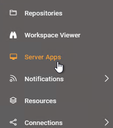
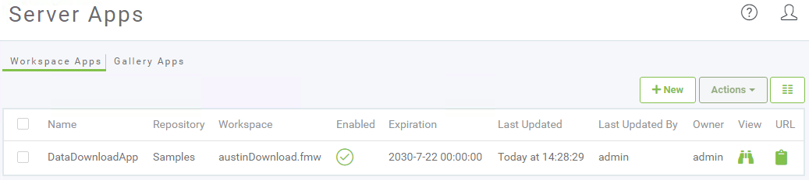
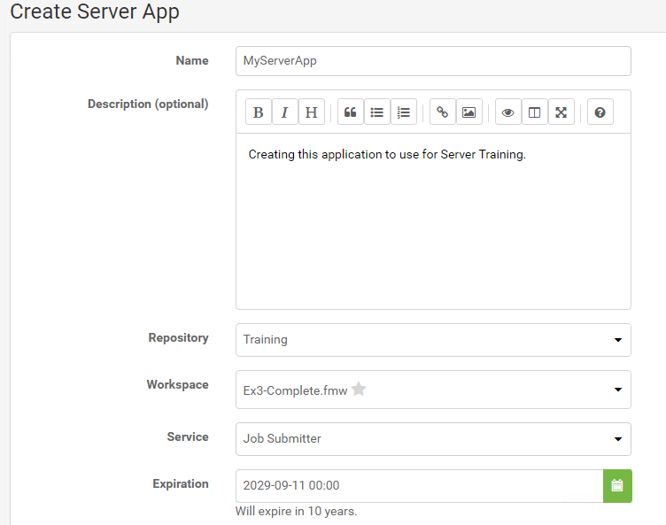
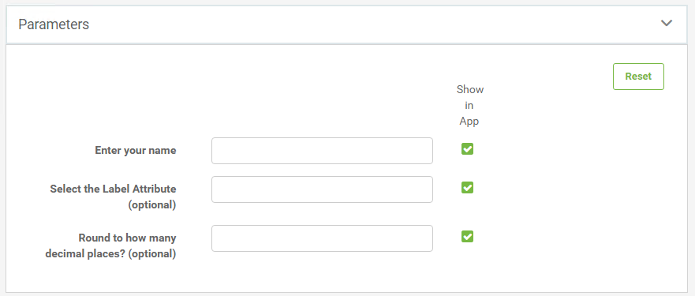
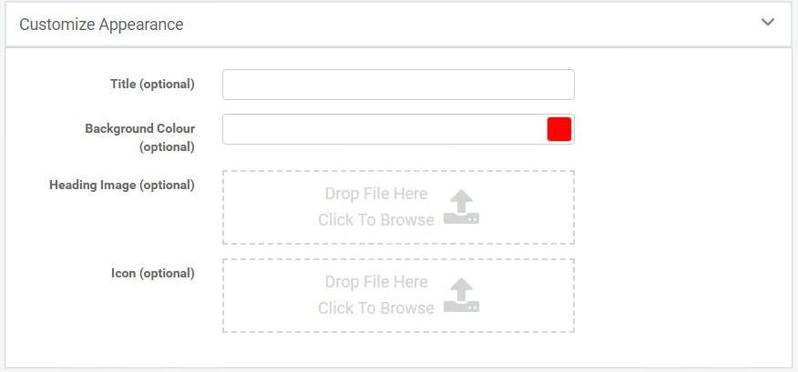
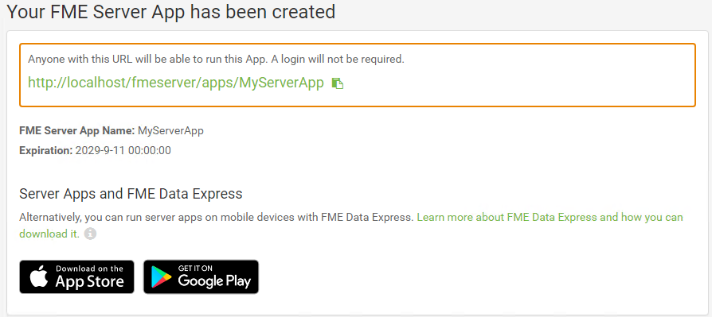
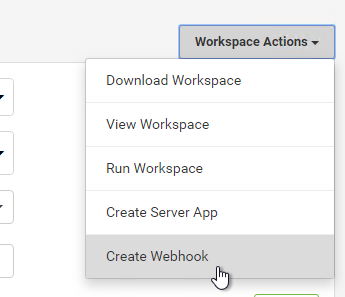
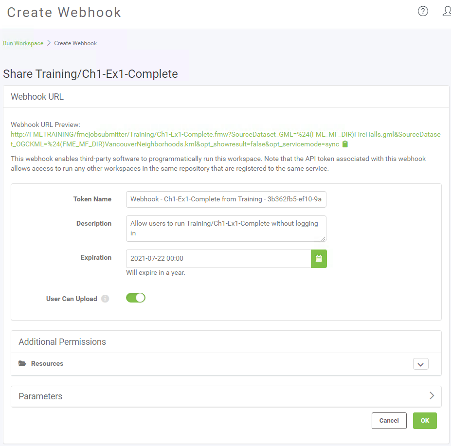
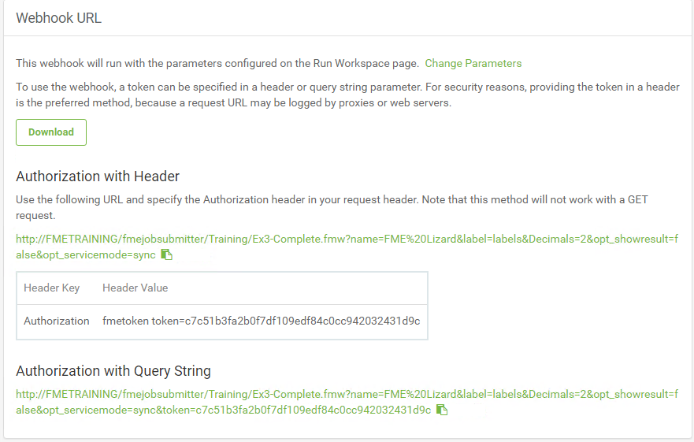

## Sharing Workspaces ##

### FME Server Apps ###

Sharing a repository is a great option for sharing workspaces with other users who also have access to FME Server, but what if you want to allow anyone to be able to submit a job without needing to have an account on FME Server?

A new option in FME Server 2019 is the ability to create an FME Server App. You can create an FME Server App by clicking on Server Apps from the FME Server Menu:

These will open the Server App management page within FME Server. From here, you can manage all your existing apps and create new ones.

When creating a new Server App, you will be able to select which workspace you would like your App to run and also set an Expiration date for the App. This is useful if you would like to temporarily share the app, then disable it after a set period of time.

Next, you can select which Published Parameters you would like to be displayed for your end users to set when they use your Server App:

And finally, you can customize the appearance of your Server App by adding a title, changing the background color, the image that will appear at the top of the page, and the icon that will appear in the browser tab when the App is opened:

An FME Server App URL will then be generated. Anyone with that URL will be able to run the App that you created without having to log into FME Server first.

The FME Server App link will open up a simplified Run Workspace page:

<!--Tip Section-->

<table style="border-spacing: 0px">
<tr>
<td style="vertical-align:middle;background-color:darkorange;border: 2px solid darkorange">
<i class="fa fa-info-circle fa-lg fa-pull-left fa-fw" style="color:white;padding-right: 12px;vertical-align:text-top"></i>
FME Lizard says...
</td>
</tr>

<tr>
<td style="border: 1px solid darkorange">

You can also create an FME Server App from the Run Workspace page for any workspace by clicking on Workspace Actions > Create Server App or from under the Advanced parameters section. This can be a handy shortcut as it will open the Create FME Server App page directly and automatically select the Workspace for you.

</td>
</tr>
</table>

---

### Webhook URL ###

While FME Server Apps allow other people run a workspace on FME Server, a Webhook allows for an application to programmatically run a workspace. A Webhook URL will include all the workspace parameters directly in the URL itself. So, when the URL is triggered, it will immediately run the workspace without the need to prompt for those parameter values.

Webhooks are useful for building your own web applications that access FME Server services because you can copy the HTTP request and embed it on your own website or a 3rd party application. You could also embed the URL into an email, or paste the URL directly into a web browser.

You can create a Webhook URL from the Run Workspace page for any workspace. Once you have selected your workspace to run, click on Workspace Actions > Create Webhook or go to the Advanced parameters and select Create a Webhook from there.

You will then be able to configure an your Webhook. You can set an expiry time to control how long the URL will be active for and also decide what values should be filled in for any Published Parameters associated with the workspace.

When finished, your Webhook URL will be generated and you will be able to download a text file containing the Webhook information and see some examples of how to use the Webhook within 3rd party or custom applications.

