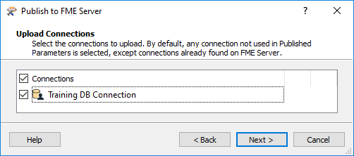
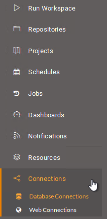

## Using Database Connections

When the source data for a dataset is a database, FME is capable of storing connection parameters in a secure container. That container can be either published to FME Server or recreated on it.

### What is a Database Connection? ###

Database connections are containers for a set of database connection parameters. These parameters include database server, port number, username, password, and others that vary according to the database type.

The two main advantages of database connections are:

- Connection parameters are no longer embedded in a workspace, meaning less of a security risk
	- For example, your parameters would not be exposed to anyone who downloaded the workspace
- Connection parameters can be reused among multiple workspaces
	- For example, two workspaces that use the same database can use the same connection

Database connections can be published with a workspace from FME Desktop, or they can be added directly within FME Server.

---

### Creating a Database Connection ###

Creating a database connection often starts in FME Desktop. They can be created using Tools &gt; FME Options &gt; Database Connections in the FME Workbench menubar. The defined connection can then be used in a reader, writer, or transformer.

For example, this workspace has a connection for a PostGIS database, as seen in the reader parameters and a list of database connections:

When the workspace is published to FME Server a new dialog asks the author whether to also publish the database connection:

The connection is then added to the connections container on FME Server.

---

<!--Person X Says Section-->

<table style="border-spacing: 0px">
<tr>
<td style="vertical-align:middle;background-color:darkorange;border: 2px solid darkorange">
<i class="fa fa-quote-left fa-lg fa-pull-left fa-fw" style="color:white;padding-right: 12px;vertical-align:text-top"></i>
Police Chief Webb-Mapp says...
</td>
</tr>

<tr>
<td style="border: 1px solid darkorange">

Note that you don't have to upload the connection with the workspace. If a connection for that database already exists on FME Server you can use that.
  If you don't upload the connection, and you don't already have one to use on FME Server, then you will need to use the Database Connections page to create one.

</td>
</tr>
</table>

---

### Managing Database Connections ###

FME Server has a page for managing database connections accessed through the main menu:

This page allows workspace authors - but usually administrators - to create new connections, copy existing connections, delete existing connections, or edit existing connections:

---

### Using Database Connections ###

When a workspace is run, if it has a database reader (for example) the end-user is prompted with a published parameter and can select the database connection to use:

The workspace then runs to completion as normal.

---

<!--Person X Says Section-->

<table style="border-spacing: 0px">
<tr>
<td style="vertical-align:middle;background-color:darkorange;border: 2px solid darkorange">
<i class="fa fa-quote-left fa-lg fa-pull-left fa-fw" style="color:white;padding-right: 12px;vertical-align:text-top"></i>
Police Chief Webb-Mapp says...
</td>
</tr>

<tr>
<td style="border: 1px solid darkorange">

Connections, like other objects on FME Server, have security permissions. Only the owner, someone with whom the connection is shared, or (by default) an administrator, can make use of it. It's not the case that any random user will be provided access to all database connections via the published parameter.   
  This also means that a workspace can be tested in FME Desktop using the author's connection parameters, but then require the end-user's connection once published to Server; all in a way that is both easy and secure.

</td>
</tr>
</table>

---

<!--Person X Says Section-->

<table style="border-spacing: 0px">
<tr>
<td style="vertical-align:middle;background-color:darkorange;border: 2px solid darkorange">
<i class="fa fa-quote-left fa-lg fa-pull-left fa-fw" style="color:white;padding-right: 12px;vertical-align:text-top"></i>
Miss Vector says...
</td>
</tr>

<tr>
<td style="border: 1px solid darkorange">

If I create a database connection that has superuser permissions then it would bypass any permission checks the database would make for creating and dropping tables. So how do you think I might prevent a user misusing that capability?
  1. Remove that user's permission to run that workspace on FME Server
 2. Remove that user's permissions to access the entire repository that workspace resides in
 3. Remove permission to access that particular database connection for that user's role
 4. Remove from their role permission to manage database connections

</td>
</tr>
</table>
