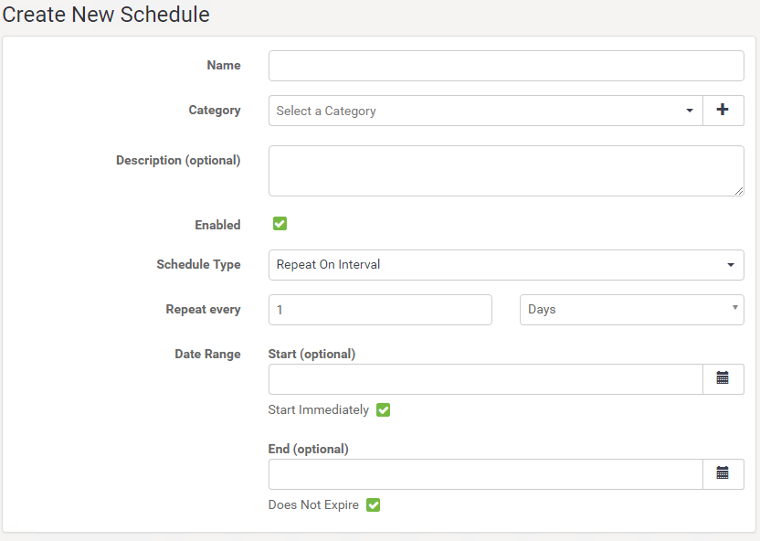

# Scheduling

Scheduled Translations are the best way to start a workspace at a particular time or date. It is also important to use schedules to automate tasks but running a workspace multiple times at a defined interval. 

## What is Scheduling? ##

Scheduling is the ability to configure FME Server to run a workspace in a repository at a specific time in the future. The schedule can cause the workspace to run once or on a repeating basis.

## Managing Scheduled Tasks ##

Scheduled tasks are set up in the web interface. They can be accessed through a button on the main menu:

The interface supports all the capabilities you would expect, including the ability to create, remove, copy, and enable and disable tasks:

## Creating a Scheduled Task ##

There are a number of parameters that can be set when creating a scheduled task.

The first group of parameters includes options for naming and describing the schedule as well as setting up the actual schedule. Here the workspace will be set to run once a day starting on the 28th of April at 2:00 am.

---

<!--Tip Section-->

<table style="border-spacing: 0px">
<tr>
<td style="vertical-align:middle;background-color:darkorange;border: 2px solid darkorange">
<i class="fa fa-info-circle fa-lg fa-pull-left fa-fw" style="color:white;padding-right: 12px;vertical-align:text-top"></i>
NEW for 2018.1
</td>
</tr>

<tr>
<td style="border: 1px solid darkorange">

Notice that in FME Server 2018.1 the Create New Schedule interface has changed slightly. The main change is that if the End (optional) field is left blank, the schedule will not expire. This replaces the Schedule Does Not Expire checkbox in previous FME Server versions:
  

</td>
</tr>
</table>

---

Notice that each schedule can be assigned to a particular category.

The next few parameters concentrate on the workspace to be run.

Once a workspace is selected, there will be a short pause while FME retrieves information about the workspace. It will then expose any published parameters that exist in the workspace:

There are also optional parameters for notification topics to trigger on completion of the scheduled task. These could be used to inform an administrator of the success or failure of the translation.

Finally, there are advanced options to control job queue, and job expiry (for jobs that are time-sensitive and would be no longer useful if held back past a particular time by higher priority tasks).

Once the parameters are set for a scheduled task, it is added to the main Schedules interface where it can be easily enabled or disabled.
