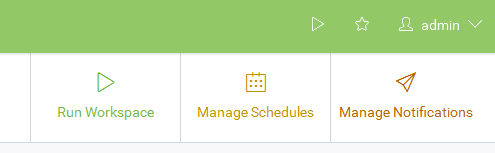
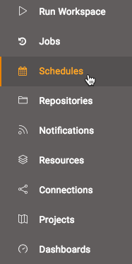
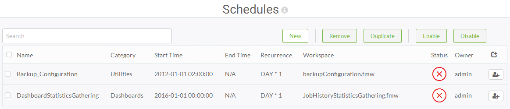
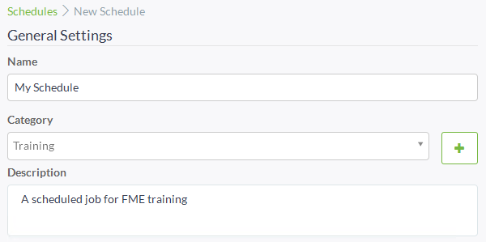
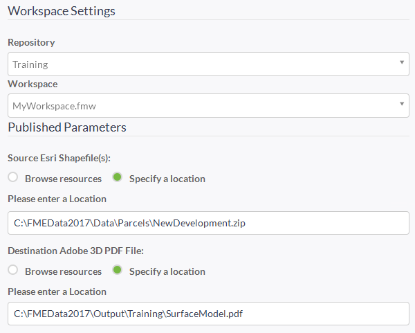
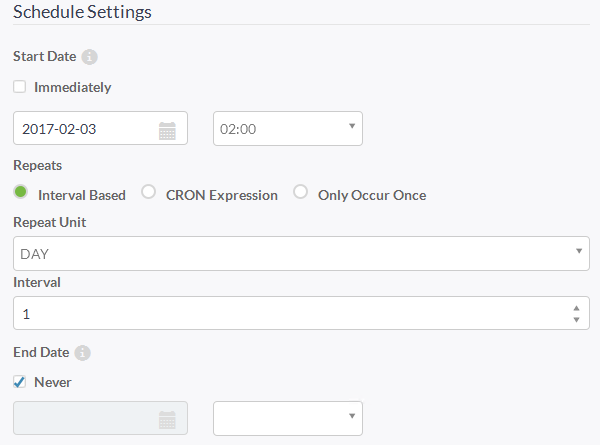

# Scheduling

Scheduled Translations are the best way to kick off a workspace at a particular time or date.

## What is Scheduling? ##

Scheduling is the ability to program FME Server to run a workspace in a repository, at a specific time in the future. The schedule can cause the workspace to run once or on a repeating basis.

## Managing Scheduled Tasks ##

Scheduled tasks are set up in the web interface. Firstly there is a quick link on the landing page to scheduled tasks:

...and secondly there is also a button on the main menu:

The interface supports all the capabilities you would expect, including the ability to create new schedules, remove existing ones, copy existing ones, and to enable and disable existing tasks:

## Creating a Scheduled Task ##

There are a number of parameters involved in creating a scheduled task.

The first parameters are very simple ones for naming and describing the schedule.

Notice that each schedule can be assigned to a particular category.

The next few parameters concentrate on the workspace to be run.

Once a workspace is selected there will be a short pause while FME retrieves information about the workspace. It will then expose any published parameters that exist in the workspace:

The key parameters, of course, are for setting the actual schedule. Here the workspace is set to run every week starting on the 30th January at 2:00am

There are also optional parameters for notification topics to trigger on completion of the scheduled task. These could be used to inform an administrator of the success or failure of the translation.

Finally there are options to control job priority, job routing (which engine it should use) and job expiry (for jobs that are time-sensitive and would be no longer useful if held back past a certain time by higher priority tasks).

Once the parameters are set for a scheduled task, it is added to the main Scheduling interface.
