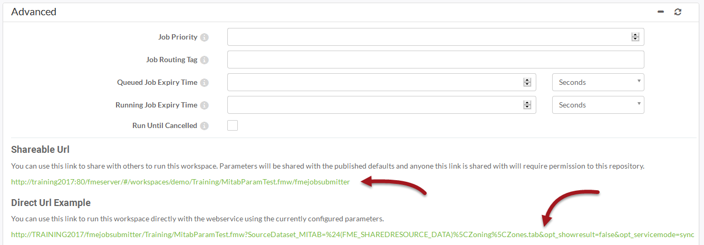

# Running the Job Submitter using a URL #

All job requests to an FME Server are a variation on an HTTP request. This makes running a workspace via a URL very simple, provided you know what form the request will take.

The easiest way to find that URL is in the advanced section of the Run Workspace page:

Notice that there are two versions of the URL. The descriptions of each are below.

### Shareable Url ###

This URL will simply take the user to the Run Workspace page of the FME Server interface and prompt them to fill in any published parameters.

### Direct Url ###

This URL includes parameters and the command to run the workspace immediately. This URL will run the workspace using the current parameter values without bringing a user to the "Run Workspace" page.

This information is a useful tool for building your own web applications that access FME Server services, because you can copy the HTTP request and embed it on your own website or application. You could also embed the URL into an email, or paste the URL directly into a web browser.

---

<table style="border-spacing: 0px">
<tr>
<td style="vertical-align:middle;background-color:darkorange;border: 2px solid darkorange">
<i class="fa fa-info-circle fa-lg fa-pull-left fa-fw" style="color:white;padding-right: 12px;vertical-align:text-top"></i>
TIP
</td>
</tr>

<tr>
<td style="border: 1px solid darkorange">

The URLs shown use HTTP GET requests whereas clicking Run on this HTML form uses an HTTP POST request.
  There are limits to the amount of data you can send in a GET request because URLs have length restrictions that vary depending on the browser being used. If you anticipate that your request parameters may include very long strings, use a POST request instead.

</td>
</tr>
</table>
