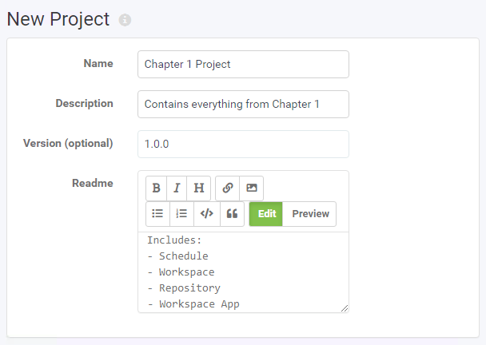
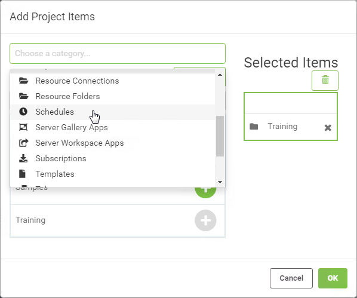
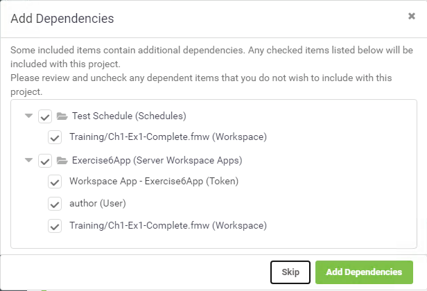
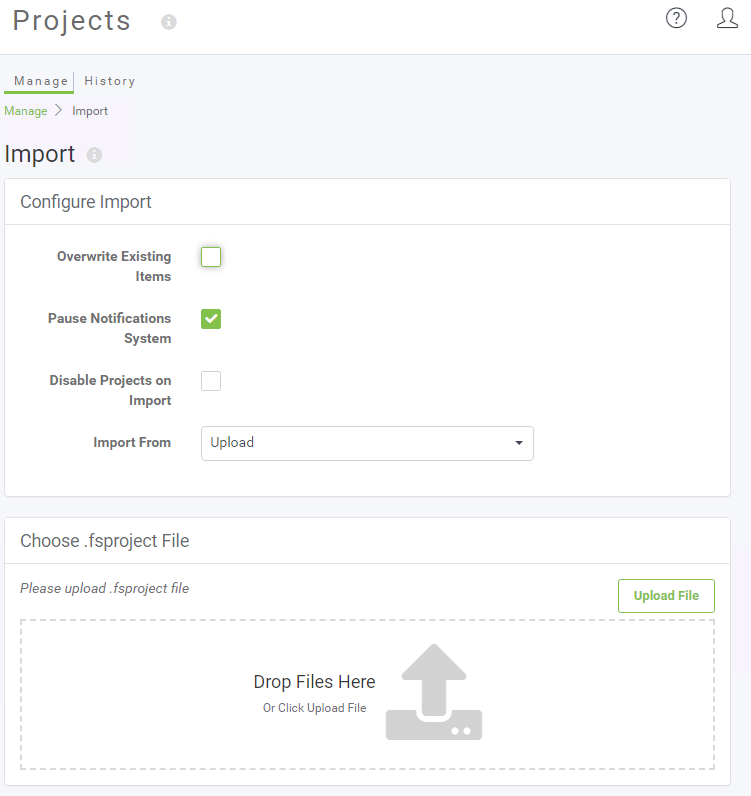
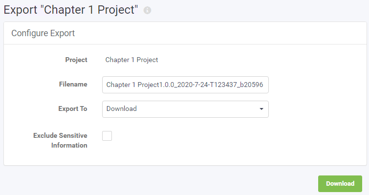
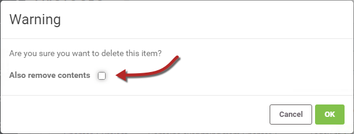

## Working with Projects ##

All Project related tasks can be completed from within the Projects page of the FME Server Web Interface.

### Creating a Project ###

Creating a new project is done by expanding the Projects section on the side menu and clicking Build Project:

On the New Projects page, enter in a Name, Description, and Readme information:

Below the Project parameters is a dialog that shows all content currently added to the project (if any) with a button to add new items on the right-hand side:

Clicking on the '+' button opens the Add Project Items dialog which allows components to be added to the project:

Once you have added some items to the project, they will be listed under the Contents dialog:

When you click OK to create the project, if any of the components you selected have dependencies, you are able to fine-tune what exactly gets saved in the project:

Once complete the project is added to the list on the Manage Projects page:

### Importing a Project ###

You can import an existing project into your FME Server by simply clicking the Import button.

The Import page allows a .fsproject file to be uploaded or read from a folder in Resources. It also includes other parameters to control the import:

### Exporting a Project ###

Exporting a project is carried out on the Projects page (accessed via the main menu) by selecting the Project to be exported and clicking the Export button:

This opens a dialog in which to configure and carry out the export:

The export writes to a file with a .fsproject extension. There is an option to either provide the export as a download or to write it to a Resources folder.

### Removing a Project ###

Once a Project has been exported, you may wish to remove it from the FME Server instance on which it currently resides. That can be done by selecting the Project and clicking the Remove button.

The confirmation dialog that opens allows you to choose whether to also delete all of the components that make up the Project:

