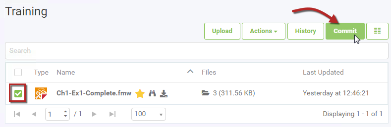
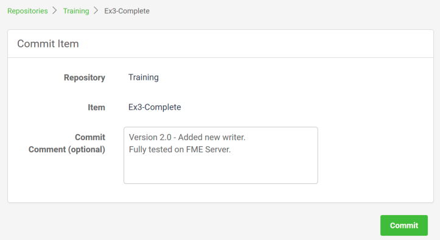
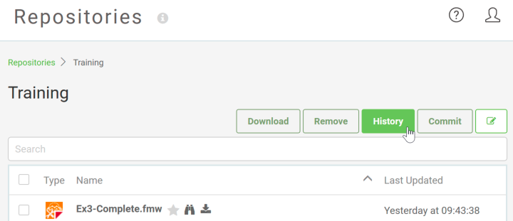
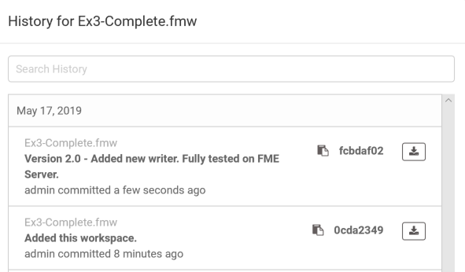
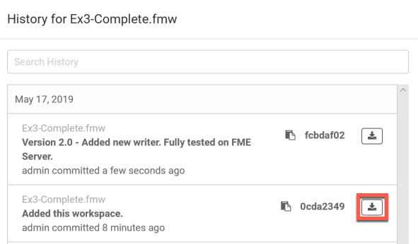

# Workspace Versioning #

<!--New Section-->

<table style="border-spacing: 0px">
<tr>
<td style="vertical-align:middle;background-color:darkorange;border: 2px solid darkorange">
<i class="fa fa-bolt fa-lg fa-pull-left fa-fw" style="color:white;padding-right: 12px;vertical-align:text-top"></i>
NEW
</td>
</tr>

<tr>
<td style="border: 1px solid darkorange">

Version Control is brand new in FME Server 2018.0. Well, technically it was released as a tech preview last release, but it is now an official new feature!

</td>
</tr>
</table>

---
Version Control makes it much easier to keep track of updates made to your workspaces as you make changes and publish them to FME Server.

You can commit new versions of workspaces while publishing them to FME Server or after you've published and tested your workspace through the web interface. Then access the full version history for any Repository or Workspace directly through the Repository page.

## Configuring Version Control ##

Version Control will be turned off by default on a new FME Server installation, but can easily be switched on and configured by your FME Server Administrator. The options for this can be found under the System Configuration > Features menu.

---

<!--Tip Section-->

<table style="border-spacing: 0px">
<tr>
<td style="vertical-align:middle;background-color:darkorange;border: 2px solid darkorange">
<i class="fa fa-info-circle fa-lg fa-pull-left fa-fw" style="color:white;padding-right: 12px;vertical-align:text-top"></i>
TIP
</td>
</tr>

<tr>
<td style="border: 1px solid darkorange">

Setting up Version Control from an administrator's perspective is covered in detail in the <a href="https://safe-software.gitbooks.io/fme-server-administration-training-2018/content/ServerAdmin5Customization/5.09.WorkspaceVersioning.html">FME Server 2018 Administrator training</a> course. So be sure to check that out if you're interested in learning more about how to configure it.

</td>
</tr>
</table>

---

## Authoring and Version Control ##

Once an FME Server Administrator has switched on Version Control, versioning tools will be available to any workspace authors.

Not every change made to an FME Server workspace will automatically be added to the version history. The workspace author can choose to 'commit' a version that they decide is significant or worth checkpointing. There are two ways to commit a new version of a workspace to the Version History.

### Commit while Publishing ###

A Commit button will appear on the Publish Workspace dialog of the Publish to FME Server Wizard inside FME Desktop. It opens a Version Options window that has options to add the current workspace to Version History as well as add a commit message with a summary of any changes made.

### Commit after Publishing ###

The Commit button is also available within the Repositories page in the FME Server web interface. This is useful if you want to publish and test your workspace on FME Server before committing the new version. Just open the Repository, select the workspace, and click Commit.

This opens a page to optionally include a commit comment to include a summary of what has changed in the new version.

## View Version History ##

To see the full version history of committed changes for any repository, go to the Repositories page and click the History button at the top.

This will open a dialog that lists all the commits in chronological order with the most recent at the top. It will also show the workspace that it relates to, the commit message, which user committed the change, and when it was added.

<!--Tip Section-->
<table style="border-spacing: 0px">

<tr>
<td style="vertical-align:middle;background-color:darkorange;border: 2px solid darkorange">
<i class="fa fa-info-circle fa-lg fa-pull-left fa-fw" style="color:white;padding-right: 12px;vertical-align:text-top"></i>
TIP
</td>
</tr>

<tr>
<td style="border: 1px solid darkorange">

By default, you will see all the versions for all workspaces within the repository. If you select a workspace first, then the history will only show the commits for the selected workspace.

</td>

---

## Restore a Previous Version ##

To restore a preview version of a workspace, open the Version History for that workspace and click the download button next to the version you want.

This will download a copy of that workspace to your computer. You can then open it using Workbench and publish that version back to FME Server.
