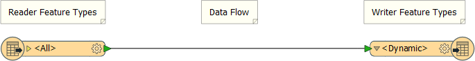
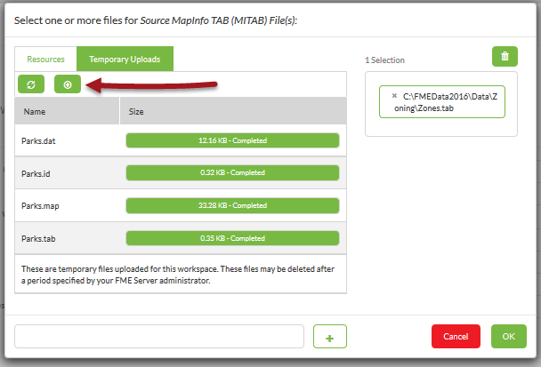

## Uploading Datasets at Run Time ##

Publishing data to FME Server along with the workspace is fine, but it isn't a method that an end-user could use to have a dataset translated.

Therefore, functionality exists to allow the end-user to upload data at run-time.

---

### Uploading Source Data ###

This workspace was created with a dynamic Reader and Writer. That means it is possible to process any source dataset (of the right format) and have it translated:

Of course, publishing the data with the workspace does not make much sense. It is better if the user uploads data at run time. They can do this very easily in the FME Server interface in the Run Workspace page by clicking the browse button:

This opens a dialog with a button (highlighted) to use for uploading files (here a Parks dataset):

The next step is to click the file (here Parks.tab) to select it:

Finally, click the [+] button to add it to the translation:

Any existing files in the selection window can be removed by clicking their X button (as must have been done here for Zones/.tab).

Now when the workspace runs, the user-uploaded data gets translated.

---

### Cautions and Limitations ###

There are a number of cautions and limitations to be concerned about here.

Firstly - and perhaps most obviously to experienced workspace authors - the data chosen by the end user has to match the workspace's schema definition, otherwise the translation will fail. 

Secondly, data uploaded like this is not accessible by any other means and cannot be used by another workspace.

Finally, a look at the System Cleanup dialog shows us that files uploaded like this are only temporary; the default is to clean out these datasets when they become more than 24 hours old.

So, although this is one way to get data onto the Server, it is perhaps not the best way.

---

<!--New Section--> 

<table style="border-spacing: 0px">
<tr>
<td style="vertical-align:middle;background-color:darkorange;border: 2px solid darkorange">
<i class="fa fa-bolt fa-lg fa-pull-left fa-fw" style="color:white;padding-right: 12px;vertical-align:text-top"></i>
NEW
</td>
</tr>

<tr>
<td style="border: 1px solid darkorange">

In FME2016 this technique was altered slightly to store uploaded data to an accessible file in the Resources setup:
  
  So, technically, you could use that data as the source for another translation. However, in practice it's not a long-term solution because of how the system cleanup tools will empty this folder within a day.

</td>
</tr>
</table>

---

<!--Person X Says Section-->

<table style="border-spacing: 0px">
<tr>
<td style="vertical-align:middle;background-color:darkorange;border: 2px solid darkorange">
<i class="fa fa-quote-left fa-lg fa-pull-left fa-fw" style="color:white;padding-right: 12px;vertical-align:text-top"></i>
Miss Vector says...
</td>
</tr>

<tr>
<td style="border: 1px solid darkorange">

The system cleanup tools will erase any data uploaded like this when it is more than a day old. But which cleanup task is it that will do so?
  1. Delete&#95;DataUpload&#95;Files
 2. Delete&#95;EngineResults&#95;Files
 3. Delete&#95;Service_Post&#95;Content&#95;Files
 4. Delete&#95;UserData&#95;Files

</td>
</tr>
</table>