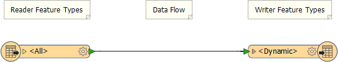
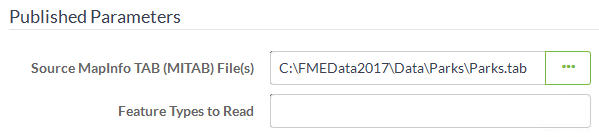

## Uploading Datasets at Run Time ##

Although it's easy for an author to publish data to an FME Server repository along with the workspace, it isn't a method that an end-user has access to.

Therefore, for files (rather than a feed or database), functionality exists to allow the end-user to upload data at run-time.

---

### Uploading Source Data ###

This workspace was created with a dynamic Reader and Writer. That means it is possible to process any source dataset (of the right format) and have it translated:

Of course, in this scenario publishing the data with the workspace does not make much sense. It is better if the user uploads data at run time. 

Provided the source dataset is a published parameter, they can do this very easily in the Run Workspace page of the FME Server interface by clicking the browse button:

This opens a dialog with a button (highlighted) to use for uploading files (here a Parks dataset):

Any file uploaded is automatically *selected* for translation. At that point simply click OK. Now when the workspace runs, the selected user-uploaded data gets translated.

---

<!--Person X Says Section-->

<table style="border-spacing: 0px">
<tr>
<td style="vertical-align:middle;background-color:darkorange;border: 2px solid darkorange">
<i class="fa fa-quote-left fa-lg fa-pull-left fa-fw" style="color:white;padding-right: 12px;vertical-align:text-top"></i>
Police Chief Webb-Mapp says...
</td>
</tr>

<tr>
<td style="border: 1px solid darkorange">

In the above example, the source dataset is in a format (MapInfo TAB) that consists of several files.
 Although all files need to be uploaded, only the TAB file itself needs to be <strong>selected</strong>.
  
 The method to use is to deselect files under the section Selected Items; here the .dat, .id, and .map files.
  The files are still available, but FME won't treat each of them as a separate dataset, which is what would happen if they all remained selected. 

</td>
</tr>
</table>

---

### Cautions and Limitations ###

There are a number of cautions and limitations to be concerned about when data is uploaded for translation by the end-user:

- Giving the user upload ability is risky because their dataset's schema has to match the workspace's schema definition, otherwise the translation will fail with unexpected input. Alternatively - as above - a dynamic (and maybe generic) translation could be used to avoid such issues. 

- Data uploaded by the user is only temporarily available. The System Cleanup page shows us that such files are (by default) deleted when they become more than 24 hours old. User uploads are not a long-term solution.

- Data uploaded by the user is, in theory, also accessible through the Resources page (more on that to come). However, in practice, it's in an obscure location where an end user would not be expected to find it. For that reason, temporary data should be considered inaccessible by any other means and unavailable for use by any other workspace.
