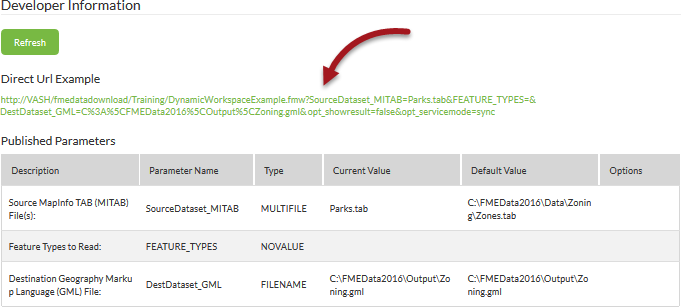

# Running the Job Submitter using a URL #

All job requests to an FME Server are a variation on an HTTP request. This makes running a workspace via a URL very simple, provided you know what form the request will take.

The easiest way to find that URL is in the workspace dialog in the FME Server web interface. Notice that there is a little spanner/wrench icon:

Click this and developer information, including a URL to run the workspace, are displayed:

The URL shown uses a HTTP GET request whereas the HTML form uses a HTTP POST request.

This information is a useful tool for building your own web applications that access FME Server services, because you can copy the HTTP request and embed it on your own website or application.

You could also embed the URL or form into an email, or paste the URL directly into a web browser.

---

<table style="border-spacing: 0px">
<tr>
<td style="vertical-align:middle;background-color:darkorange;border: 2px solid darkorange">
<i class="fa fa-info-circle fa-lg fa-pull-left fa-fw" style="color:white;padding-right: 12px;vertical-align:text-top"></i>
TIP
</td>
</tr>

<tr>
<td style="border: 1px solid darkorange">

There are limits to the amount of data you can send in a GET request because URLs have length restrictions that vary depending on the browser being used. If you anticipate that your request parameters may include very long strings, use a POST request.

</td>
</tr>
</table>