<!--Instructor Notes-->
<!--This exercise uses a basic amount of FME Workbench as a test for students-->
<!--If students have problems now, it is unlikely they will have much success at further exercises-->

<!--Exercise Section-->

<table style="border-spacing: 0px;border-collapse: collapse;font-family:serif">
<tr>
<td width=25% style="vertical-align:middle;background-color:darkorange;border: 2px solid darkorange">
<i class="fa fa-cogs fa-lg fa-pull-left fa-fw" style="color:white;padding-right: 12px;vertical-align:text-top"></i>
Exercise 1
</td>
<td style="border: 2px solid darkorange;background-color:darkorange;color:white">
Daily Database Updates
</td>
</tr>

<tr>
<td style="border: 1px solid darkorange; font-weight: bold">Data</td>
<td style="border: 1px solid darkorange">Earthquakes (GeoJSON)</td>
</tr>

<tr>
<td style="border: 1px solid darkorange; font-weight: bold">Overall Goal</td>
<td style="border: 1px solid darkorange">Create a workspace to read and process departmental data and publish it to FME Server</td>
</tr>

<tr>
<td style="border: 1px solid darkorange; font-weight: bold">Demonstrates</td>
<td style="border: 1px solid darkorange">Publishing a workspace to FME Server</td>
</tr>

<tr>
<td style="border: 1px solid darkorange; font-weight: bold">Start Workspace</td>
<td style="border: 1px solid darkorange">None</td>
</tr>

<tr>
<td style="border: 1px solid darkorange; font-weight: bold">End Workspace</td>
<td style="border: 1px solid darkorange">C:\FMEData2017\Workspaces\ServerAuthoring\Basics-Ex1-Complete.fmw</td>
</tr>

</table>

---

For the exercises in this chapter, you are a technical analyst in the GIS department of your local city. You have plenty of experience using FME Desktop, and your department is now investigating FME Server to evaluate its capabilities.

There are many departments within the city, and one of your tasks is to take the data from each department and merge it together into a single, corporate database.

Because each department produces their datasets in a different format and style, you use FME for this task, and carry it out on a weekly basis.   

One of the reasons for purchasing FME Server is to automate this procedure, so let's start implementing that.

---

<!--Person X Says Section-->

<table style="border-spacing: 0px">
<tr>
<td style="vertical-align:middle;background-color:darkorange;border: 2px solid darkorange">
<i class="fa fa-quote-left fa-lg fa-pull-left fa-fw" style="color:white;padding-right: 12px;vertical-align:text-top"></i>
Police Chief Webb-Mapp says...
</td>
</tr>

<tr>
<td style="border: 1px solid darkorange">

If you have lots of experience with FME Workbench - <strong>and if your instructor agrees</strong> - simply open the workspace listed in the header above and skip to step 8

</td>
</tr>
</table>

---

 **1) Inspect Source Data**
 For the sake of simplicity - and because this course is about Server, not Desktop - we'll just use a few datasets. These are:

<table style="border: 0px">

<tr>
<td style="font-weight: bold">Reader Format</td>
<td style="">GML (Geography Markup Language)</td>
</tr>

<tr>
<td style="font-weight: bold">Reader Dataset</td>
<td style="">C:\FMEData2017\Data\Emergency\FireHalls.gml</td>
</tr>

</table>

<table style="border: 0px">

<tr>
<td style="font-weight: bold">Reader Format</td>
<td style="">MapInfo TAB (MITAB)</td>
</tr>

<tr>
<td style="font-weight: bold">Reader Dataset</td>
<td style="">C:\FMEData2017\Data\Parks\Parks.tab C:\FMEData2017\Data\Zoning\Zones.tab</td>
</tr>

</table>

<table style="border: 0px">

<tr>
<td style="font-weight: bold">Reader Format</td>
<td style="">Google KML</td>
</tr>

<tr>
<td style="font-weight: bold">Reader Dataset</td>
<td style="">C:\FMEData2017\Data\Boundaries\VancouverNeighborhoods.kml</td>
</tr>

</table>

So start the FME Data Inspector by selecting it from the Windows start menu. Inspect all of the source data to become familiar with it. The VancouverNeighborhoods has a different coordinate system than the other datasets so be careful and turn on a background map if you want to view all the data together.

The goal of our translation will be to convert the Firehall, Parks, and Zoning datasets to a Geodatabase, dividing the data up into a separate table per neighborhood.

 **2) Start FME Workbench**
 Start FME Workbench by selecting it from the Windows start menu. Begin with an empty canvas by closing any existing workspace (if necessary) and clicking on the Main tab.

Now select Readers &gt; Add Reader to start adding a reader to the workspace. When prompted, enter the following details for the Firehalls dataset:

<table style="border: 0px">

<tr>
<td style="font-weight: bold">Reader Format</td>
<td style="">GML (Geography Markup Language)</td>
</tr>

<tr>
<td style="font-weight: bold">Reader Dataset</td>
<td style="">C:\FMEData2017\Data\Emergency\FireHalls.gml</td>
</tr>

</table>

Click OK to add the Reader to the workspace, which will now look like this:

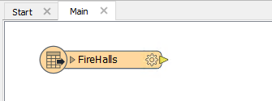

 **3) Add MapInfo Data**
 Now repeat the process of adding a reader to add in the MapInfo datasets:

<table style="border: 0px">

<tr>
<td style="font-weight: bold">Reader Format</td>
<td style="">MapInfo TAB (MITAB)</td>
</tr>

<tr>
<td style="font-weight: bold">Reader Dataset</td>
<td style="">C:\FMEData2017\Data\Parks\Parks.tab C:\FMEData2017\Data\Zoning\Zones.tab</td>
</tr>

</table>

To be able to select two datasets stored in differently located files, instead of choosing the browse button, click the drop-down arrow and choose Select Multiple Folders/Files: 

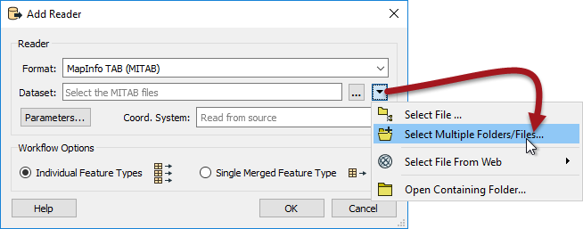

This will open an advanced dialog in which you can separately select two datasets to add with the same reader:

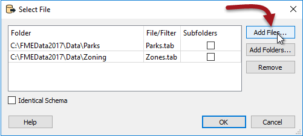

After adding this reader the workspace will look like this:

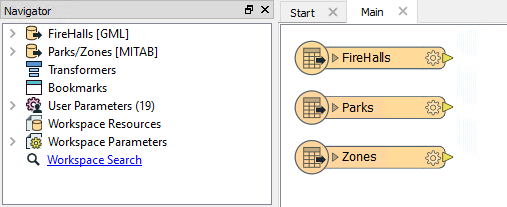

 **4) Add KML Data**
 Now repeat the process one more time to add a reader for the KML dataset:

<table style="border: 0px">

<tr>
<td style="font-weight: bold">Reader Format</td>
<td style="">Google KML</td>
</tr>

<tr>
<td style="font-weight: bold">Reader Dataset</td>
<td style="">C:\FMEData2017\Data\Boundaries\VancouverNeighborhoods.kml</td>
</tr>

</table>

While adding the dataset you'll be prompted which feature types (layers) to add to the workspace. The only one we need is called Neighborhoods:

 **5) Add Writer**
 Now use Writers &gt; Add Writer on the menubar to add a writer to our workspace. Set up the following parameters:

<table style="border: 0px">

<tr>
<td style="font-weight: bold">Writer Format</td>
<td style="">Esri Geodatabase (File Geodb API)</td>
</tr>

<tr>
<td style="font-weight: bold">Writer Dataset</td>
<td style="">C:\FMEData2017\Output\Training\DepartmentData.gdb</td>
</tr>

<tr>
<td style="font-weight: bold">Feature Class or Table Definition</td>
<td style="">Copy from Reader...</td>
</tr>

</table>

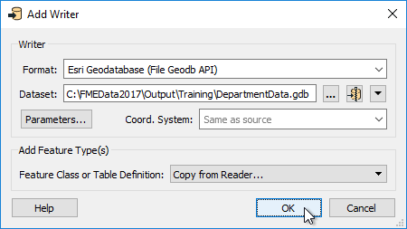

Before clicking OK, open the parameters dialog and put a checkmark in the box labelled Overwrite Existing Geodatabase.  

Click OK and OK again. When prompted, select Firehalls, Zones, and Parks as the feature types to add:

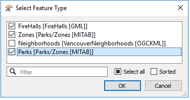

Don't select the Neighborhoods data. We want to use that to split up the other data, but don't need to write it.

The workspace will now look like this:

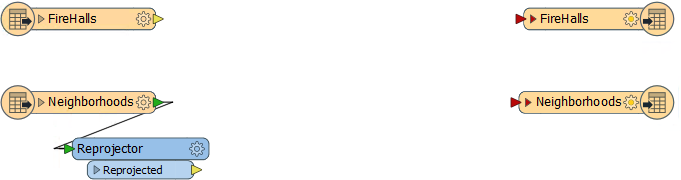

 **6) Add Reprojector Transformer**
 Add a Reprojector transformer to the workspace. You can do this by simply clicking on the canvas and starting to type Reprojector. Connect it to the Neighborhoods feature type:

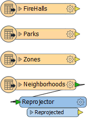

Check the transformer's parameters and set the Destination Coordinate System to UTM83-10:

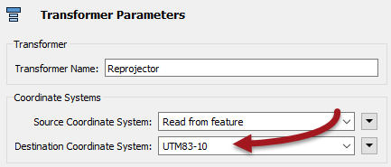

This will ensure the neighborhoods data is in the same coordinate system as the rest of the data.

 **7) Add Clipper Transformer**
 Add a Clipper transformer to the workspace. You can do this by simply clicking on the canvas and starting to type Clipper. 

The Clipper will be used to divide up the data into separate outputs per neighborhood. 

Connect the Firehalls, Parks, and Zones feature types to the Clipper:Clippee port and the Reprojector:Reprojected output to the Clipper:Clipper port. You may wish to rearrange the feature types (or the port order) to avoid overlapping connections:

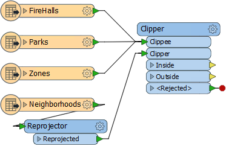

Check the parameters for the Clipper transformer to ensure the Clipper Type is set to Multiple Clippers. That's because there are multiple neighborhood features to act as a clipper feature.

 **8) xxxx**
 Here comes the Server part of the process. In FME Workbench, choose File &gt; Publish to FME Server from the 

 **XXX) Publish to Server (Step 1)**
 Here comes the Server part of the process. In FME Workbench, choose File &gt; Publish to FME Server from the menubar (or select the same tool on the toolbar).

In the first dialog of the wizard you are prompted to enter connection parameters to FME Server.

Enter the parameters provided by your training instructor.

In most cases the parameters will be as follows:

- **FME Server URL:** http://localhost
- **Username:** admin
- **Password:** admin

You may or may not (probably not) need to enter a port number with the hostname, depending on how the system is set up. 

Click Next to continue. If the credentials are correct a connection will be made and you will move on to the next dialog in the wizard.

 **9) Publish to Server (Step 2)**
 The next dialog prompts you to choose a repository in which to store the workspace.

For this exercise we’ll create a new repository by clicking the New button. When prompted enter the name Training.

Click OK to close the Create New Repository dialog. Enter a name for the workspace such as Basics-Ex1-Complete.fmw. The Upload Data Files option should be greyed out, because we aren't using any source files in this case.

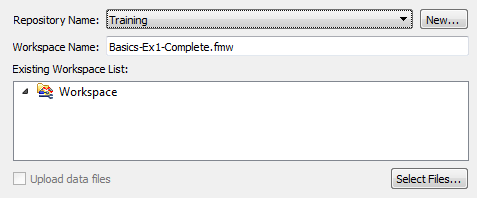

Then click Next to continue the wizard.

 **10) Publish to Server (Step 3)**
 In the final screen of the wizard we can register the workspace for use with various services.

Select the Job Submitter service as this is the only service we are using for now and click Publish to complete publishing the workspace.

After a workspace is transferred to Server, the log window displays a message reporting which workspace has been published to which repository and for which services.

---

<!--Exercise Congratulations Section--> 

<table style="border-spacing: 0px">
<tr>
<td style="vertical-align:middle;background-color:darkorange;border: 2px solid darkorange">
<i class="fa fa-thumbs-o-up fa-lg fa-pull-left fa-fw" style="color:white;padding-right: 12px;vertical-align:text-top"></i>
CONGRATULATIONS
</td>
</tr>

<tr>
<td style="border: 1px solid darkorange">

By completing this exercise you have learned how to:
 
<ul><li>Create a workspace using a GeoJSON feed as the source</li>
<li>Publish a workspace to FME Server using the Publishing Wizard</li>
<li>Create a repository on FME Server using the Publishing Wizard</li>
<li>Register a workspace with the Job Submitter service using the Publishing Wizard</li></ul>

</td>
</tr>
</table>