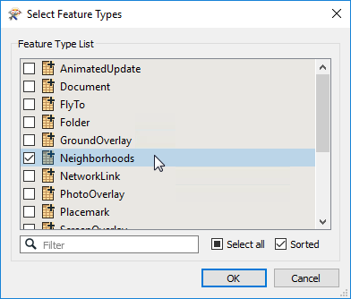
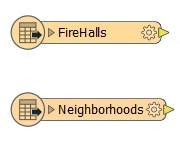
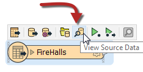
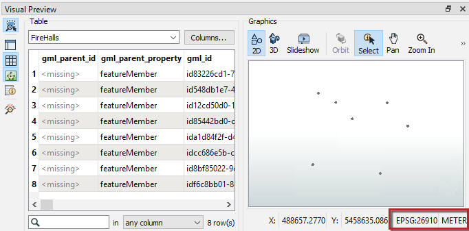
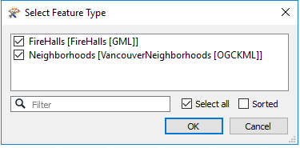
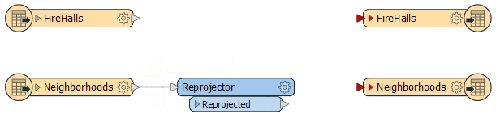
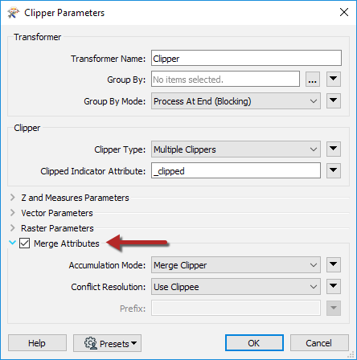
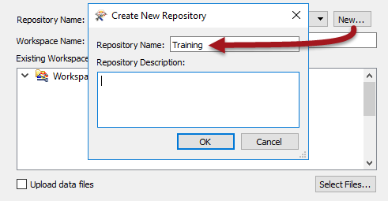
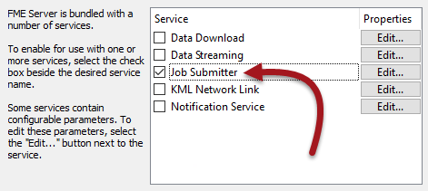
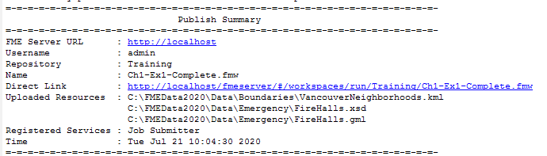

<!--Instructor Notes-->
<!--This exercise uses a basic amount of FME Workbench as a test for students-->
<!--If students have problems now, it is unlikely they will have much success at further exercises-->

<!--Exercise Section-->

<table style="border-spacing: 0px;border-collapse: collapse;font-family:serif">
<tr>
<td width=25% style="vertical-align:middle;background-color:darkorange;border: 2px solid darkorange">
<i class="fa fa-cogs fa-lg fa-pull-left fa-fw" style="color:white;padding-right: 12px;vertical-align:text-top"></i>
Exercise 1.1
</td>
<td style="border: 2px solid darkorange;background-color:darkorange;color:white">
Daily Database Updates: Publishing a Workspace
</td>
</tr>

<tr>
<td style="border: 1px solid darkorange; font-weight: bold">Data</td>
<td style="border: 1px solid darkorange">FireHalls (GML) Neighborhoods (KML)</td>
</tr>

<tr>
<td style="border: 1px solid darkorange; font-weight: bold">Overall Goal</td>
<td style="border: 1px solid darkorange">Create a workspace to read and process departmental data and publish it to FME Server</td>
</tr>

<tr>
<td style="border: 1px solid darkorange; font-weight: bold">Demonstrates</td>
<td style="border: 1px solid darkorange">Publishing a workspace to FME Server</td>
</tr>

<tr>
<td style="border: 1px solid darkorange; font-weight: bold">Start Workspace</td>
<td style="border: 1px solid darkorange">None</td>
</tr>

<tr>
<td style="border: 1px solid darkorange; font-weight: bold">End Workspace</td>
<td style="border: 1px solid darkorange">C:\FMEData2020\Workspaces\ServerAuthoring\Basics-Ex1-Complete.fmw</td>
</tr>

</table>

---

For the exercises in this chapter, you are a technical analyst in the GIS department of your local city. You have plenty of experience using FME Desktop, and your department is now investigating FME Server to evaluate its capabilities.

There are many departments within the city, and one of your tasks is to take the data from each department and merge it together into a single corporate database.

Because each department produces its datasets in a different format and style, you use FME for this task and carry it out on a weekly basis.   

One of the reasons for purchasing FME Server is to automate this procedure, so let's start implementing that.

---

<!--Person X Says Section-->

<table style="border-spacing: 0px">
<tr>
<td style="vertical-align:middle;background-color:darkorange;border: 2px solid darkorange">
<i class="fa fa-quote-left fa-lg fa-pull-left fa-fw" style="color:white;padding-right: 12px;vertical-align:text-top"></i>
FME Lizard says...
</td>
</tr>

<tr>
<td style="border: 1px solid darkorange">

If you have lots of experience with FME Workbench - <strong>and if your instructor agrees</strong> - simply open the workspace listed in the header above and skip to step 8.

</td>
</tr>
</table>

---

 **1) Start FME Workbench**
 Since this course is focused on FME Server, we will create a simple workspace in FME Desktop using a couple of formats.

 Start FME Workbench by selecting it from the Windows start menu. On a blank canvas, select Readers &gt; Add Reader to start adding a reader to the workspace. When prompted, enter the following details for the GML FireHalls dataset:

<table style="border: 0px">

<tr>
<td style="font-weight: bold">Reader Format</td>
<td style="">GML (Geography Markup Language)</td>
</tr>

<tr>
<td style="font-weight: bold">Reader Dataset</td>
<td style="">C:\FMEData2020\Data\Emergency\FireHalls.gml</td>
</tr>

</table>

 **2) Add KML Data**
 Now repeat the process one more time to add a reader for the KML Neighborhoods dataset:

<table style="border: 0px">

<tr>
<td style="font-weight: bold">Reader Format</td>
<td style="">Google KML</td>
</tr>

<tr>
<td style="font-weight: bold">Reader Dataset</td>
<td style="">C:\FMEData2020\Data\Boundaries\VancouverNeighborhoods.kml</td>
</tr>

</table>

While adding the KML dataset, you'll be prompted to choose which Feature Types (layers) to add to the workspace. The only one we need is called Neighborhoods:

You should now have two readers on the canvas:

 **3) Inspect the Data**
 Before we proceed, we should inspect the data. Click on the FireHalls reader feature type to open the popup menu. On the popup menu, click on View Source Data, this will open the data in Visual Preview:

While viewing the data in Visual Preview, take note of the coordinate system in the bottom right corner of the Graphics window. Since we are working with more than one dataset, we will want to make sure that all of the datasets are in the same coordinate system:

Repeat the same steps to view the Neighborhoods reader feature type, and take note of the coordinate system.

 **4) Add Reprojector Transformer**
 The FireHalls dataset is in ESPG:26910, which is also known as UTM83-10, and the Neighborhoods is in LL84. Let's reproject the Neighborhoods dataset to UTM83-10, as it is a coordinate system more suited for this region.

Add a Reprojector transformer to the workspace. You can do this by simply clicking on the canvas and starting to type Reprojector. Connect it to the Neighborhoods feature type:

In the Reprojector's parameters set the Destination Coordinate System to UTM83-10:

This will ensure the Neighborhoods data is in the same coordinate system as the rest of the data.

 **5) Add Writer**
 Now we should add a writer to the workspace. For now, we'll just set up a dummy writer until we are more familiar with FME Server. To do this, select Writers &gt; Add Writer on the menu bar to add a writer and set it up with the following parameters:

<table style="border: 0px">

<tr>
<td style="font-weight: bold">Writer Format</td>
<td style="">NULL (Nothing)</td>
</tr>

<tr>
<td style="font-weight: bold">Feature Class or Table Definition</td>
<td style="">Copy from Reader...</td>
</tr>

</table>

Click OK. When prompted, select both FireHalls and Neighborhoods as the feature types to add  and OK again:

The workspace will now look like this:

 **6) Add Clipper Transformer**
 Add a Clipper transformer to the workspace. This will be used to divide the FireHall data by Neighborhood.

Connect the FireHalls feature type to the Clipper:Clippee port and the Reprojector:Reprojected output to the Clipper:Clipper port. You may wish to rearrange the feature types (or the port order) to avoid overlapping connections; this is done by right-clicking on the Clipper:Clipper port and selecting Move Down:

In the Clipper parameters, enable Merge Attributes, so that the neighborhood name is copied from the Neighborhood features to the FireHall features:

Connect the Clipper:Inside port to the FireHalls writer feature type. Also make a connection from the Reprojector:Reprojected port to the Neighborhoods writer feature type:

 **7) Set Firehall Feature Type Name**
 Finally, let's set the Feature Type Name for the FireHalls writer feature type.

Inspect its parameters and under Feature Type Name either enter:

<pre>
FireHalls-@Value(NeighborhoodName)
</pre>

...or click the drop-down and use the text editor dialog to enter that value. This will cause firehalls in each different neighborhood to be written to a different table/layer.

 **8) Run Workspace**
 Here comes the Server part of the process.

First, save the workspace. It is always a good idea to save the workspace before publishing to FME Server. Next, ensure that Prompt for User Parameters is disabled, then run the workspace. If the workspace won't run on FME Desktop, then it is not likely to run on FME Server. If you get the Unexpected Input dialog, it is safe to ignore it.

Once the workspace has been run, inspect the translation log. Your translation log should look like the one below:

 **9) Publish to Server: Create Connection**
 Now we have a workspace and know that it works correctly, let's publish it to FME Server.

In FME Workbench, choose File &gt; Publish to FME Server from the menubar. As this is the first time we've connected to our FME Server, we'll need to create a new connection, so in the Publish to FME Server wizard select Add Web Connection from the drop-down menu:

---

<!--Warning Section-->

<table style="border-spacing: 0px">
<tr>
<td style="vertical-align:middle;background-color:darkorange;border: 2px solid darkorange">
<i class="fa fa-exclamation-triangle fa-lg fa-pull-left fa-fw" style="color:white;padding-right: 12px;vertical-align:text-top"></i>
WARNING
</td>
</tr>

<tr>
<td style="border: 1px solid darkorange">

As of FME 2019, the admin password is required to be set up after install. For this course, our administrator has chosen the password FMElearnings. If you are taking this course outside of Safe Software, please consult your FME Server Administrator for the admin password on their training machines.

</td>
</tr>
</table>

---

In the dialog that opens, enter the parameters provided by your training instructor. In most cases, the parameters will be as follows:

- **Connection Name:** Training FME Server
- **FME Server URL:** http://localhost
- **Username:** admin
- **Password:** FMElearnings

You may or may not (probably not) need to enter a port number with the hostname, depending on how the system is set up.

Click Authenticate to confirm the connection and return to the previous dialog. Make sure the newly defined connection is selected and click Next to continue.

 **10) Publish to Server: Repository Selection**
 The next dialog prompts you to choose a repository in which to store the workspace.

For this exercise, we’ll create a new repository by clicking the New button. When prompted, enter the name Training.

Click OK to close the Create New Repository dialog. Enter a name for the workspace if it doesn't already have one. Place a checkmark against the Upload Data Files option:

Then click Next to continue the wizard.

 **11) Publish to Server: Select Service**
 In the final screen of the wizard, we can register the workspace for use with various services.

Select the Job Submitter service as this is the only service we are using for now:

... and click Publish to complete publishing the workspace.

After a workspace is transferred to Server, the log window displays a message reporting which workspace has been published to which repository and for which services. It will look something like this:

---

<!--Exercise Congratulations Section-->

<table style="border-spacing: 0px">
<tr>
<td style="vertical-align:middle;background-color:darkorange;border: 2px solid darkorange">
<i class="fa fa-thumbs-o-up fa-lg fa-pull-left fa-fw" style="color:white;padding-right: 12px;vertical-align:text-top"></i>
CONGRATULATIONS
</td>
</tr>

<tr>
<td style="border: 1px solid darkorange">

By completing this exercise you have learned how to:
 
<ul><li>Create a workspace converting data to a Null (dummy) format</li>
<li>Use a Clipper to transfer attribute values from one feature to another</li>
<li>Rename output layers according to the value of an attribute</li>
<li>Create a repository on FME Server using the Publishing Wizard</li>
<li>Publish a workspace to FME Server using the Publishing Wizard</li>
<li>Register a workspace with the Job Submitter service using the Publishing Wizard</li></ul>

</td>
</tr>
</table>
