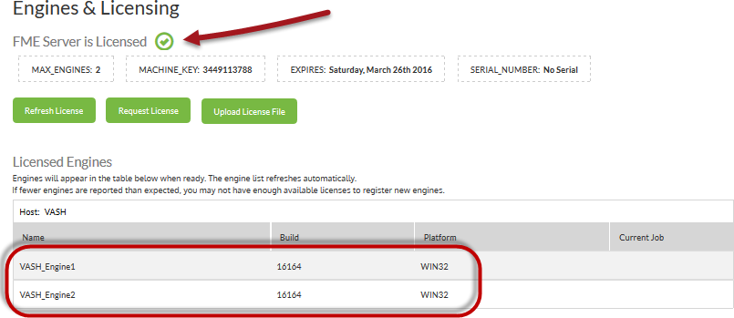
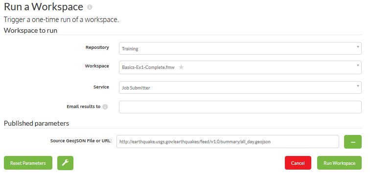
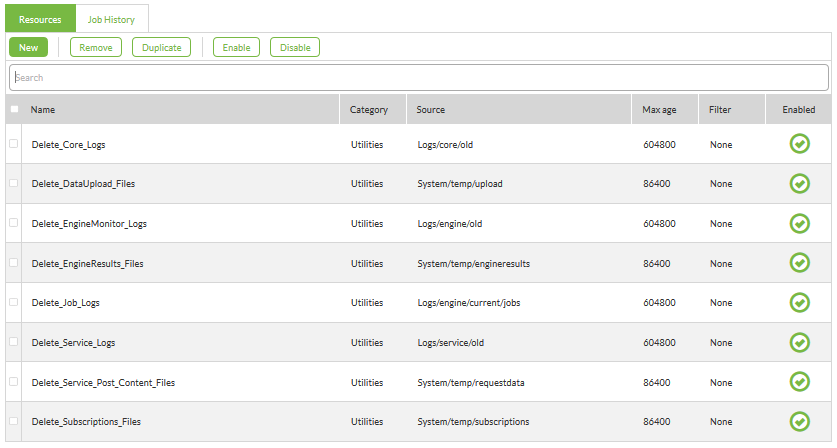

<!--Instructor Notes-->
<!--This exercise uses a basic amount of FME Workbench as a test for students-->
<!--If students have problems now, it is unlikely they will have much success at further exercises-->

<!--Exercise Section-->

<table style="border-spacing: 0px;border-collapse: collapse;font-family:serif">
<tr>
<td width=25% style="vertical-align:middle;background-color:darkorange;border: 2px solid darkorange">
<i class="fa fa-cogs fa-lg fa-pull-left fa-fw" style="color:white;padding-right: 12px;vertical-align:text-top"></i>
Exercise 2 
</td>
<td style="border: 2px solid darkorange;background-color:darkorange;color:white">
Earthquake Processing
</td>
</tr>

<tr>
<td style="border: 1px solid darkorange; font-weight: bold">Data</td>
<td style="border: 1px solid darkorange">Earthquakes (GeoJSON)</td>
</tr>

<tr>
<td style="border: 1px solid darkorange; font-weight: bold">Overall Goal</td>
<td style="border: 1px solid darkorange">Create a workspace to read and process earthquake data and publish it to FME Server</td>
</tr>

<tr>
<td style="border: 1px solid darkorange; font-weight: bold">Demonstrates</td>
<td style="border: 1px solid darkorange">Examining the FME Server interface and running a workspace</td>
</tr>

<tr>
<td style="border: 1px solid darkorange; font-weight: bold">Start Workspace</td>
<td style="border: 1px solid darkorange">N/A</td>
</tr>

<tr>
<td style="border: 1px solid darkorange; font-weight: bold">End Workspace</td>
<td style="border: 1px solid darkorange">N/A</td>
</tr>

</table>

---

You're a technical analyst in the GIS department of your local city. You have plenty of experience using FME Desktop, and your department is now investigating FME Server to evaluate its capabilities.

After creating a workspace to read a feed of earthquake data, and publishing it to FME Server, you now wish to log in to Server to run that workspace. 

 **1) Connect to Server**
 To log in to the server interface either select the Web User Interface option from the start menu or - in your web browser - enter the address to your FME Server.

---

<table style="border-spacing: 0px">
<tr>
<td style="vertical-align:middle;background-color:darkorange;border: 2px solid darkorange">
<i class="fa fa-info-circle fa-lg fa-pull-left fa-fw" style="color:white;padding-right: 12px;vertical-align:text-top"></i>
TIP
</td>
</tr>

<tr>
<td style="border: 1px solid darkorange">

When FME Server is installed on either physical or virtual hardware, the address is http://&lt;servername&gt;/fmeserver
  If you are using FME Cloud, then the address is: http://&lt;server name&gt;.fmecloud.com/fmeserver

</td>
</tr>
</table>

---

This will open the web user interface login screen for the FME Server being used. Bookmark this web address, since you will use this link quite often.

 **2) Log In to Server**
 In the User Login dialog, enter a username and password for your FME Server account. A common username/password combination for a training installation is admin/admin

Click the Login button.

 **3) Examine the User Interface**
 This is your primary method for interacting with FME Server.

The first thing we should do is make sure FME Server is running correctly (the fact that we could log in is a good sign) and that we are licensed and have engines running.

Click Manage &gt; Administration &gt; Engines & Licensing on the menu of the interface. This will open up the licensing section. You should see a message informing you that FME Server is licensed and a list of the engines available:

---

<table style="border-spacing: 0px">
<tr>
<td style="vertical-align:middle;background-color:darkorange;border: 2px solid darkorange">
<i class="fa fa-info-circle fa-lg fa-pull-left fa-fw" style="color:white;padding-right: 12px;vertical-align:text-top"></i>
TIP
</td>
</tr>

<tr>
<td style="border: 1px solid darkorange">

If your machine is unlicensed, or is missing engines, then check with your instructor for troubleshooting tips

</td>
</tr>
</table>

---

 **4) Select Workspace**
 Click the Home button on the menubar (or the FME icon in the top-left) to return to the Server interface home page. Notice that the workspace created in the previous exercise is listed under Last Published Workspaces:

Click on this entry to open the web page for this workspace.

 **5) Run Workspace**
 The workspace page shows very few options, because this workspace did not have many published parameters:

So, simply click the Run button to run the workspace. The workspace will run to completion.

 **6) Examine Jobs Page**
 Click Manage &gt; Jobs on the menu. A list of previously run jobs will open, including the one we just ran:

Click on your job to inspect the results in more detail. You will be able to see the job ID number; the different times at which it was submitted, queued, and run; the exact request made to FME Server; and the full results of the translation. You may also click the View Log button to inspect the FME translation log file.

---

<!--Person X Says Section-->

<table style="border-spacing: 0px">
<tr>
<td style="vertical-align:middle;background-color:darkorange;border: 2px solid darkorange">
<i class="fa fa-quote-left fa-lg fa-pull-left fa-fw" style="color:white;padding-right: 12px;vertical-align:text-top"></i>
Police Chief Webb-Mapp says...
</td>
</tr>

<tr>
<td style="border: 1px solid darkorange">

Remember, this workspace did not write any data, only sent it to the Logger. So, for now, to view any results search for them in the log file.

</td>
</tr>
</table>

---

Well done. You have now run a workspace on FME Server. But there are some more parts of the interface we should look into. 

---

<!--Advanced Exercise Section-->

<table style="border-spacing: 0px">
<tr>
<td style="vertical-align:middle;background-color:darkorange;border: 2px solid darkorange">
<i class="fa fa-cogs fa-lg fa-pull-left fa-fw" style="color:white;padding-right: 12px;vertical-align:text-top"></i>
Advanced Exercise
</td>
</tr>

<tr>
<td style="border: 1px solid darkorange">

If you have time, carry out the following steps to explore the FME Server web interface in a little more detail.

</td>
</tr>
</table>

---

 **7) Open Resources Page**
 Click Manage &gt; Resources on the menu. This opens the Resources page. Feel free to explore the different folders. In particular inspect the Engine folder, which is the location for custom tools that you might want to include in a translation:

Also check the data folder and, if you wish, upload some files from the C:\FMEData2017 folder.

 **8) Check Cleanup Tools**
 Click Manage &gt; Administration &gt; System Cleanup on the menu. This opens the dialog where all automated cleanup tasks are defined. 

Take a look at the different cleanup tasks that are available. Note that the times are all specified in seconds. 

---

<!--Person X Says Section-->

<table style="border-spacing: 0px">
<tr>
<td style="vertical-align:middle;background-color:darkorange;border: 2px solid darkorange">
<i class="fa fa-quote-left fa-lg fa-pull-left fa-fw" style="color:white;padding-right: 12px;vertical-align:text-top"></i>
Police Chief Webb-Mapp says...
</td>
</tr>

<tr>
<td style="border: 1px solid darkorange">

If you change one of these parameters, don't expect it to take effect immediately. For example, if you change the job logs time to be 1 second, they won't all disappear within a second. FME Server only runs these tasks every hour, so it could be up to 60 minutes before the changes have any effect.

</td>
</tr>
</table>

---

<!--Exercise Congratulations Section--> 

<table style="border-spacing: 0px">
<tr>
<td style="vertical-align:middle;background-color:darkorange;border: 2px solid darkorange">
<i class="fa fa-thumbs-o-up fa-lg fa-pull-left fa-fw" style="color:white;padding-right: 12px;vertical-align:text-top"></i>
CONGRATULATIONS
</td>
</tr>

<tr>
<td style="border: 1px solid darkorange">

By completing this exercise you have learned how to:
 
<ul><li>Log in to FME Server and check that it is running and licensed</li>
<li>Locate a workspace using the Last Published list</li>
<li>Run a workspace and inspect the job history to confirm it ran correctly</li>
<li>Find and upload resources to FME Server</li>
<li>Check the parameters for cleanup tools</li></ul>

</td>
</tr>
</table>
