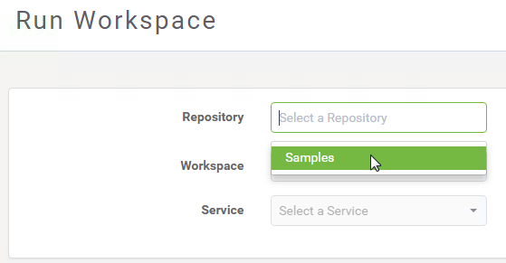
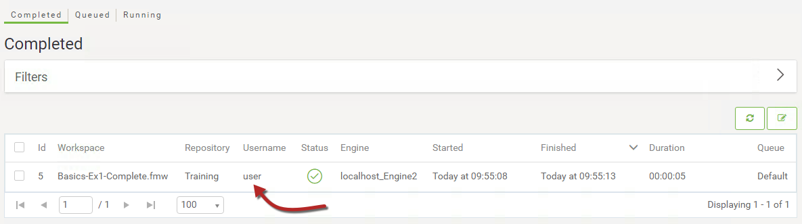
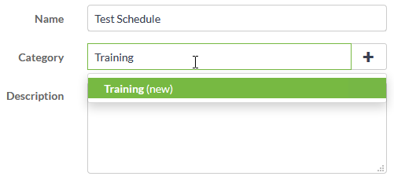
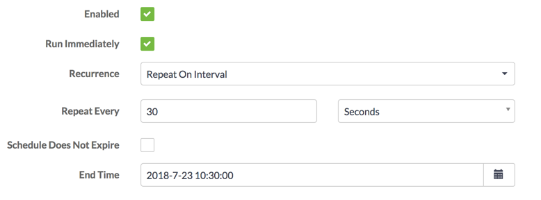
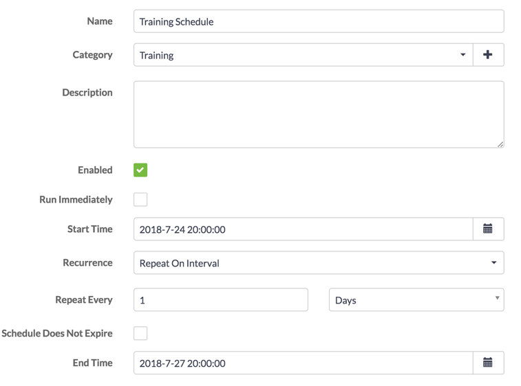

<!--Exercise Section-->

<table style="border-spacing: 0px;border-collapse: collapse;font-family:serif">
<tr>
<td width=25% style="vertical-align:middle;background-color:darkorange;border: 2px solid darkorange">
<i class="fa fa-cogs fa-lg fa-pull-left fa-fw" style="color:white;padding-right: 12px;vertical-align:text-top"></i>
Exercise 3
</td>
<td style="border: 2px solid darkorange;background-color:darkorange;color:white">
Daily Database Updates: Sharing and Scheduling
</td>
</tr>

<tr>
<td style="border: 1px solid darkorange; font-weight: bold">Data</td>
<td style="border: 1px solid darkorange">Firehalls (GML) Neighborhoods (KML)</td>
</tr>

<tr>
<td style="border: 1px solid darkorange; font-weight: bold">Overall Goal</td>
<td style="border: 1px solid darkorange">Create a workspace to read and process departmental data and publish it to FME Server</td>
</tr>

<tr>
<td style="border: 1px solid darkorange; font-weight: bold">Demonstrates</td>
<td style="border: 1px solid darkorange">Sharing and scheduling a translation in FME Server</td>
</tr>

<tr>
<td style="border: 1px solid darkorange; font-weight: bold">Start Workspace</td>
<td style="border: 1px solid darkorange">None</td>
</tr>

<tr>
<td style="border: 1px solid darkorange; font-weight: bold">End Workspace</td>
<td style="border: 1px solid darkorange">None</td>
</tr>

</table>

---

You have already (in Exercises 1 and 2) created a workspace to carry out this translation, published it to FME Server, and run it to confirm it works.

As a daily task, you plan to run the translation every day after work. However... what happens if you are not there or leave early, or someone else stays late. Who will run it then?

Firstly you should ensure other users have access to the workspace to run it, but you can also set it up to run on an automatic schedule.

 **1) Connect to Server**
 Browse to the login page of the FME Server interface, either by starting it through the Web Interface option on the start menu or by logging out if you are already logged in.

This time, log in using the generic user account that is a default account on any FME Server installation. The username is ***user*** and the password is ***user*** as well!

The first thing you'll notice is that the menu and functionality is much more restricted for this account:

In fact, if you try to run a workspace you'll find that the only repository this account has access to is the Samples repository; not Training where the existing workspace resides:

 **2) Share Repository**
 Log out of the user account and log back in as an administrator (admin/admin).

Now you have the full set of menu entries, click Repositories on the menu. Under the list of repositories locate the Training repository. Click the Share icon to the right:

In the Sharing Options dialog, select fmeuser as the role to share with, and allow them to run the workspace:

By selecting the *fmeuser* role (rather than the single *user* account), we allow anyone who is tagged as a user to access the workspace; and by allowing them only the run capability, we prevent them downloading and making edits to our workspace.

 **3) Check Sharing**
 Log out of the administrator account and log back into FME Server with the user account (user/user).

This time, you should have access to the Training repository. Click Run Workspace, select your workspace in the Training repository and run it.  Check the Completed Jobs page, and you'll see one entry for the workspace when it was run as the user. Check the Jobs page, and you'll see one entry for the workspace when it was run as the user. There is only one entry because the user does not have the privileges required to view any other users' jobs:

Log out again and log back in as an administrator. Now, in the Jobs | Completed window, you should be able to see both the administrator's jobs and the user's jobs

That's because the administrator group does have permission to view all jobs.

 **4) Create Test Schedule**
 Now we've allowed other users to run the workspace on demand, but we should also set up the translation to run on a schedule.

Firstly, just to confirm that scheduling does work, let's set up a test schedule. Click Schedules on the menu and, in the Schedules page, click the New button to start the process.

Set a name of Test Schedule and add it to a Training category by typing Training into the Category field:

For the time settings, set the schedule to start immediately and run every 30 seconds. Uncheck the box beside Schedule Does Not Expire and set the end time to be approximately 30 minutes into the future (that way if we forget to cancel the schedule it won't carry on forever!)

Be aware that the times are given in 24-hour format, so 1:30 means AM and 13:30 means PM. It is also important to note that this time is the local time of the machine on which you are running the web browser that is connected to FME Server. Keep this in mind if your FME Server is on a machine in a different time zone from the machine where you are accessing FME Server.

Under Workspace Settings, select the Training repository and within that the workspace previously uploaded (Basics-Ex1-Complete.fmw):

There are no user parameters we need to change for this workspace so any can be ignored.

Now click OK to add the new schedule.

 **5) Examine Jobs Page**
 Open the Jobs page. A list of previously run jobs will open. You will find (if it was set up correctly) that there will be jobs running to schedule:

Notice that the username is set to admin; since that is the user who created the schedule, that is the username under which the job will be run.

 **6) Create Actual Schedule**
 Now we are confident that we know how to use the interface, let's set up an actual schedule. We want the workspace to run, say, every day of the week. There should also be no end date.

So, return to the Schedules page. You may now either:

- Click on the Test schedule and edit it to the required values
- Delete the test schedule and create a new one with the required values

This setup will run the workspace at 8:00pm every day. Don't forget to click the OK button!

You may wish to check back periodically during this training to ensure the workspace runs as expected.

---

<!--Exercise Congratulations Section-->

<table style="border-spacing: 0px">
<tr>
<td style="vertical-align:middle;background-color:darkorange;border: 2px solid darkorange">
<i class="fa fa-thumbs-o-up fa-lg fa-pull-left fa-fw" style="color:white;padding-right: 12px;vertical-align:text-top"></i>
CONGRATULATIONS
</td>
</tr>

<tr>
<td style="border: 1px solid darkorange">

By completing this exercise you have learned how to:
 
<ul><li>Share a repository in FME Server and tested to ensure it is available to the right users</li>
<li>Schedule a translation in FME Server</li>
<li>Check the job history to ensure the scheduled translation took place</li></ul>

</td>
</tr>
</table>
