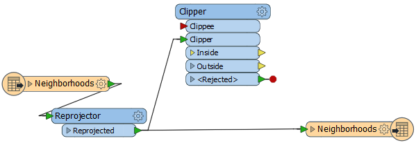

<!--Exercise Section-->

<table style="border-spacing: 0px;border-collapse: collapse;font-family:serif">
<tr>
<td width=25% style="vertical-align:middle;background-color:darkorange;border: 2px solid darkorange">
<i class="fa fa-cogs fa-lg fa-pull-left fa-fw" style="color:white;padding-right: 12px;vertical-align:text-top"></i>
Exercise 4
</td>
<td style="border: 2px solid darkorange;background-color:darkorange;color:white">
Daily Database Updates: Publishing Data
</td>
</tr>

<tr>
<td style="border: 1px solid darkorange; font-weight: bold">Data</td>
<td style="border: 1px solid darkorange">Firehalls (GML) Neighborhoods (KML) Election Voting (GML)</td>
</tr>

<tr>
<td style="border: 1px solid darkorange; font-weight: bold">Overall Goal</td>
<td style="border: 1px solid darkorange">Create a workspace to read and process departmental data and publish it to FME Server</td>
</tr>

<tr>
<td style="border: 1px solid darkorange; font-weight: bold">Demonstrates</td>
<td style="border: 1px solid darkorange">Publishing source data and uploading temporary datasets</td>
</tr>

<tr>
<td style="border: 1px solid darkorange; font-weight: bold">Start Workspace</td>
<td style="border: 1px solid darkorange">C:\FMEData2017\Workspaces\ServerAuthoring\Basics-Ex4-Begin.fmw</td>
</tr>

<tr>
<td style="border: 1px solid darkorange; font-weight: bold">End Workspace</td>
<td style="border: 1px solid darkorange">C:\FMEData2017\Workspaces\ServerAuthoring\Basics-Ex4-Complete.fmw</td>
</tr>

</table>

---

For the exercises in this chapter, you are a technical analyst in the GIS department of your local city. 

You have already (Exercises 1, 2, and 3) created a workspace to carry out a translation, published it to FME Server, ran it to confirm it works, shared the repository, and set the workspace to run on a schedule.

Now you have a task to create a new workspace. One of the datasets it uses is the same as in the previous exercise, so we will try to have this second workspace use the data belonging to the first.

---

<!--Person X Says Section-->

<table style="border-spacing: 0px">
<tr>
<td style="vertical-align:middle;background-color:darkorange;border: 2px solid darkorange">
<i class="fa fa-quote-left fa-lg fa-pull-left fa-fw" style="color:white;padding-right: 12px;vertical-align:text-top"></i>
Sister Intuitive says...
</td>
</tr>

<tr>
<td style="border: 1px solid darkorange">

If you have lots of experience with FME Workbench - <strong>and if your instructor agrees</strong> - simply open the workspace listed in the header above and skip to step 7

</td>
</tr>
</table>

---

 **1) Inspect Source Data**
 The first task in any new project is to inspect the source data, so let's do that. Use the FME Data Inspector to open these two datasets:

<table style="border: 0px">

<tr>
<td style="font-weight: bold">Reader Format</td>
<td style="">GML (Geography Markup Language)</td>
</tr>

<tr>
<td style="font-weight: bold">Reader Dataset</td>
<td style="">C:\FMEData2017\Data\Elections\ElectionVoting.gml</td>
</tr>

</table>

You can turn off the layer of VotingDivisions. All we are interested in for this exercise are the point features designated as VotingPlaces:

 Map tiles by <a href="http://stamen.com">Stamen Design</a>, under <a href="http://creativecommons.org/licenses/by/3.0">CC-BY-3.0</a>. Data by <a href="http://openstreetmap.org">OpenStreetMap</a>, under <a href="http://creativecommons.org/licenses/by-sa/3.0">CC-BY-SA</a>.

 **2) Create Workspace**
 Open the starting workspace listed above. 

You might notice that it's a copy of our previous project, since the requirements for this workspace as so similar. If you do choose to just carry on working in that workspace, be sure to save it under a different name - otherwise the data we will publish will not work for this exercise.

The workspace looks like this:

 **3) Remove Firehalls**
 For this project we need to process election data instead of firehalls, so firstly delete the writer feature type for the firehalls, and then the reader feature type.

When you delete the reader feature type, you will be asked if you wish to delete the entire reader. We could reuse it but, for the sake of simplicity, click yes.

The workspace now looks like this:

 **4) Add VotingPlaces**
 Now... 

---

 **7) Publish to Server**
 Now we should publish the workspace to Server. We'll experiment by publishing one dataset with the workspace and uploading one through the web interface when we run the workspace.

So, start the FME Server publishing wizard (File &gt; Publish to Server).

Specify the connection parameters as usual. Choose Training as the repository to upload to, but then check the Upload Data Files box and click the Select Files button:

In the Select Files dialog, deselect the five files belonging to the Shape dataset, and leave only the CSV file selected:

You will receive a warning about the lack of Shape data, but that can be ignored. Finish the publishing process by registering the workspace with the Job Submitter and Data Download services.

 **8) Run On Server**
 Now open the FME Server web interface and select the workspace we just published (if you visit the home page it will be in the Last Published Workspaces section). 

Firstly make sure the Service parameter is set to Data Download.

Next check the Published Parameters section. The source CSV is set to be read from the dataset published with the workspace. For the Shape dataset click the browse button:

 

In the dialog that opens, make sure it is on the Temporary Uploads tab, then click the Upload button:

Browse to and select the five files in the Shape dataset and click OK to upload them:

---

Click the "garbage can" icon to remove the currently chosen dataset:

Now click the .shp file you uploaded (you only need to select the .shp file now, not all five files), then click the add button to add it as the newly chosen dataset:

Click OK to close the dialog. Click the Run Workspace button to run the workspace.

The workspace runs using a mixture of published data and a temporary upload of Shape data. 

 **9) Check Logs**
 If you had correctly selected the Data Download service, running the workspace would have returned a link through which to download a dataset of the output. For now, don't click that.

Click the Home button instead, and then click the translation just carried out in the Last Run Workspaces section:

This will open the job summary page for the workspace. Notice that you can view the FME log file, but also download the result of the translation, as the URL to access it is also recorded here.

<!--Exercise Congratulations Section--> 

<table style="border-spacing: 0px">
<tr>
<td style="vertical-align:middle;background-color:darkorange;border: 2px solid darkorange">
<i class="fa fa-thumbs-o-up fa-lg fa-pull-left fa-fw" style="color:white;padding-right: 12px;vertical-align:text-top"></i>
CONGRATULATIONS
</td>
</tr>

<tr>
<td style="border: 1px solid darkorange">

By completing this exercise you have learned how to:
 
<ul><li>Create a workspace using two Readers and find features within X radius of another</li>
<li>Publish a workspace to FME Server and include source data</li>
<li>Select a source dataset to upload temporarily at run-time</li>
<li>Locate a data download result through a workspace summary page</li></ul>

</td>
</tr>
</table>