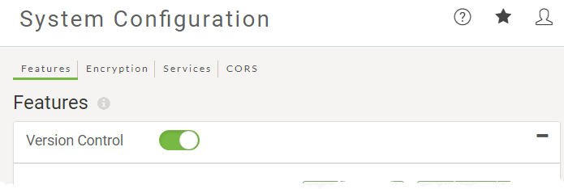
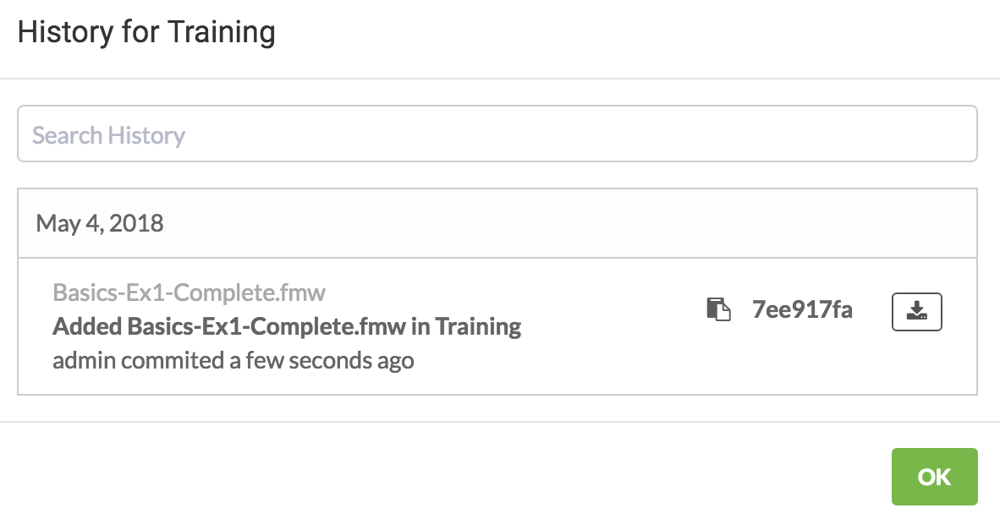

<!--Exercise Section-->

<table style="border-spacing: 0px;border-collapse: collapse;font-family:serif">
<tr>
<td width=25% style="vertical-align:middle;background-color:darkorange;border: 2px solid darkorange">
<i class="fa fa-cogs fa-lg fa-pull-left fa-fw" style="color:white;padding-right: 12px;vertical-align:text-top"></i>
Exercise 3
</td>
<td style="border: 2px solid darkorange;background-color:darkorange;color:white">
Daily Database Updates: Adding to Version History
</td>
</tr>

<tr>
<td style="border: 1px solid darkorange; font-weight: bold">Data</td>
<td style="border: 1px solid darkorange">Firehalls (GML) Neighborhoods (KML)</td>
</tr>

<tr>
<td style="border: 1px solid darkorange; font-weight: bold">Overall Goal</td>
<td style="border: 1px solid darkorange">Commit a copy of the workspace built in the previous exercises to Version History on FME Server.</td>
</tr>

<tr>
<td style="border: 1px solid darkorange; font-weight: bold">Demonstrates</td>
<td style="border: 1px solid darkorange">Interacting with Version History tools</td>
</tr>

<tr>
<td style="border: 1px solid darkorange; font-weight: bold">Start Workspace</td>
<td style="border: 1px solid darkorange">None</td>
</tr>

<tr>
<td style="border: 1px solid darkorange; font-weight: bold">End Workspace</td>
<td style="border: 1px solid darkorange">None</td>
</tr>

</table>

---

You have already (in Exercises 1, 2, and 3) created a workspace to carry out this translation, published it to FME Server, run it to confirm it works, and scheduled it to run daily.

You would now like to 'checkpoint' this working version of the workspace to ensure that you can always come back to this state if any edits are made to it in the future.

 **1) Connect to Server**
 Browse to the log in page of the FME Server interface, and log in using the administrator account (admin/admin).

 **2) Turn on Version Control**
 Version Control will be turned off by default, so you'll need to switch it on before you can use it. Click System Configuration > Features in the Admin part of the interface menu. Locate the Version Control settings on that page and simply toggle the switch to turn on Version Control.

Don't worry about the other settings on that page for now, just leave them with the default values.

 **3) Add Workspace to Version History**
 As the database update workspace has already been published to FME Server, you can add it to the version history from the web interface. Go to the Repositories page and open the Training repository. Select the checkbox beside the workspace and click Commit.

Add a meaningful commit comment for this version fo the workspace and click Commit to add it to the history.

 **4) Check Version History**
 Confirm that this new version has been added to your Version History. Go to the Repositories page and open the Training Repository.Select the checkbox beside the workspace and click the History button to see the information about the workspace version you just committed.

---

<!--Exercise Congratulations Section-->

<table style="border-spacing: 0px">
<tr>
<td style="vertical-align:middle;background-color:darkorange;border: 2px solid darkorange">
<i class="fa fa-thumbs-o-up fa-lg fa-pull-left fa-fw" style="color:white;padding-right: 12px;vertical-align:text-top"></i>
CONGRATULATIONS
</td>
</tr>

<tr>
<td style="border: 1px solid darkorange">

By completing this exercise you have learned how to:
 
<ul><li>Commit a new version of a workspace to Version History</li>
<li>View the version history for a Repository</li>

</td>
</tr>
</table>
