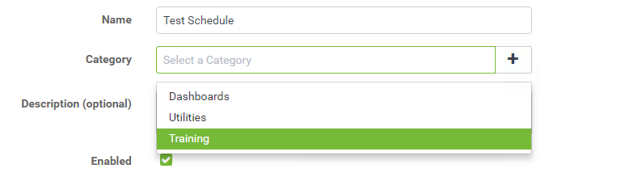
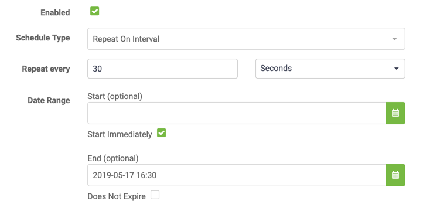
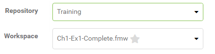
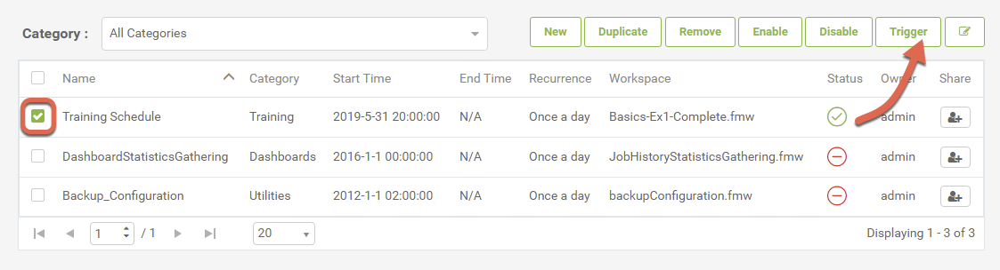
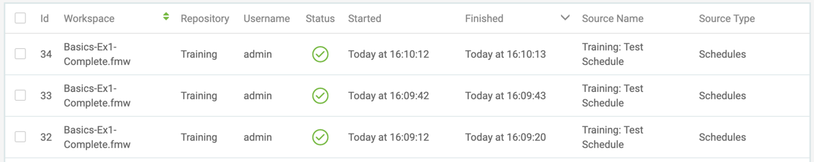

<!--Exercise Section-->

<table style="border-spacing: 0px;border-collapse: collapse;font-family:serif">
<tr>
<td width=25% style="vertical-align:middle;background-color:darkorange;border: 2px solid darkorange">
<i class="fa fa-cogs fa-lg fa-pull-left fa-fw" style="color:white;padding-right: 12px;vertical-align:text-top"></i>
Exercise 1.4
</td>
<td style="border: 2px solid darkorange;background-color:darkorange;color:white">
Daily Database Updates: Workspace Scheduling
</td>
</tr>

<tr>
<td style="border: 1px solid darkorange; font-weight: bold">Data</td>
<td style="border: 1px solid darkorange">Firehalls (GML) Neighborhoods (KML)</td>
</tr>

<tr>
<td style="border: 1px solid darkorange; font-weight: bold">Overall Goal</td>
<td style="border: 1px solid darkorange">Create a workspace to read and process departmental data and publish it to FME Server</td>
</tr>

<tr>
<td style="border: 1px solid darkorange; font-weight: bold">Demonstrates</td>
<td style="border: 1px solid darkorange">Schedule a workspace to run automatically on FME Server </td>
</tr>

<tr>
<td style="border: 1px solid darkorange; font-weight: bold">Start Workspace</td>
<td style="border: 1px solid darkorange">None</td>
</tr>

<tr>
<td style="border: 1px solid darkorange; font-weight: bold">End Workspace</td>
<td style="border: 1px solid darkorange">None</td>
</tr>

</table>

---

You have already (in Exercises 1, 2, and 3) created a workspace to carry out this translation, published it to FME Server, run it to confirm it works, and committed it to version history.

As a daily task, you plan to run the translation every day after work. However... what happens if you are not there or leave early? How can you make sure it runs every day at the same time then?

This is where Scheduling comes in handy. You can set up the workspace to run on an automatic schedule so you don't have to remember to run it daily.

 **1) Connect to Server**
 Browse to the login page of the FME Server interface, and log in using the administrator account (admin/FMElearnings).

 **2) Create Schedule**
 Now let's create a new schedule. Expand Schedules on the side menu and select Build Schedule.

Set a name of Test Schedule, then create a new Category named Training, by clicking on the plus sign (+):

Change the Schedule Type to Repeat on Interval. Set the Repeat Every to 1 Days at 9am, then enable Start Immediately. Then leave the end time blank, and ensure that Does Not Expire is enabled.

Be aware that the times are given in 24-hour format, so 1:30 means AM and 13:30 means PM. It is also important to note that this time is the local time of the machine on which you are running the web browser that is connected to FME Server. Keep this in mind if your FME Server is on a machine in a different time zone from the machine where you are accessing FME Server.

Under Workspace Settings, select the Training repository and within that the workspace previously uploaded (Ch-Ex1-Complete.fmw):

There are no user parameters we need to change for this workspace, so any can be ignored.

Now click OK to add the new schedule.

 **3) Trigger Schedule**
 Our schedule is set up to run every day at 9am, depending on what time you are taking this course, you might have to wait until tomorrow to see the schedule in action. Thankfully, we can trigger the schedule to run whenever we want. This is great for testing purposes or whenever you might need the workspace to run.

On the Manage Schedules page, select the Test Schedule schedule we just made and then click the Actions drop-down and select Trigger.

 **4) Examine Jobs Page**
 Open the Jobs page. A list of previously run jobs will open. You will see the workspace we triggered with the schedule. You can tell it was the workspace associated with the schedule as schedule will appear under Source Type.

Notice that the username is set to admin; since that is the user who created the schedule, that is the username under which the job will be run.

---

<!--Exercise Congratulations Section-->

<table style="border-spacing: 0px">
<tr>
<td style="vertical-align:middle;background-color:darkorange;border: 2px solid darkorange">
<i class="fa fa-thumbs-o-up fa-lg fa-pull-left fa-fw" style="color:white;padding-right: 12px;vertical-align:text-top"></i>
CONGRATULATIONS
</td>
</tr>

<tr>
<td style="border: 1px solid darkorange">

By completing this exercise you have learned how to:
 
<ul><li>Schedule a translation in FME Server</li>
<li>Trigger a schedule</li>
<li>Check the job history to ensure the scheduled translation took place</li></ul>

</td>
</tr>
</table>
