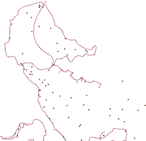
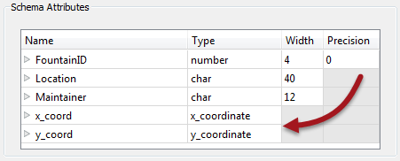
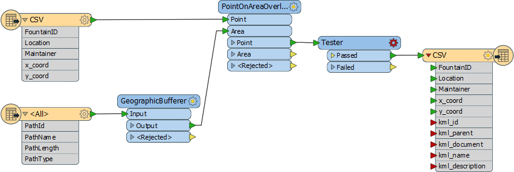
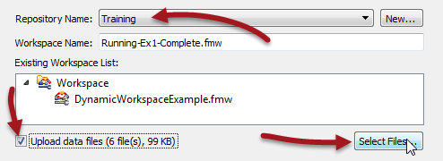
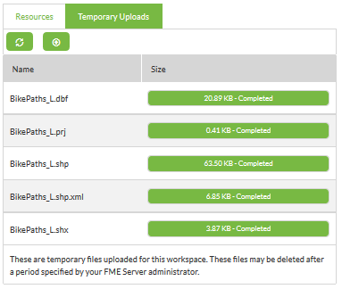
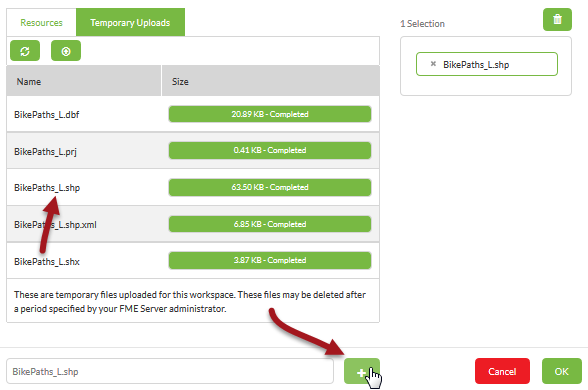

<!--Instructor Notes-->

<!--Exercise Section-->

<table style="border-spacing: 0px;border-collapse: collapse;font-family:serif">
<tr>
<td width=25% style="vertical-align:middle;background-color:darkorange;border: 2px solid darkorange">
<i class="fa fa-cogs fa-lg fa-pull-left fa-fw" style="color:white;padding-right: 12px;vertical-align:text-top"></i>
Exercise 1
</td>
<td style="border: 2px solid darkorange;background-color:darkorange;color:white">

</td>
</tr>

<tr>
<td style="border: 1px solid darkorange; font-weight: bold">Data</td>
<td style="border: 1px solid darkorange">Cycle Paths (Esri Shapefile) Drinking Fountains (CSV (Comma Separated Value))</td>
</tr>

<tr>
<td style="border: 1px solid darkorange; font-weight: bold">Overall Goal</td>
<td style="border: 1px solid darkorange">Create an FME Server-hosted workspace to identify drinking fountains with 20 metres of a cycle path</td>
</tr>

<tr>
<td style="border: 1px solid darkorange; font-weight: bold">Demonstrates</td>
<td style="border: 1px solid darkorange">Publishing source data and making temporary data uploads</td>
</tr>

<tr>
<td style="border: 1px solid darkorange; font-weight: bold">Start Workspace</td>
<td style="border: 1px solid darkorange">None</td>
</tr>

<tr>
<td style="border: 1px solid darkorange; font-weight: bold">End Workspace</td>
<td style="border: 1px solid darkorange">C:\FMEData2016\Workspaces\ServerAuthoring\Running-Ex1-Complete.fmw</td>
</tr>

</table>

---

You're a technical analyst in the GIS department of your local city. You have plenty of experience using FME Desktop, and your department has just purchased FME Server.

Today's task for you is to use two datasets - cycle paths and drinking fountains - to figure out which drinking fountains are close (within 20 metres) of a cycle route. The output is to be written as a KML dataset.

You can easily do this using FME Desktop, and decide to publish it to FME Server too so that users can upload their own set of cycle paths.

---

<!--Person X Says Section-->

<table style="border-spacing: 0px">
<tr>
<td style="vertical-align:middle;background-color:darkorange;border: 2px solid darkorange">
<i class="fa fa-quote-left fa-lg fa-pull-left fa-fw" style="color:white;padding-right: 12px;vertical-align:text-top"></i>
Sister Intuitive says...
</td>
</tr>

<tr>
<td style="border: 1px solid darkorange">

If you have lots of experience with FME Workbench - <strong>and if your instructor agrees</strong> - simply open the workspace listed in the header above and skip to step 7

</td>
</tr>
</table>

---

 **1) Inspect Source Data**
 The first task in any new project is to inspect the source data, so let's do that. Use the FME Data Inspector to open these two datasets:

<table style="border: 0px">

<tr>
<td style="font-weight: bold">Reader Format</td>
<td style="">Esri Shapefile</td>
</tr>

<tr>
<td style="font-weight: bold">Reader Dataset</td>
<td style="">C:\FMEData2016\Data\Transportation\Cycling\BikePaths_L.shp</td>
</tr>

</table>

<table style="border: 0px">

<tr>
<td style="font-weight: bold">Reader Format</td>
<td style="">CSV (Comma Separated Value)</td>
</tr>

<tr>
<td style="font-weight: bold">Reader Dataset</td>
<td style="">C:\FMEData2016\Data\Engineering\DrinkingFountains.csv</td>
</tr>

</table>

You can view the CSV data as a table only, or you can set the Schema Attributes (in the parameters dialog) to ensure the X/Y coordinate fields are interpreted as coordinate values. The data will look like this:

 **2) Create Workspace**
 Having seen what the data looks like, let's create a workspace to process it. Start FME Workbench and select the Generate Workspace tool. When prompted create the workspace with these parameters:

<table style="border: 0px">

<tr>
<td style="font-weight: bold">Reader Format</td>
<td style="">CSV (Comma Separated Value)</td>
</tr>

<tr>
<td style="font-weight: bold">Reader Dataset</td>
<td style="">C:\FMEData2016\Data\Engineering\DrinkingFountains.csv</td>
</tr>

<tr>
<td style="font-weight: bold">Reader Parameters</td>
<td style="">Coordinate System: utm83-10 Schema Attributes: x_coord, type = x_coordinate Schema Attributes: y_coord, type = y_coordinate  </td>
</tr>

<tr>
<td style="font-weight: bold">Writer Format</td>
<td style="">Google KML</td>
</tr>

<tr>
<td style="font-weight: bold">Writer Dataset</td>
<td style="">C:\FMEData2016\Output\DrinkingFountains.kml</td>
</tr>

</table>

 **3) Add Cycle Path Reader**
 The workspace, at this point, looks like this:

You'll notice that the reason we created the workspace with the CSV data is because it contains the attributes we want on the output. But now we should also add the cycle path data.

Select Readers &gt; Add Reader from the menubar. When prompted select the source data as follows:

<table style="border: 0px">

<tr>
<td style="font-weight: bold">Reader Format</td>
<td style="">Esri Shapefile</td>
</tr>

<tr>
<td style="font-weight: bold">Reader Dataset</td>
<td style="">C:\FMEData2016\Data\Transportation\Cycling\BikePaths_L.shp</td>
</tr>

<tr>
<td style="font-weight: bold">Workflow Option</td>
<td style="">Single Merged Feature Type</td>
</tr>

</table>

Click OK to add the Reader to the workspace. The reason we selected the Merged Feature Type option is because there are other cycle path datasets in that folder that we may wish to read in the future, and this option will allow each data file to pass into the workspace. 

 **4) Add Transformers**
 There are various ways we could find the closest water fountains to the cycle paths, but the simplest is perhaps to buffer the cycle paths, overlay the two datasets, and then check for overlaps. 

To do this requires three transformers: a GeographicBufferer, a PointOnAreaOverlayer, and a Tester. Place one instance of each transformer and connect them up in this configuration:

- CSV Reader &gt; PointOnAreaOverlayer:Point
- Cycle Reader &gt; GeographicBufferer:Input
- GeographicBuffer:Output &gt; PointOnAreaOverlayer:Area
- PointOnAreaOverlayer:Point &gt; Tester
- Tester:Passed &gt; KML Writer 

 **5) Set Transformer Parameters**
 Now the transformers are placed, let's set the parameters. 

- GeographicBufferer: Units=Metres, Distance=20
- PointOnAreaOverlayer: None
- Tester: Test Clause: _overlaps >= 1

These parameters will ensure we create a 20m buffer around each cycle path, count the number of times a drinking fountain overlaps the buffer, and filter through only drinking fountains with a count of 1 or greater.
 

 **6) Set Writer Schema**
 The only last thing to do is clean up the writer schema. We don't need to write out the x_coord or y_coord attributes in the output, and we don't need to see the kml attributes that have been exposed. Plus the feature type name for the output should be something other than "CSV".

So open the feature type properties for the KML Writer feature type.

In the general tab change the name from CSV to CyclePathFountains. In the user attributes tab remove the x_coord and y_coord attribute and any other kml attributes that have been added.

The result will look like this:

Save the workspace and run it to make sure the output looks correct.

---

<!--Person X Says Section-->

<table style="border-spacing: 0px">
<tr>
<td style="vertical-align:middle;background-color:darkorange;border: 2px solid darkorange">
<i class="fa fa-quote-left fa-lg fa-pull-left fa-fw" style="color:white;padding-right: 12px;vertical-align:text-top"></i>
Sister Intuitive says...
</td>
</tr>

<tr>
<td style="border: 1px solid darkorange">

If the workspace fails with the error KML: Feature does not have a coordinate system specified then you did not set the coordinate system when you generated the workspace. Find the Reader coordinate system parameter in the Navigator window, set it to utm83-10, and try again!

</td>
</tr>
</table>

---

 **7) Publish to Server**
 Now we should publish the workspace to Server. We'll experiment by publishing one dataset with the workspace and uploading one through the web interface when we run the workspace.

So, start the FME Server publishing wizard (File &gt; Publish to Server).

Specify the connection parameters as usual. Choose Training as the repository to upload to, but then check the Upload Data Files box and click the Select Files button:

In the Select Files dialog, deselect the five files belonging to the Shape dataset, and leave only the CSV file selected:

You will receive a warning about the lack of Shape data, but that can be ignored. Finish the publishing process by registering the workspace with the Job Submitter and Data Download services.

 **8) Run On Server**
 Now open the FME Server web interface and select the workspace we just published (if you visit the home page it will be in the Last Published Workspaces section). 

Firstly make sure the Service parameter is set to Data Download.

Next check the Published Parameters section. The source CSV is set to be read from the dataset published with the workspace. For the Shape dataset click the browse button:

 

In the dialog that opens, make sure it is on the Temporary Uploads tab, then click the Upload button:

Browse to and select the five files in the Shape dataset and click OK to upload them:

---

<!--Person X Says Section-->

<table style="border-spacing: 0px">
<tr>
<td style="vertical-align:middle;background-color:darkorange;border: 2px solid darkorange">
<i class="fa fa-quote-left fa-lg fa-pull-left fa-fw" style="color:white;padding-right: 12px;vertical-align:text-top"></i>
Sister Intuitive says...
</td>
</tr>

<tr>
<td style="border: 1px solid darkorange">

If you set Single Merged Feature Type when you added the Shape Reader to the workspace, you should be able to select any of the Shapefile datasets here - or even all of them!

</td>
</tr>
</table>

---

Click the "garbage can" icon to remove the currently chosen dataset:

Now click the .shp file you uploaded (you only need to select the .shp file now, not all five files), then click the add button to add it as the newly chosen dataset:

Click OK to close the dialog. Click the Run Workspace button to run the workspace.

The workspace runs using a mixture of published data and a temporary upload of Shape data. 

 **9) Check Logs**
 If you had correctly selected the Data Download service, running the workspace would have returned a link through which to download a dataset of the output. For now, don't click that.

Click the Home button instead, and then click the translation just carried out in the Last Run Workspaces section:

This will open the job summary page for the workspace. Notice that you can view the FME log file, but also download the result of the translation, as the URL to access it is also recorded here.

---

<!--New Section--> 

<table style="border-spacing: 0px">
<tr>
<td style="vertical-align:middle;background-color:darkorange;border: 2px solid darkorange">
<i class="fa fa-bolt fa-lg fa-pull-left fa-fw" style="color:white;padding-right: 12px;vertical-align:text-top"></i>
NEW
</td>
</tr>

<tr>
<td style="border: 1px solid darkorange">

The listing of the data download URL in this window is new for FME2016. Previously you had no way of finding this link to the output data once you left the Run Workspace page!

</td>
</tr>
</table>

---

<!--Exercise Congratulations Section--> 

<table style="border-spacing: 0px">
<tr>
<td style="vertical-align:middle;background-color:darkorange;border: 2px solid darkorange">
<i class="fa fa-thumbs-o-up fa-lg fa-pull-left fa-fw" style="color:white;padding-right: 12px;vertical-align:text-top"></i>
CONGRATULATIONS
</td>
</tr>

<tr>
<td style="border: 1px solid darkorange">

By completing this exercise you have learned how to:
 
<ul><li>Create a workspace using two Readers and find features within X radius of another</li>
<li>Publish a workspace to FME Server and include source data</li>
<li>Select a source dataset to upload temporarily at run-time</li>
<li>Locate a data download result through a workspace summary page</li></ul>

</td>
</tr>
</table>