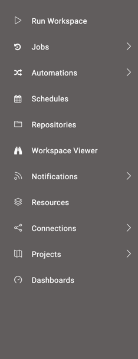
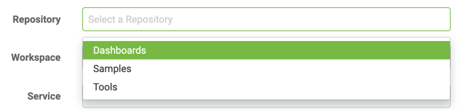
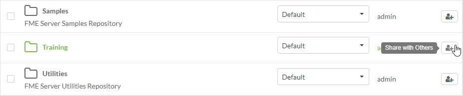
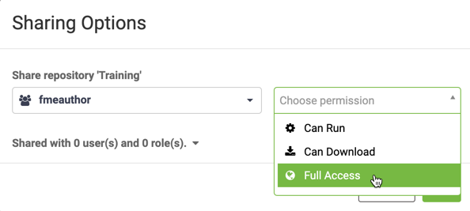
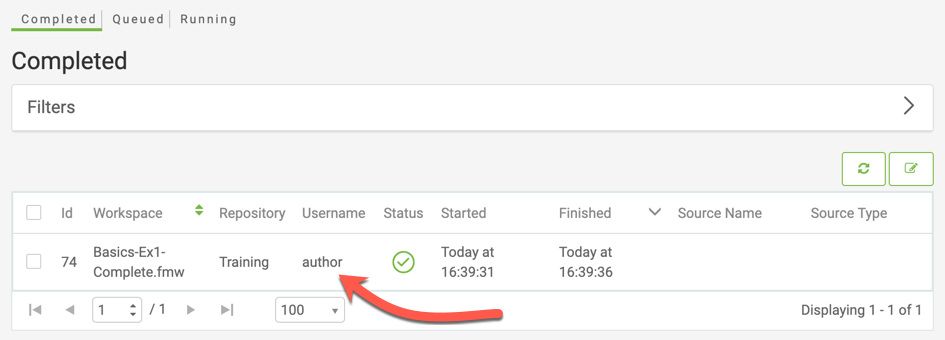
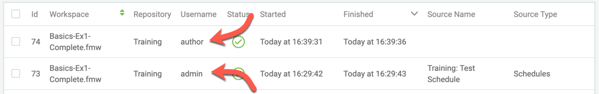

<!--Exercise Section-->

<table style="border-spacing: 0px;border-collapse: collapse;font-family:serif">
<tr>
<td width=25% style="vertical-align:middle;background-color:darkorange;border: 2px solid darkorange">
<i class="fa fa-cogs fa-lg fa-pull-left fa-fw" style="color:white;padding-right: 12px;vertical-align:text-top"></i>
Exercise 1.5
</td>
<td style="border: 2px solid darkorange;background-color:darkorange;color:white">
Daily Database Updates: Sharing a Repository
</td>
</tr>

<tr>
<td style="border: 1px solid darkorange; font-weight: bold">Data</td>
<td style="border: 1px solid darkorange">Firehalls (GML) Neighborhoods (KML)</td>
</tr>

<tr>
<td style="border: 1px solid darkorange; font-weight: bold">Overall Goal</td>
<td style="border: 1px solid darkorange">Create a workspace to read and process departmental data and publish it to FME Server</td>
</tr>

<tr>
<td style="border: 1px solid darkorange; font-weight: bold">Demonstrates</td>
<td style="border: 1px solid darkorange">Share a repository with another FME Server user</td>
</tr>

<tr>
<td style="border: 1px solid darkorange; font-weight: bold">Start Workspace</td>
<td style="border: 1px solid darkorange">None</td>
</tr>

<tr>
<td style="border: 1px solid darkorange; font-weight: bold">End Workspace</td>
<td style="border: 1px solid darkorange">None</td>
</tr>

</table>

---
In the last exercise, you created a schedule to automatically run the workspace you created in Exercise 1 once a day. But what happens if something goes wrong with this workspace or it needs to be updated and you're not available to fix it? It would be a good idea to allow other FME Server authors within your department to be able to edit and run this workspace.

Let's ensure that other users that are part of the FME Server author role have access to this repository to run and modify the workspace.  

 **1) Connect to Server**
 Browse to the login page of the FME Server interface, either by starting it through the Web Interface option on the start menu or by logging out if you are already logged in.

This time, log in using the generic author account that is a default account on any FME Server installation. The username is ***author*** and the password is ***author*** as well!

The first thing you'll notice is that the menu and functionality is more restricted for this account (notice the Admin section is now gone):

Also, if you try to run a workspace you'll find that this account does not have access to the Training repository where the existing workspace resides:

 **2) Share Repository**
 Log out of the author account and log back in as an administrator (admin/admin).

Now you have the full set of menu entries, click Repositories on the menu. Under the list of repositories locate the Training repository. Click the Share icon to the right:

In the Sharing Options dialog, select fmeauthor as the role to share with, and allow them full access to the repository:

By selecting the *fmeauthor* role (rather than the single *author* account), we allow anyone who is tagged as an author to access the workspace; and by allowing them full access to the repository, we allow them to run, download, and make edits to our workspace.

 **3) Check Sharing**
 Log out of the administrator account and log back into FME Server with the author account (author/author).

This time, you should have access to the Training repository. Click Run Workspace, select your workspace in the Training repository and run it. Check the Jobs page, and you'll see one entry for the workspace when it was run as the author. There is only one entry because the author does not have the privileges required to view any other users' jobs:

Log out again and log back in as an administrator. Now, in the Jobs | Completed window, you should be able to see both the administrator's jobs and the user's jobs:

That's because the administrator group does have permission to view all jobs.

---

<!--Exercise Congratulations Section-->

<table style="border-spacing: 0px">
<tr>
<td style="vertical-align:middle;background-color:darkorange;border: 2px solid darkorange">
<i class="fa fa-thumbs-o-up fa-lg fa-pull-left fa-fw" style="color:white;padding-right: 12px;vertical-align:text-top"></i>
CONGRATULATIONS
</td>
</tr>

<tr>
<td style="border: 1px solid darkorange">

By completing this exercise you have learned how to:
 
<ul><li>Share a repository in FME Server and tested to ensure it is available to the right users</li></ul>

</td>
</tr>
</table>
