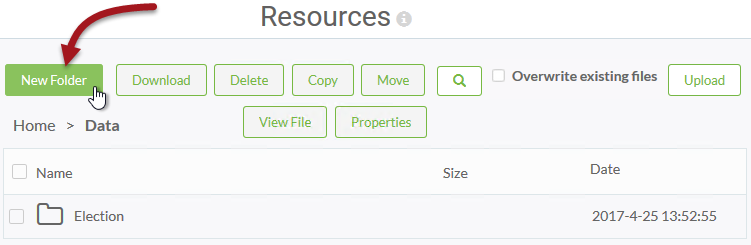
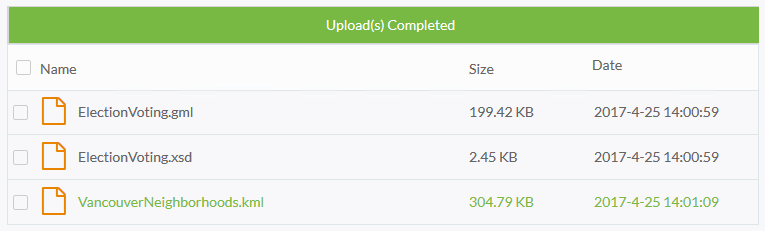
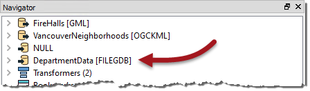
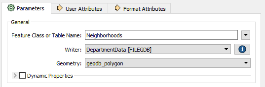
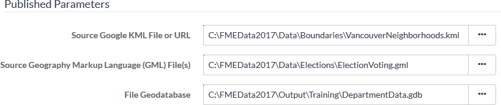
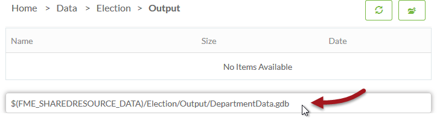
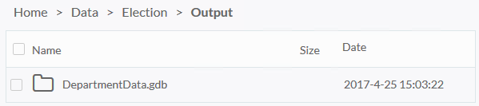
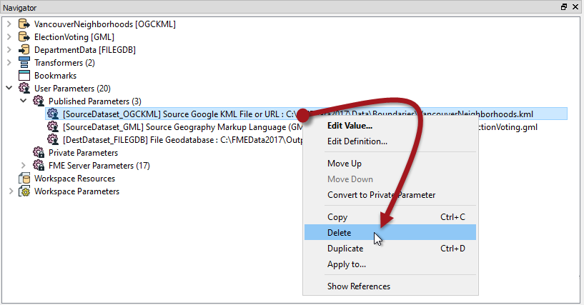
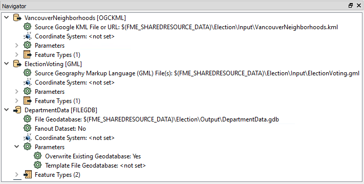

<!--Exercise Section-->

<table style="border-spacing: 0px;border-collapse: collapse;font-family:serif">
<tr>
<td width=25% style="vertical-align:middle;background-color:darkorange;border: 2px solid darkorange">
<i class="fa fa-cogs fa-lg fa-pull-left fa-fw" style="color:white;padding-right: 12px;vertical-align:text-top"></i>
Exercise 5
</td>
<td style="border: 2px solid darkorange;background-color:darkorange;color:white">
Daily Database Updates: Using Resources
</td>
</tr>

<tr>
<td style="border: 1px solid darkorange; font-weight: bold">Data</td>
<td style="border: 1px solid darkorange">Neighborhoods (KML) Election Voting (GML)</td>
</tr>

<tr>
<td style="border: 1px solid darkorange; font-weight: bold">Overall Goal</td>
<td style="border: 1px solid darkorange">Create a workspace to read and process departmental data and publish it to FME Server</td>
</tr>

<tr>
<td style="border: 1px solid darkorange; font-weight: bold">Demonstrates</td>
<td style="border: 1px solid darkorange">Uploading data to a resources folder and authoring a workspace to make use of it</td>
</tr>

<tr>
<td style="border: 1px solid darkorange; font-weight: bold">Start Workspace</td>
<td style="border: 1px solid darkorange">C:\FMEData2018\Workspaces\ServerAuthoring\Basics-Ex5-Begin.fmw</td>
</tr>

<tr>
<td style="border: 1px solid darkorange; font-weight: bold">End Workspace</td>
<td style="border: 1px solid darkorange">C:\FMEData2018\Workspaces\ServerAuthoring\Basics-Ex5-Complete.fmw</td>
</tr>

</table>

---

For the exercises in this chapter, you are a technical analyst in the GIS department of your local city. 

You have already (Exercise 4) created a workspace to carry out a translation, and published it to FME Server; both with data and using data uploaded temporarily. 

However, such data management tools are not particularly suited to a long term project, so the task here is to upgrade the workspaces to use datasets stored in a Resources folder. There we can store source data and write destination data.

---

 **1) Open FME Server Web Interface**
 Log in to the FME Server web interface using an administrator account (such as admin/admin). Click Resources on the menubar to navigate to the resources management pages.

 **2) Create Folder**
 In most cases data should be stored under the Data folder, so click on Data in the Resources dialog to open that folder. To avoid mixing datasets our data should go into its own subfolder. So click on the New Folder button and create a folder called Election:

Next click on the Election folder and within there create subfolders called Input and Output.

 **3) Upload Source Datasets**
 Browse to the Input folder and click the upload button. Upload the source datasets for the current translation: 

<table style="border: 0px">

<tr>
<td style="font-weight: bold">Reader Datasets</td>
<td style="">C:\FMEData2018\Data\Elections\ElectionVoting.gml C:\FMEData2018\Data\Elections\ElectionVoting.xsd C:\FMEData2018\Data\Boundaries\VancouverNeighborhoods.kml</td>
</tr>

</table>

So we now have both source datasets and a folder to write the output data to.

 **4) Add Writer**
 Up until now all of our workspaces have had only a NULL (dummy) writer. Now we know about Resources we can add a proper writer and point its output to the Resources Output folder.

So, open the workspace listed above in FME Workbench and then select Writers &gt; Add Writer on the menubar and set up a new writer with the following parameters:

<table style="border: 0px">

<tr>
<td style="font-weight: bold">Writer Format</td>
<td style="">Esri Geodatabase (File Geodb Open API)</td>
</tr>

<tr>
<td style="font-weight: bold">Writer Dataset</td>
<td style="">C:\FMEData2018\Output\Training\DepartmentData.gdb</td>
</tr>

<tr>
<td style="font-weight: bold">Feature Class or Table Definition</td>
<td style="">None (Advanced)</td>
</tr>

</table>

<!--Updated Section--> 

<table style="border-spacing: 0px">
<tr>
<td style="vertical-align:middle;background-color:darkorange;border: 2px solid darkorange">
<i class="fa fa-bolt fa-lg fa-pull-left fa-fw" style="color:white;padding-right: 12px;vertical-align:text-top"></i>
.1 UPDATE
</td>
</tr>

<tr>
<td style="border: 1px solid darkorange">

Note that Esri Geodatabase format was renamed from *File Geodb API* to *File Geodb **Open** API* in FME 2017.1!

</td>
</tr>
</table>

The reason we want to add no feature types is that we can move the existing ones from the NULL writer. So when you click OK the workspace will look no different, but there will be a new writer in the Navigator window:

 **5) Move Feature Types**
 Inspect the parameters dialog for each writer feature type in turn. For each type move it from the NULL writer to the FILEGDB writer, like so: 

This will expose a number of extra parameters. The key one to set is Geometry. For the Neighborhoods they should be set to geodb_polygon:

For the VotingPlaces feature type the Geometry parameter should be set to geodb_point.

Now the two feature types belong to the Geodatabase writer, and the NULL writer can be deleted from the Navigator window if you wish.

 **6) Set Geodatabase Parameter**
 One (very quick) last thing to change: locate the Geodatabase writer in the Navigator window and expand its list of parameters. Double-click the parameter labelled Overwrite Existing Geodatabase and set it to Yes:

This ensures we aren't continually adding data to the same dataset if we run the workspace more than once.

 **7) Run Workspace**
 Test run the workspace in FME Desktop. Inspect the output. You should find the output is a Geodatabase containing seven tables (the Neighborhoods table and a separate table for each set of voting places).

 **8) Publish and Run Workspace**
 Publish the workspace to FME Server. Be sure not to check the button to upload any data. Register the workspace against the Job Submitter service as usual.

Return to the FME Server web interface. Locate the workspace under the Run Workspace dialog. Notice how the dataset paths are all hard-coded to the original file locations:

Obviously this will be of no use if the Server does not have access to those files. However, because we already uploaded them to the Resources folders we can use those files.

So, for each file, click the browse button, browse to the appropriate subfolder in the Resources folder, and select/set the file location. For the Geodatabase output location you'll need to type the file name manually:

<pre>
$(FME_SHAREDRESOURCE_DATA)/Election/Output/DepartmentData.gdb
</pre>

Remember to remove any existing references to the incorrect files:

Now when the workspace is completed a Geodatabase file should appear in the folder Resources\Data\Election\Output:

 **9) Apply FME Server Parameter**
 Although the workspace ran correctly, and used the data in the resources folder, that's only because we selected that data at run time. It is not a permanent feature of the workspace.

It would be much better if the workspace was programmed to look into the resources folders automatically.

So, return to the workspace in FME Workbench. 

If we do set the workspace to read from the resources folders, we don't want to give users the chance to change that. So in the Navigator window locate the three parameters for source and destination datasets and delete them:

 **10) Set Source/Destination Parameters**
 Now, in turn, locate the source and destination dataset parameters for the two readers and one writer. Double-click each in turn and change them to:

<table>
<tr><td>KML Reader</td><td>$(FME&#95;SHAREDRESOURCE&#95;DATA)\Election\Input\VancouverNeighborhoods.kml</td></tr>
<tr><td>GML Reader</td><td>$(FME&#95;SHAREDRESOURCE&#95;DATA)\Election\Input\ElectionVoting.gml</td></tr>
<tr><td>Geodatabase Writer</td><td>$(FME&#95;SHAREDRESOURCE&#95;DATA)\Election\Output\DepartmentData.gdb</td></tr>
</table>

Save the workspace and publish it back to FME Server.

---

<!--Person X Says Section-->

<table style="border-spacing: 0px">
<tr>
<td style="vertical-align:middle;background-color:darkorange;border: 2px solid darkorange">
<i class="fa fa-quote-left fa-lg fa-pull-left fa-fw" style="color:white;padding-right: 12px;vertical-align:text-top"></i>
Sister Intuitive says...
</td>
</tr>

<tr>
<td style="border: 1px solid darkorange">

This time you won't be able to test-run the workspace in FME Workbench, because it won't recognize the shared resource parameter. Only FME Server will return a value for that parameter.

</td>
</tr>
</table>

---

 **11) Re-Run Workspace**
 Now run the workspace on FME Server. Be sure to use the Job Submitter service (not Data Download) so the output is written to the required file. This time you will not be prompted with a parameter to select the source (or destination) datasets, but they will be used from the resources folders just the same.

---

<!--Exercise Congratulations Section--> 

<table style="border-spacing: 0px">
<tr>
<td style="vertical-align:middle;background-color:darkorange;border: 2px solid darkorange">
<i class="fa fa-thumbs-o-up fa-lg fa-pull-left fa-fw" style="color:white;padding-right: 12px;vertical-align:text-top"></i>
CONGRATULATIONS
</td>
</tr>

<tr>
<td style="border: 1px solid darkorange">

By completing this exercise you have learned how to:
 
<ul><li>Create resources folders and upload data to them</li>
<li>Add a writer to a workspace and move feature types from another writer</li>
<li>Run a workspace and select data from resources folders</li>
<li>Edit a workspace to permanently use the resources folders</li>
<li>Delete parameters to prevent the end-user changing them</li></ul>

</td>
</tr>
</table>
