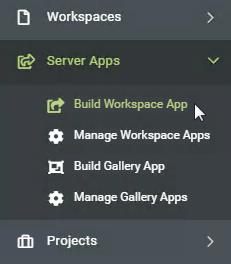
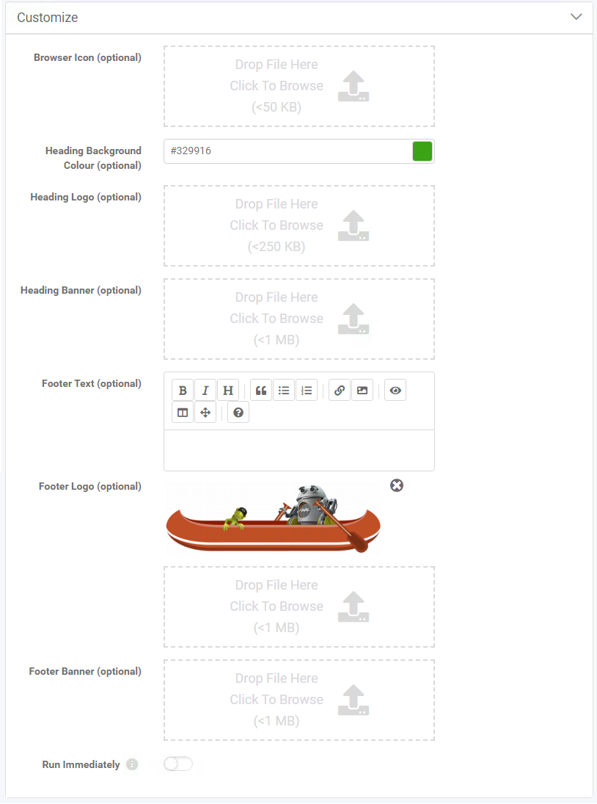
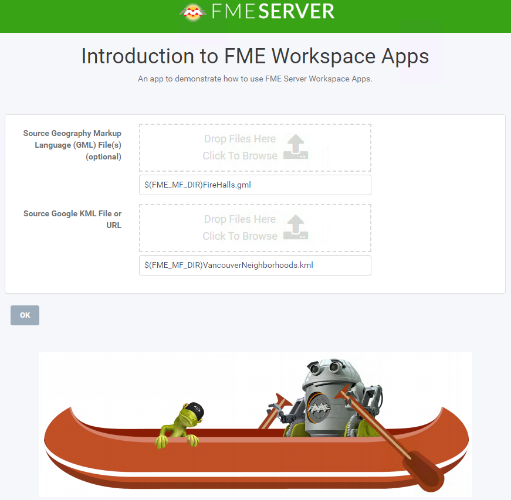

<!--Exercise Section-->

<table style="border-spacing: 0px;border-collapse: collapse;font-family:serif">
<tr>
<td width=25% style="vertical-align:middle;background-color:darkorange;border: 2px solid darkorange">
<i class="fa fa-cogs fa-lg fa-pull-left fa-fw" style="color:white;padding-right: 12px;vertical-align:text-top"></i>
Exercise 1.6
</td>
<td style="border: 2px solid darkorange;background-color:darkorange;color:white">
Daily Database Updates: Workspace Sharing
</td>
</tr>

<tr>
<td style="border: 1px solid darkorange; font-weight: bold">Data</td>
<td style="border: 1px solid darkorange">Firehalls (GML) Neighborhoods (KML)</td>
</tr>

<tr>
<td style="border: 1px solid darkorange; font-weight: bold">Overall Goal</td>
<td style="border: 1px solid darkorange">Create a workspace to read and process departmental data and publish it to FME Server</td>
</tr>

<tr>
<td style="border: 1px solid darkorange; font-weight: bold">Demonstrates</td>
<td style="border: 1px solid darkorange">Share a workspace so that anyone can run it</td>
</tr>

<tr>
<td style="border: 1px solid darkorange; font-weight: bold">Start Workspace</td>
<td style="border: 1px solid darkorange">None</td>
</tr>

<tr>
<td style="border: 1px solid darkorange; font-weight: bold">End Workspace</td>
<td style="border: 1px solid darkorange">None</td>
</tr>

</table>

---
You have already (in Exercises 1, 2, and 3) created a workspace to carry out this translation, published it to FME Server, run it to confirm it works, and committed it to version history.

In the last exercise, you shared the Training repository you created in Exercise 1 with other authors on FME Server. Now you have gotten requests from other users who do not have FME Server accounts to be able to run the translation on demand.  

Let's create an FME Server App so that anyone with the URL can run this workspace to update the database whenever they need to.

 **1) Connect to Server**
 Browse to the login page of the FME Server interface, and log in using the administrator account (admin/FMElearnings).

 **2) Open Server Apps**
 Expand Server Apps from the side menu, then click Build Workspace App, to create a new Workspace App.

 **3) Configure Server App**
 Set a Name, Title, and Description for your new Server App. The Name is what is displayed in the list of Workspace Apps and the Title and Description is what will be displayed on the actual App. Select the Training Repository and Ch1-Ex1-Complete.fmw Workspace.

You can leave the expiration time at its default value, which will allow the API Token to expire after 10 years. You could set this to a shorter time if you only want to grant access for a smaller time window.

Keep the User Can Upload option turned on, this will allow your users to upload their own datasets to send as input to the workspace.

 **4) Customize Server App**

Below the workspace selection area, you will see sections for Additional Permissions and Parameters.
- Additional Permissions will let you decide if you want the users who will access your Server App to be able to access items within the FME Server Resources.
- Parameters will allow you to configure which published parameters should be displayed for your users to set when using the Server App.

Leave those with their default values and move on to Customize Appearance. Expand Customize Appearance, then change Header Background Color to green. Then for Footer Logo browse to C:\FMEData2020\Resources\ServerAuthoring\ServerApps and upload CanoeZipster.png. You can also edit any of the other customization parameters if you wish.

Click OK to create the Server App.

 **4) Test the FME Server App**
 Now that your App has been created, you'll see that a URL was generated for it.

Click on the URL to open it. You will see that it opens a webpage very similar to the Run Workspace page in FME Server, but it has no options other than to run this one workspace and it does not require a user to enter a username and password to access it. The styling for the page will also match what you selected within the customization options.

---

<!--Advanced Exercise Section-->

<table style="border-spacing: 0px">
<tr>
<td style="vertical-align:middle;background-color:darkorange;border: 2px solid darkorange">
<i class="fa fa-cogs fa-lg fa-pull-left fa-fw" style="color:white;padding-right: 12px;vertical-align:text-top"></i>
Advanced Exercise
</td>
</tr>

<tr>
<td style="border: 1px solid darkorange">

We've been requested to create a webhook to share our workspace with customers in an email.
 From the Run Workspace page, ensure that the Workspace is set to Ch1-Ex1-Completed.fmw, then from the Workspace Actions drop-down select Create Webhook
 
 On the Create Webhook page, we can just accept the defaults for the paramters. Optionally, you can add additional permissions for the user, such as access to the data folder. Click OK to create the Webhook.
 Before closing the Webhook URL page, ensure that you download your Webhook token and parameters as this will be the only time you can do so. If you forget to download it, or lose the file, you will have to recreate the Webhook.

</td>
</tr>
</table>

---

<!--Exercise Congratulations Section-->

<table style="border-spacing: 0px">
<tr>
<td style="vertical-align:middle;background-color:darkorange;border: 2px solid darkorange">
<i class="fa fa-thumbs-o-up fa-lg fa-pull-left fa-fw" style="color:white;padding-right: 12px;vertical-align:text-top"></i>
CONGRATULATIONS
</td>
</tr>

<tr>
<td style="border: 1px solid darkorange">

By completing this exercise you have learned how to:
 
<ul><li>Create an FME Server App to share a workspace with users who do not have FME Server accounts</li>

</td>
</tr>
</table>
