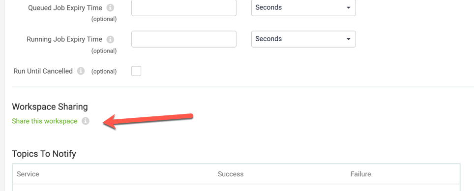
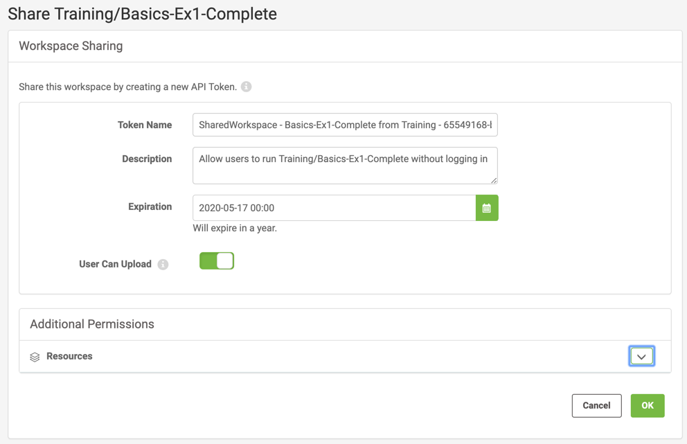
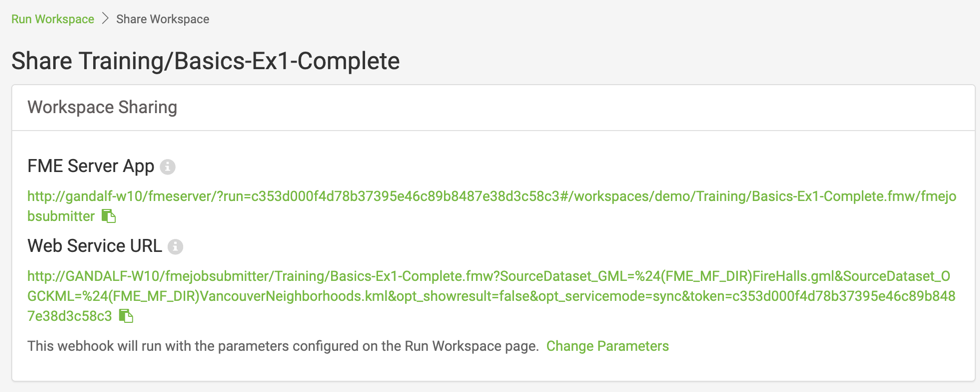

<!--Exercise Section-->

<table style="border-spacing: 0px;border-collapse: collapse;font-family:serif">
<tr>
<td width=25% style="vertical-align:middle;background-color:darkorange;border: 2px solid darkorange">
<i class="fa fa-cogs fa-lg fa-pull-left fa-fw" style="color:white;padding-right: 12px;vertical-align:text-top"></i>
Exercise 1.6
</td>
<td style="border: 2px solid darkorange;background-color:darkorange;color:white">
Daily Database Updates: Workspace Sharing
</td>
</tr>

<tr>
<td style="border: 1px solid darkorange; font-weight: bold">Data</td>
<td style="border: 1px solid darkorange">Firehalls (GML) Neighborhoods (KML)</td>
</tr>

<tr>
<td style="border: 1px solid darkorange; font-weight: bold">Overall Goal</td>
<td style="border: 1px solid darkorange">Create a workspace to read and process departmental data and publish it to FME Server</td>
</tr>

<tr>
<td style="border: 1px solid darkorange; font-weight: bold">Demonstrates</td>
<td style="border: 1px solid darkorange">Share a workspace so that anyone can run it</td>
</tr>

<tr>
<td style="border: 1px solid darkorange; font-weight: bold">Start Workspace</td>
<td style="border: 1px solid darkorange">None</td>
</tr>

<tr>
<td style="border: 1px solid darkorange; font-weight: bold">End Workspace</td>
<td style="border: 1px solid darkorange">None</td>
</tr>

</table>

---
You have already (in Exercises 1, 2, and 3) created a workspace to carry out this translation, published it to FME Server, run it to confirm it works, and committed it to version history.

In the last exercise, you shared the Training repository you created in Exercise 1 with other authors on FME Server. Now you have gotten requests from other users who do not have FME Server accounts to be able to run the translation on demand.  

Let's create an FME Server app so that anyone with the URL can run this workspace to update the database whenever they need to.

 **1) Connect to Server**
 Browse to the login page of the FME Server interface, and log in using the administrator account (admin/admin).

 **2) Locate Workspace Sharing**
 Click on Run Workspace from the Server menu and select the Training Repository and Basics-Ex1-Complete.fmw Workspace on that page.

Below the published parameters, click on the arrow to the right of Advanced to expand the panel and click on Share this workspace under Workspace Sharing.

 **3) Configure Workspace Sharing**
 This will open a new page to let you configure the workspace sharing options. You can set an expiration date for the token used to share the workspace and also give additional permissions to users who will run the workspace through the FME Server App you create.

You can leave the expiration time at its default value which will allow the API Token to expire after 1 year. You could set this to a shorter time if you only want to grant access for a small time window.

Keep the User Can Upload option turned on, this will allow your users to upload their own datasets to send as input to the workspace. Notice under Additional Parameters, you can give the users access to browse for data within folders in Resources. We won't touch that setting now either.

Click OK to share the workspace.

 **4) Test the FME Server App**
 Now that your workspace has been shared, you'll see that two URLs were generated.

The FME Server App URL will open a webpage that is very similar to the Run Workspace page in FME Server, but has no options other than to run this one workspace and it does not require a user to enter a username and password to access it.

The Web Service URL will not open a webpage when it is clicked on, it will simply run the workspace using the parameter values that are set directly in the URL itself.

Click on the clipboard icon at the end of each of these URLs and paste them into an incognito browser window to see the differences in how they behave.

---

<!--Exercise Congratulations Section-->

<table style="border-spacing: 0px">
<tr>
<td style="vertical-align:middle;background-color:darkorange;border: 2px solid darkorange">
<i class="fa fa-thumbs-o-up fa-lg fa-pull-left fa-fw" style="color:white;padding-right: 12px;vertical-align:text-top"></i>
CONGRATULATIONS
</td>
</tr>

<tr>
<td style="border: 1px solid darkorange">

By completing this exercise you have learned how to:
 
<ul><li>Create an FME Server App to share a workspace with users who do not have FME Server accounts</li>
<li>Generate a Web Service URL for a workspace that can act as a webhook to run the workspace programmatically</li></ul>

</td>
</tr>
</table>
