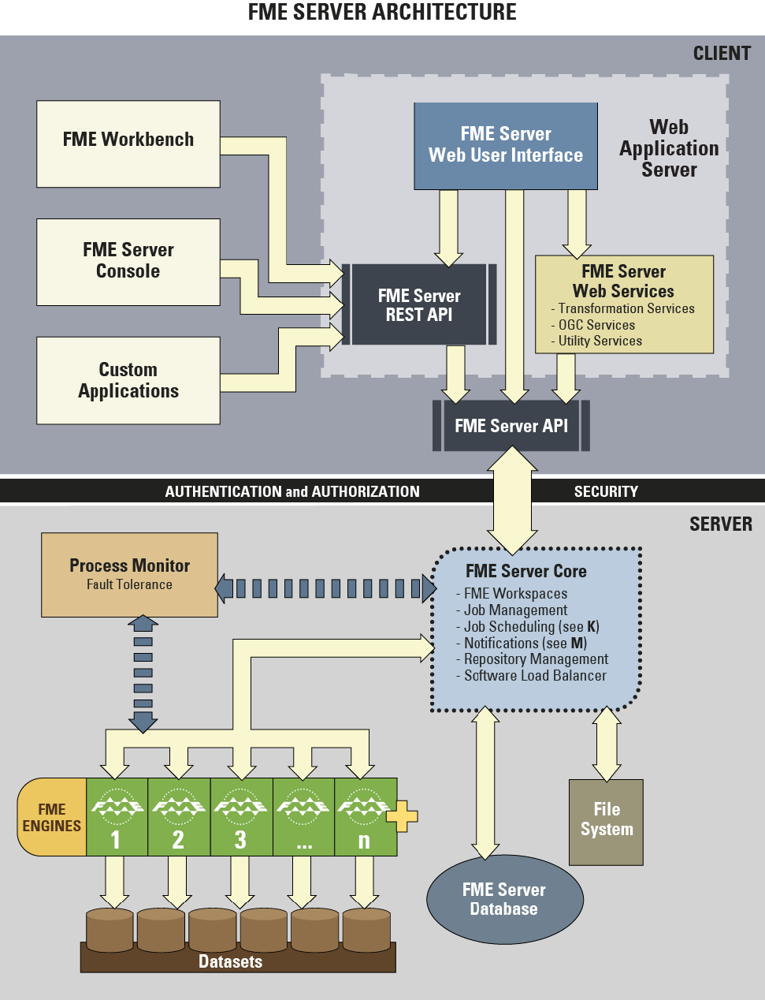
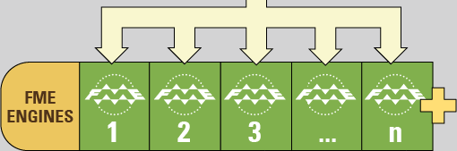

# FME Server Architecture

FME Server consists of a number of different components.

The architecture of FME Server looks something like this:

## FME Server Components ##

Don’t worry about trying to understand the whole structure, just be aware of the main components of FME Server:

- FME Engines: To carry out data transformation processing
- Server Core: To queue jobs, handle scheduling, and manage load balancing
- Web Services: To handle networking capabilities

### FME Engines ###

FME Engines process job requests by running FME Workspaces. This is the same core engine, carrying out the same processing, that is used by FME Desktop. An FME Server installation can possess multiple engines.

Each FME Engine processes a single request at a time.

FME Server processing can be scaled by adding FME Engines to the same computer or to separate computers within a distributed FME Server environment.

### Server Core ###

The FME Server Core manages and distributes job requests (queuing, request routing, scheduling), the repository contents (workspaces, custom formats, custom transformers, data), and notification requests.

The FME Server Core contains a Software Load Balancer (SLB) that distributes jobs to FME Engines.

### Web Services ###

Much of the FME Server networking capabilities are handled using what we call "Services". Services are software whose interface provides communication between server and clients.

FME Server has a number of services:

- Data Download
- Data Upload
- Data Streaming
- Job Submitter
- KML Network Link
- OGC Services (WFS and WMS)
- Catalog
- Token Security
- Web Connection (SOAP)
- REST
- Notification

Some services (for example, Data Download) are “transformation” services that carry out data transformation, whereas others (for example, Catalog) are non-transforming "utility" services.

---

<!--Person X Says Section-->

<table style="border-spacing: 0px">
<tr>
<td style="vertical-align:middle;background-color:darkorange;border: 2px solid darkorange">
<i class="fa fa-quote-left fa-lg fa-pull-left fa-fw" style="color:white;padding-right: 12px;vertical-align:text-top"></i>
Miss Vector says...
</td>
</tr>

<tr>
<td style="border: 1px solid darkorange">

Here's a question to see if you grasp, not the details, but how FME Server works in general. I have an FME Server with two engines. Four users submit jobs at the same time. What happens?
  1. Two jobs are processed. Two jobs are returned to their authors. 
 2. Two extra engines will fire up automatically to process all four jobs.
 3. The four jobs will be processed simultaneously, sharing the two engines.
 4. Two jobs are processed. The other two sit in a queue until an engine becomes free.

</td>
</tr>
</table>
