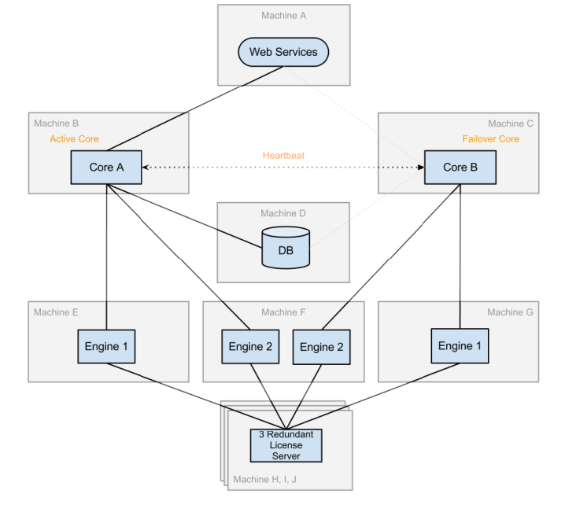

# Deploying FME Server

FME Server can be deployed in a number of configurations 

## Platforms ##

FME Server can be deployed on a variety of platforms:

### Local Infrastructure (Physical Hardware) ###
This is the traditional platform where you purchase FME Server and install it on your own hardware systems.

### Infrastructure as a Service (Virtual Hardware) ###
This is where you purchase FME Server and install it on virtual hardware that is provided as service by a company such as Amazon.

### Platform as a Service (FME Cloud) ###
This is where FME Server is delivered pre-installed on an Amazon virtual computer, with the whole platform provided by Safe Software on a pay-as-you-go basis.

## Distributed Systems ##

A distributed system is when different components of a system are located on separate, networked, computers.

For example, in a distributed environment FME Engines can run on a computer or computers that are separate from the FME Server host. Administrators can configure the FME Engines to register with a failover FME Server host, which acts as a backup if the primary FME Server host fails.

---

<!--New Section--> 

<table style="border-spacing: 0px">
<tr>
<td style="vertical-align:middle;background-color:darkorange;border: 2px solid darkorange">
<i class="fa fa-bolt fa-lg fa-pull-left fa-fw" style="color:white;padding-right: 12px;vertical-align:text-top"></i>
NEW
</td>
</tr>

<tr>
<td style="border: 1px solid darkorange">

This layout reflects the architecture of FME2016, which no longer uses a FlexLM license server. Instead licensing is now stored in the FME Server System Share, which multiple FME Server Cores can point towards.

</td>
</tr>
</table>

---