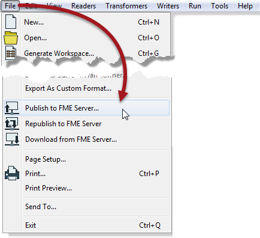
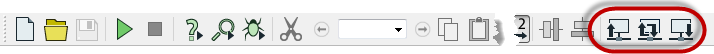

# Workspace Management

Because Workbench is a client of FME Server, workspaces may be transferred to and from an FME Server repository.

## Transferring Workspaces ##

FME Workbench has the ability to:

- Publish a workspace (upload it to FME Server)
- Republish a workspace (upload a previously published workspace)
- Download a workspace (retrieve it from FME Server)

These three capabilities are accessed in FME Workbench either through the menubar:

...or the toolbar:

## Repositories ##

Repositories are storage facilities for FME Server workspaces. Each FME Server may have multiple repositories, but any workspace can only belong to one of them.

Published workspaces are held on FME Server in a file-based part of the repository. 

All metadata related to the workspace is held separately in FME Server’s repository database. This metadata includes information about source and destination datasets, workspace feature types, and published
parameters.

Repositories are managed by the FME Core. They can be accessed (by authors and administrators) through the web user interface.

---

<table style="border-spacing: 0px">
<tr>
<td style="vertical-align:middle;background-color:darkorange;border: 2px solid darkorange">
<i class="fa fa-quote-left fa-lg fa-pull-left fa-fw" style="color:white;padding-right: 12px;vertical-align:text-top"></i>
Police Chief Webb-Mapp says…
</td>
</tr>

<tr>
<td style="border: 1px solid darkorange">

Security in FME Server is very important, and never more so than for repositories.
  You can think of each repository as being like a folder on a file-system, with the same ability to grant access rights to individuals and groups. So, for each repository you create, be sure to check the security settings. If you don’t then end-users may not get access to the repository!

</td>
</tr>
</table>

---

<!--Person X Says Section-->

<table style="border-spacing: 0px">
<tr>
<td style="vertical-align:middle;background-color:darkorange;border: 2px solid darkorange">
<i class="fa fa-quote-left fa-lg fa-pull-left fa-fw" style="color:white;padding-right: 12px;vertical-align:text-top"></i>
Miss Vector says...
</td>
</tr>

<tr>
<td style="border: 1px solid darkorange">

If I wanted to find out about workspaces stored in a repository - for example I'm building a tool to catalogue my workspaces - what is the best way to do it?
  1. Use the FME Server REST API
 2. Scrape the contents of the Server repository page
 3. Get a file listing from the repository folder
 4. Connect to the FME Server database to query it directly

</td>
</tr>
</table>
