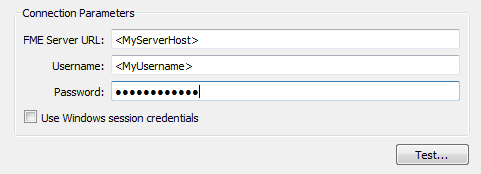

## Publishing a Workspace ##

Once a workspace has been authored it is *published* to FME Server. The publish tool in Workbench opens a simple wizard interface that connects to FME Server using the REST API.

### Connecting to Server ###

The first dialog in the publishing wizard is where a connection is defined.

Workbench can connect to FME Server by web connection (using HTTP and the REST API). The web connection requires the URL of the Server. HTTP is used when the FME Server is not on the same Local Area Network, but on a web-accessible server.

The dialog also provides fields in which to define connection credentials. Note the ability to save time by reusing Windows session credentials

---

<table style="border-spacing: 0px">
<tr>
<td style="vertical-align:middle;background-color:darkorange;border: 2px solid darkorange">
<i class="fa fa-info-circle fa-lg fa-pull-left fa-fw" style="color:white;padding-right: 12px;vertical-align:text-top"></i>
TIP
</td>
</tr>

<tr>
<td style="border: 1px solid darkorange">

To avoid entering the same parameters every time a connection is made, set the
parameters, click the Defaults button, and select ‘Save as My Defaults'. Now these
parameter values will be used automatically every time the connection dialog is opened.

</td>
</tr>
</table>

---

### Repository Selection ###

The next dialog defines the repository for the workspace:

Either an existing repository can be used, or a new one created. The workspace name can also be edited, even making it different to what it is saved as locally.

---

### Workspace Registration ###

The final dialog defines which services the workspace is to be registered against.

The Job Submitter service allows FME Server to run a workspace as-is. This is the closest to running a workspace on FME Desktop. All inputs and outputs are defined in the workspace so data is simply written out and not streamed or delivered in any other manner.

Job submission is ideal for testing workspaces, and for running large-scale and batch translations that make use of the server process queue.

---

## Republishing a Workspace ##

Once a workspace has been published, the republish tool becomes active. Further updates to the workspace (within the same session) can then be uploaded with a single click.

The same parameters are used as before. If changes need to be made to these parameters, then the full publishing wizard should be used.

---

## Downloading a Workspace ##

Workbench can also “download” a workspace held in an FME Server repository. This is usually done in order to make edits to the workspace. Note that downloaded workspaces are copies of the original, which remains in the FME Server repository.

The downloading wizard begins with the same connection dialog as the publishing wizard. From there, the second – and final – dialog page is a repository and workspace selection tool:

The user is then prompted for a location to save the workspace. The default is &lt;user&gt;/FME/My FME Server Workspaces. The workspace – and resources – are then downloaded.

Once downloaded, the workspace is automatically opened within Workbench for editing.

---

<table style="border-spacing: 0px">
<tr>
<td style="vertical-align:middle;background-color:darkorange;border: 2px solid darkorange">
<i class="fa fa-quote-left fa-lg fa-pull-left fa-fw" style="color:white;padding-right: 12px;vertical-align:text-top"></i>
Ms. Analyst says…
</td>
</tr>

<tr>
<td style="border: 1px solid darkorange">

Besides workspaces, it’s also possible to publish/download FME custom transformers and custom formats to/from a server repository.

</td>
</tr>
</table>

