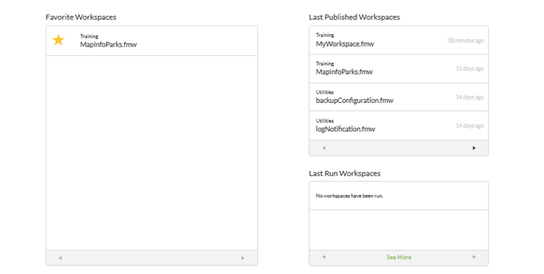
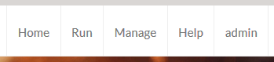

# Introduction to the FME Server Web Interface

Although translations are authored in FME Workbench, to use them on FME Server requires familiarity with the FME Server web interface. 

The web interface is accessed through the URL **&lt;servername&gt;:&lt;port&gt;/fmeserver** (the port may be optional) or through the start menu:

## Web Interface Home Page ##

The home page of the interface looks like this:

The home page is important because it includes several shortcuts to key functionality. For example, the top part of the page has shortcuts to *Run Workspace*, *Manage Schedules*, and *Manage Notifications*:

The lower part of the page has shortcuts to specific workspaces, grouped under *Favourite Workspaces*, *Last Published Workspaces*, and *Last Run Workspaces*:

However, in general, functionality is accessed through the menu at the top of the home page:

