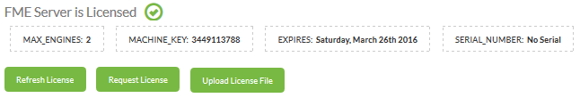

## Engines and Licensing ##

The engines and licensing page is the first stop to ensure FME Server is running correctly, is licensed, and has active engines. It is accessed under Manage &gt; Administration &gt; Engines & Licensing on the menu.

The page looks like this:

The upper section relates to licensing. The labels show how many engines are licensing, when the license expires, and what the machine key and serial number are. Buttons allow you to refresh the license, request a new one, or upload a license file.

The middle part shows the engines that are currently started, their FME build, operating system, and what jobs they are processing (if any). The platform is important because a distributed FME Server setup can have engines running on a variety of operating systems at the same time.

The lower part of the dialog allows you to easily change the number of engines running, up to the maximum provided for by the current license:

