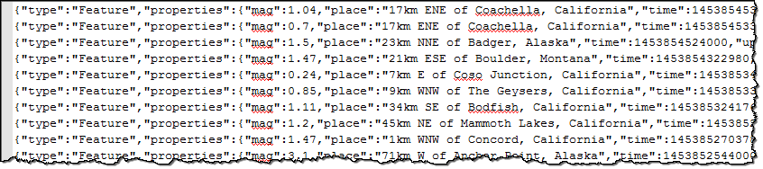
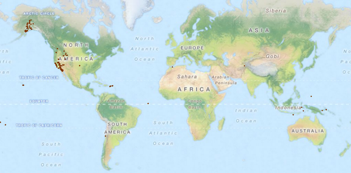
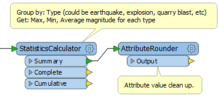

<!--Instructor Notes-->
<!--This exercise uses a basic amount of FME Workbench as a test for students-->
<!--If students have problems now, it is unlikely they will have much success at further exercises-->

<!--Exercise Section-->
<!--NB: In GitBook world we don't give a number to exercises-->

<table style="border-spacing: 0px;border-collapse: collapse;font-family:serif">
<tr>
<td width=25% style="vertical-align:middle;background-color:darkorange;border: 2px solid darkorange">
<i class="fa fa-cogs fa-lg fa-pull-left fa-fw" style="color:white;padding-right: 12px;vertical-align:text-top"></i>
Exercise
</td>
<td style="border: 2px solid darkorange;background-color:darkorange;color:white">
Earthquake Processing
</td>
</tr>

<tr>
<td style="border: 1px solid darkorange; font-weight: bold">Data</td>
<td style="border: 1px solid darkorange">Earthquakes (GeoJSON)</td>
</tr>

<tr>
<td style="border: 1px solid darkorange; font-weight: bold">Overall Goal</td>
<td style="border: 1px solid darkorange">Create a workspace to read and process earthquake data and publish it to FME Server</td>
</tr>

<tr>
<td style="border: 1px solid darkorange; font-weight: bold">Demonstrates</td>
<td style="border: 1px solid darkorange">Publishing a workspace to FME Server</td>
</tr>

<tr>
<td style="border: 1px solid darkorange; font-weight: bold">Start Workspace</td>
<td style="border: 1px solid darkorange">None</td>
</tr>

<tr>
<td style="border: 1px solid darkorange; font-weight: bold">End Workspace</td>
<td style="border: 1px solid darkorange">C:\FMEData2016\Workspaces\ServerAuthoringBasics-Ex1-Complete.fmw</td>
</tr>

</table>

---

You're a technical analyst in the GIS department of your local city. You have plenty of experience using FME Desktop, and your department is now investigating FME Server to evaluate its capabilities.

Within minutes of installing FME Server the building starts to shake. You deduce that the two events are not related and in fact a (very minor) earthquake is taking place.

Because of this, and because emergency preparedness is a big topic, you start to wonder if there is anything you can do with FME Server on the subject of earthquakes.

 **1) Inspect Feed**
 A colleague informs you about a feed of earthquake data at: [http://earthquake.usgs.gov/earthquakes/feed/v1.0/summary/all_day.geojson](http://earthquake.usgs.gov/earthquakes/feed/v1.0/summary/all_day.geojson "USGS Earthquake Feed")

Click on that link (or copy/paste it into your web browser) to view the raw data in the feed. It will look something like this:

OK. That looks like something we could handle in FME.

 **2) Start FME Workbench**
 Start FME Workbench by selecting it from the Windows start menu. You’ll find it under Start &gt; All Programs &gt; FME Desktop 2016.0 &gt; FME Workbench 2016.0.

Once started, select Readers &gt; Add Reader to start adding a Reader to the workspace. When prompted, enter the following details:

<table style="border: 0px">

<tr>
<td style="font-weight: bold">Reader Format</td>
<td style="">GeoJSON (Geographic JavaScript Object Notation)</td>
</tr>

<tr>
<td style="font-weight: bold">Reader Dataset</td>
<td style="">http://earthquake.usgs.gov/earthquakes/feed/v1.0/summary/all_day.geojson</td>
</tr>

</table>

Click OK to add the Reader to the workspace.

 **3) Inspect Source Data**
 Click on the Reader feature type in Workbench and choose the option to Inspect the data:

This will open up the source data in the FME Data Inspector and allow you to inspect it:

 Tiles Courtesy of <a href="http://www.mapquest.com/">MapQuest</a>

 **4) Add StatisticsCalculator**
 Let's calculate some statistics about the earthquakes we are reading. Place a StatisticsCalculator transformer and connect it after the Reader feature type.

Open the parameters dialog. The first thing to do is set Group By to group-by the type attribute:

Type represents the type of event measured. Not only are there earthquakes, but also explosions and quarry blasts (browse the data in the Data Inspector if you want to see if there are any).

Next set mag as the attribute to analyze:

This will analyze the magnitude of the events and calculate statistics about them. The final step here is to specify which statistics we want. To do so set:

<table>
<tr><td>Minimum Attribute</td><td>Min Magnitude</td></tr>
<tr><td>Maximum Attribute</td><td>Max Magnitude</td></tr>
<tr><td>Numeric Count Attribute</td><td>Number of Events</td></tr>
<tr><td>Mean Attribute</td><td>Average Magnitude</td></tr>
</table>

Empty all other fields, as we don't need those statistics:

 **5) Add AttributeRounder**
 Let's make sure those statistics are in a readable format. After the StatisticsCalculator place an AttributeRounder transformer. It should be connected to the StatisticsCalculator:Summary output port:

Open the parameters dialog. Set up the transformer to round *Min Magnitude*, *Max Magnitude*, and *Average Magnitude* to 1 decimal place. 

 **6) Add Output**
 The final task in FME Workbench is to get the calculations out of the workspace. To do so, while we are just testing this exercise, add a Logger transformer after the AttributeRounder.

This will cause the results to be written to the FME log file.

 **7) Publish to Server**
 Here comes the Server part of the process. In FME Workbench, choose File &gt; Publish to FME Server from the menubar. 

 