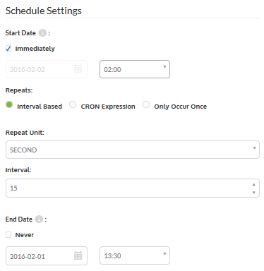

<!--Instructor Notes-->
<!--This exercise uses a basic amount of FME Workbench as a test for students-->
<!--If students have problems now, it is unlikely they will have much success at further exercises-->

<!--Exercise Section-->
<!--NB: In GitBook world we don't give a number to exercises-->

<table style="border-spacing: 0px;border-collapse: collapse;font-family:serif">
<tr>
<td width=25% style="vertical-align:middle;background-color:darkorange;border: 2px solid darkorange">
<i class="fa fa-cogs fa-lg fa-pull-left fa-fw" style="color:white;padding-right: 12px;vertical-align:text-top"></i>
Exercise 3 
</td>
<td style="border: 2px solid darkorange;background-color:darkorange;color:white">
Earthquake Processing
</td>
</tr>

<tr>
<td style="border: 1px solid darkorange; font-weight: bold">Data</td>
<td style="border: 1px solid darkorange">Earthquakes (GeoJSON)</td>
</tr>

<tr>
<td style="border: 1px solid darkorange; font-weight: bold">Overall Goal</td>
<td style="border: 1px solid darkorange">Create a workspace to read and process earthquake data and publish it to FME Server</td>
</tr>

<tr>
<td style="border: 1px solid darkorange; font-weight: bold">Demonstrates</td>
<td style="border: 1px solid darkorange">Scheduling a translation in FME Server</td>
</tr>

<tr>
<td style="border: 1px solid darkorange; font-weight: bold">Start Workspace</td>
<td style="border: 1px solid darkorange">N/A</td>
</tr>

<tr>
<td style="border: 1px solid darkorange; font-weight: bold">End Workspace</td>
<td style="border: 1px solid darkorange">N/A</td>
</tr>

</table>

---

You're a technical analyst in the GIS department of your local city. You have plenty of experience using FME Desktop, and your department is now investigating FME Server to evaluate its capabilities.

You have already published a workspace that processes a feed of earthquake data, published it to FME Server, and ran it. However... what happens if there is an earthquake in the night, when you are not at your post? Who will run it then?

The simplest method is to simply set up the translation to run on an automatic schedule. 

 **1) Connect to Server**
 Open the FME Server interface, either through the Web User Interface option on the start menu or directly in your web browser, and log in. Select Manage &gt; Schedules from the menu.

 **2) Create Test Schedule**
 Just to confirm that scheduling does work, let's set up a test schedule. Click the New button to start this process. Set a name of Test Schedule and add it to a Training category:

Under Workspace Settings, select the Training repository and from within that the workspace previously uploaded (Basics-Ex1-Complete.fmw):

 

There are no user parameters we need to change for this workspace, so any can be ignored.

 **3) Set Test Schedule**
 Now let's set some times for this schedule.

Set it to start immediately and run every 15 seconds. Set the end date to be approximately 30 minutes into the future (that way if we forget to cancel the schedule it won't carry on for ever!)

Be aware that the times are given in 24-hour format, so 1:30 means AM and 13:30 means PM.

Now click OK to add the new schedule.

 **4) Examine Jobs Page**
 Click Manage &gt; Jobs on the menu. A list of previously run jobs will open. You will find (if it was set up correctly) that there will be jobs running to schedule:

 **5) Create Actual Schedule**
 Now we are confident that we know how to use the interface, let's set up an actual schedule. We want the workspace to run, say, every two hours, each day of the week. There should also be no end date.

So, return to the Schedules page. You may now either:

- Click on the Test schedule and edit it to the required values
- Delete the test schedule and create a new one with the required values

You may wish to check back periodically during this training to ensure the workspace runs as expected.

---

<!--Exercise Congratulations Section--> 

<table style="border-spacing: 0px">
<tr>
<td style="vertical-align:middle;background-color:darkorange;border: 2px solid darkorange">
<i class="fa fa-thumbs-o-up fa-lg fa-pull-left fa-fw" style="color:white;padding-right: 12px;vertical-align:text-top"></i>
CONGRATULATIONS
</td>
</tr>

<tr>
<td style="border: 1px solid darkorange">

By completing this exercise you have learned how to:
 
<ul><li>Schedule a translation in FME Server</li>
<li>Check the job history to ensure the scheduled translation took place</li></ul>

</td>
</tr>
</table>