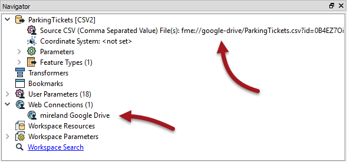
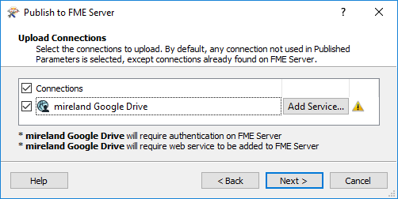
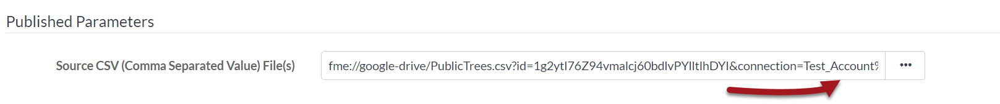

## Using Web Connections

Just as for databases, when the source data for a dataset is a web service, FME is capable of storing connection parameters in a secure container. That container can be either published to FME Server or recreated on it.

### What is a Web Connection? ###

Web connections are containers for a set of web service connection parameters. These parameters include the service, username, password (or authenticated connection), and others that vary according to the service type.

The two main advantages of web connections are:

- Connection parameters are no longer embedded in a workspace, meaning less of a security risk
	- For example, your parameters would not be exposed to anyone who downloaded the workspace
- Connection parameters can be reused among multiple workspaces
	- For example, two workspaces that use the same web service can use the same connection

Web connections can be published with a workspace from FME Desktop, or they can be added directly within FME Server.

---

### Creating Web Connections ###

Creating a web connection often starts in FME Desktop. They can be created using Tools &gt; FME Options &gt; Web Connections in the FME Workbench menubar. The defined connection can then be used in a reader, writer, or transformer.

For example, this workspace reads a CSV dataset using a connection to a Google Drive web service, as seen in the reader parameters and a list of web connections:

When the workspace is published to FME Server a new dialog asks the author whether to also publish the web connection:

The connection is then added to the connections container on FME Server.

---

<!--Person X Says Section-->

<table style="border-spacing: 0px">
<tr>
<td style="vertical-align:middle;background-color:darkorange;border: 2px solid darkorange">
<i class="fa fa-quote-left fa-lg fa-pull-left fa-fw" style="color:white;padding-right: 12px;vertical-align:text-top"></i>
Police Chief Webb-Mapp says...
</td>
</tr>

<tr>
<td style="border: 1px solid darkorange">

<strong>WARNING:</strong> While uploading a web service from Desktop is enough to run the connection, this service definition is provided by Safe Software for <strong>demonstration purposes</strong> and ease of use. The client id and client secret may become deactivated at any time. For production use, we recommend users obtain their own client id and client secret from the web service provider. Setting up the service definition for OAuth authentication is a task best left to system administrators. See the FME Server Administrator's Guide for more information on how to carry it out.

</td>
</tr>
</table>

### Using Web Connections ###

When a workspace is run, if it has a transformer or reader that references a web service then it will run correctly, just as on a Desktop installation.

In the published parameters on Server, the web connection is defined in the source dataset URL:

---

<!--Person X Says Section-->

<table style="border-spacing: 0px">
<tr>
<td style="vertical-align:middle;background-color:darkorange;border: 2px solid darkorange">
<i class="fa fa-quote-left fa-lg fa-pull-left fa-fw" style="color:white;padding-right: 12px;vertical-align:text-top"></i>
Sister Intuitive says...
</td>
</tr>

<tr>
<td style="border: 1px solid darkorange">

As with database connections, this functionality allows a workspace to be tested in FME Desktop using the author's connection parameters, but then switched to a general account once published to Server; all in a way that is both easy and secure.

</td>
</tr>
</table>
