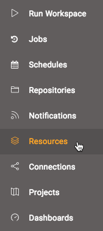
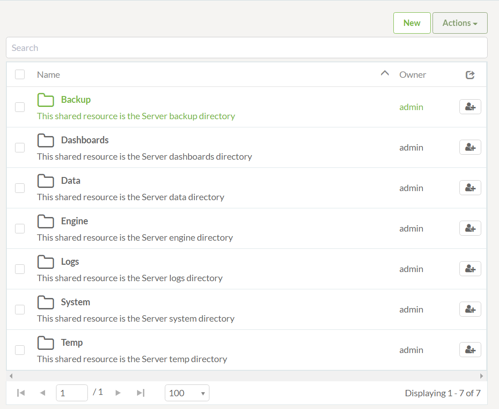
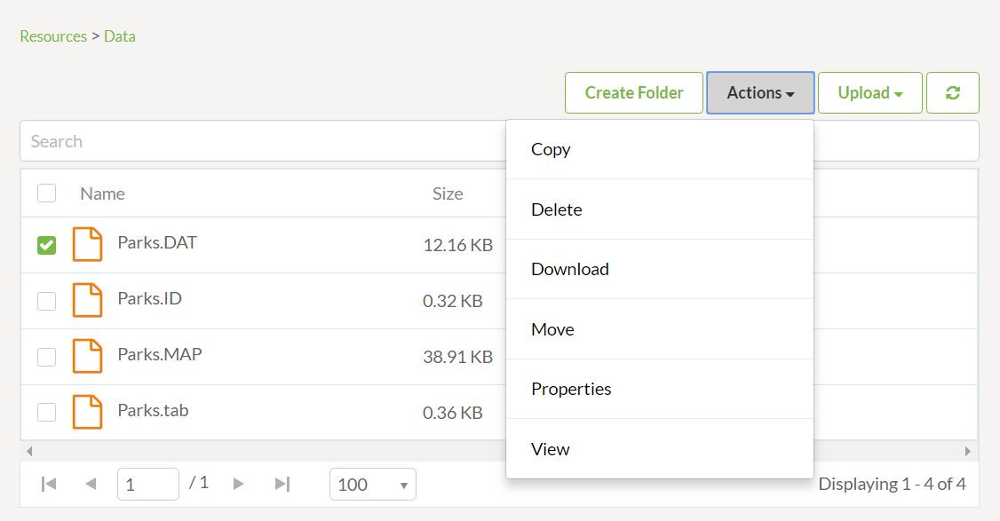
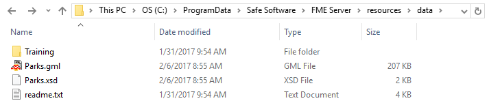
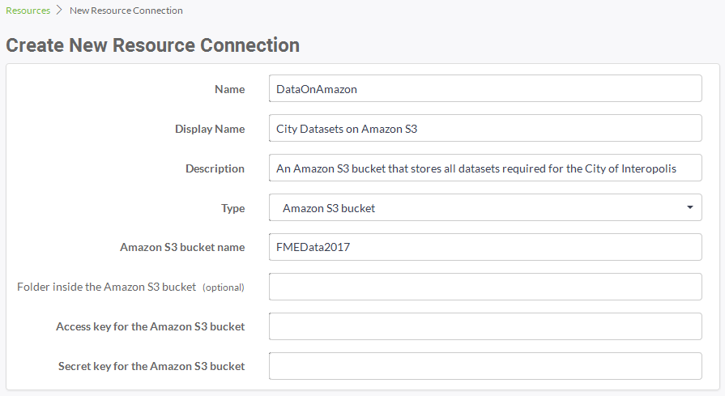
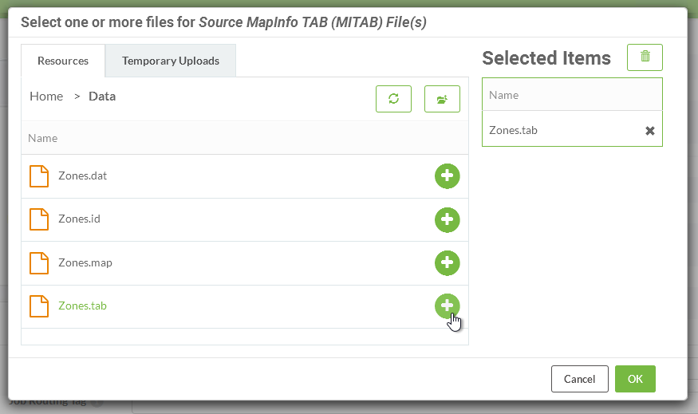
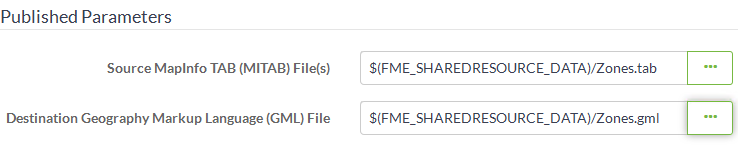

## The Resources File System ##

The final method of managing source data in FME Server is to use the system of tools called Resources.

---

### What are Resources? ###

"Resources" is an inbuilt file management system that allows data (and other files) to be published to an FME Server instance and used within all Server operations.

FME Server has a page for managing Resources, accessed through the main menu:

The Resources web page looks like this:

As you can see, the Resources filesystem is set up with a number of default folders in which files can be stored. For datasets the most logical to use is the Data folder. Although there are a number of different folders data can be stored in, the Data folder is the most logical location:

Above is the data folder containing several files. Notice once a dataset has been checked the **Actions** the button lists available actions such as upload, copy, delete, or move files (or folders).

---

### Other Upload Methods ###

Besides the web interface, there are other ways of getting data into the Resources filesystem.

Firstly, the FME Server publishing wizard in FME Workbench allows this. Where the default method is to select the files and upload them to the same repository as the workspace, it is permitted to change the location to the resources filesystem:

Alternatively, FME Server resources actually exists on the operating system's filesystem, meaning the data can be copied there directly. The default location (on a Windows operating system) is C:\ProgramData\Safe Software\FME Server\resources:

Finally, clicking the New button in the main Resources page allows a connection to be made directly to an Amazon S3 filesystem:

This allows data stored in S3 buckets to be used as the source for a translation on FME Server.

---

### Using Uploaded Data ###

Using Resources data in a translation is simply a case of selecting it from that folder where prompted. All prompts for data will allow selection of files from a Resources folder.

For example, a user has uploaded a MapInfo Zoning dataset to the Resources data folder. Provided the source dataset is a published parameter, when the workspace is run the user is able to select data from the Resources folders, like so:

In fact, it's even possible to set the output data folder to be a Resources folder too:

---

### Benefits for Data Management ###

There are several benefits to using the Resources filesystem as a data storage tool:

- Data can be used by any workspace, without having to upload it every time
- Data can be stored locally (to the Server engines), even when access to the operating system's filesystem is restricted
- A Resources folder can be mapped and shared among many users as a physical drive
- A Resources folder is a more permanent solution. Data is not removed by automated system cleaning tools

---

<!--Person X Says Section-->

<table style="border-spacing: 0px">
<tr>
<td style="vertical-align:middle;background-color:darkorange;border: 2px solid darkorange">
<i class="fa fa-quote-left fa-lg fa-pull-left fa-fw" style="color:white;padding-right: 12px;vertical-align:text-top"></i>
Miss Vector says...
</td>
</tr>

<tr>
<td style="border: 1px solid darkorange">

Not just one, but two questions this time!
 Firstly: I copy a workspace into a resources folder using the upload tool. What then?
  <a href="http://52.73.3.37/fmedatastreaming/Manual/QAResponse2017.fmw?chapter=21&question=7&answer=1&DestDataset_TEXTLINE=C%3A%5CFMEOutput%5CQAResponse.html">1. I can run it by browsing the resources, selecting the workspace, and clicking run</a>
 <a href="http://52.73.3.37/fmedatastreaming/Manual/QAResponse2017.fmw?chapter=21&question=7&answer=2&DestDataset_TEXTLINE=C%3A%5CFMEOutput%5CQAResponse.html">2. I can run it through the Manage &gt; Workspaces menu tools</a>
 <a href="http://52.73.3.37/fmedatastreaming/Manual/QAResponse2017.fmw?chapter=21&question=7&answer=3&DestDataset_TEXTLINE=C%3A%5CFMEOutput%5CQAResponse.html">3. I can run it by calling it with the FMEServerJobSubmitter transformer in FME Desktop</a>
 <a href="http://52.73.3.37/fmedatastreaming/Manual/QAResponse2017.fmw?chapter=21&question=7&answer=4&DestDataset_TEXTLINE=C%3A%5CFMEOutput%5CQAResponse.html">4. I can't run it because it's not properly published to a repository</a>
  Secondly: Uploading an entire folder of files come with what restriction?
  <a href="http://52.73.3.37/fmedatastreaming/Manual/QAResponse2017.fmw?chapter=21&question=8&answer=1&DestDataset_TEXTLINE=C%3A%5CFMEOutput%5CQAResponse.html">1. Folder upload only works on certain web browsers</a>
 <a href="http://52.73.3.37/fmedatastreaming/Manual/QAResponse2017.fmw?chapter=21&question=8&answer=2&DestDataset_TEXTLINE=C%3A%5CFMEOutput%5CQAResponse.html">2. Folder upload requires the folders to be zipped into a single file</a>
 <a href="http://52.73.3.37/fmedatastreaming/Manual/QAResponse2017.fmw?chapter=21&question=8&answer=3&DestDataset_TEXTLINE=C%3A%5CFMEOutput%5CQAResponse.html">3. Folder upload only works on Windows C: drive (not D:, E:, etc)</a>
 <a href="http://52.73.3.37/fmedatastreaming/Manual/QAResponse2017.fmw?chapter=21&question=8&answer=4&DestDataset_TEXTLINE=C%3A%5CFMEOutput%5CQAResponse.html">4. Folder upload requires FME Desktop to be installed on the computer being uploaded from</a>

</td>
</tr>
</table>
