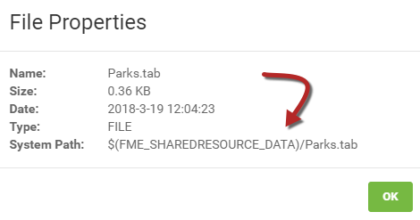

## Authoring for the Resources System ##

Using the FME Server web interface, it's simple to select data from the resources folder at run-time. However, in some cases, the author will want to read data from a resources folder without the end-user having to select it.

To do this requires the use of an FME parameter to define the data as coming from the resources folders.

---

### FME Parameters for Server ###

In FME Workbench, the Navigator window has a section called User Parameters. You might have noticed that one part of this is a list of FME Server-specific parameters. For a detailed description of all of the Server Parameters, please see the [FME Server Parameters documentation](https://docs.safe.com/fme/2018.0/html/FME_Desktop_Documentation/FME_ReadersWriters/!Transformer_Parameters/FME_Server_Parameters.htm):

The uses of these are many and varied; for example, FME&#95;SECURITY&#95;USER returns the name of the user running the workspace and could be used to either write to a custom log or perhaps filter data in different ways in the workspace based on the specific user. FME&#95;TOPIC would return the name of the notification topic (if any) that invoked the workspace.

However, when authoring for resources data, the most useful parameter is FME&#95;SHAREDRESOURCE&#95;DATA

---

<!--Warning Section-->

<table style="border-spacing: 0px">
<tr>
<td style="vertical-align:middle;background-color:darkorange;border: 2px solid darkorange">
<i class="fa fa-exclamation-triangle fa-lg fa-pull-left fa-fw" style="color:white;padding-right: 12px;vertical-align:text-top"></i>
WARNING
</td>
</tr>

<tr>
<td style="border: 1px solid darkorange">

A common factor to all these parameters is that they only have an effect when the workspace is run on FME Server. If the workspace is run on FME Desktop, it won't return a value. Therefore to test on Desktop a workspace containing such a parameter requires you to provide a dummy value.

</td>
</tr>
</table>

---

### FME&#95;SHAREDRESOURCE&#95;DATA ###

The FME&#95;SHAREDRESOURCE&#95;DATA parameter returns the path of the shared resource data. When authoring a workspace to read data directly from the resource folder, you would normally create the workspace using a local copy of the data, and then update the source dataset field to include the FME Server parameter:

Updating the field can be done directly by typing into the dialog, but is easier to achieve by clicking the drop-down arrow and choosing to use the Text Editor.

The entry in the Navigator window now looks like this:

Although the parameter is colored red in Desktop, when the workspace is run on Server the parameter is replaced by the actual path and the data is read as expected.

---

<!--Warning Section-->

<table style="border-spacing: 0px">
<tr>
<td style="vertical-align:middle;background-color:darkorange;border: 2px solid darkorange">
<i class="fa fa-exclamation-triangle fa-lg fa-pull-left fa-fw" style="color:white;padding-right: 12px;vertical-align:text-top"></i>
WARNING
</td>
</tr>

<tr>
<td style="border: 1px solid darkorange">

It's important to remember (for example notice in the screenshots above) that the Server parameter FME&#95;SHAREDRESOURCE&#95;DATA includes the 'Data' folder in its path.
  For example, I use FME&#95;SHAREDRESOURCE&#95;DATA\Zoning\Zones.tab not FME&#95;SHAREDRESOURCE&#95;DATA\Data\Zoning\Zones.tab

</td>
</tr>
</table>

---

### Shortcut to Resource Paths ###

Rather than setting the path in Workbench before uploading the data, you can also copy the path for an uploaded dataset and then paste that directly into Workbench.

The path for a shared resource is obtained by examining its properties in the FME Server Resources pages. To do this, locate the resource, click the checkbox beside the file, then click the Actions drop-down menu and select Properties:

This path can then be copied and pasted into a workspace in order to reference that dataset directly without manually entering it. Of course, this does require that the data has already been uploaded to FME Server, and isn't going to be uploaded with the workspace when it is published!

---

<!--Person X Says Section-->

<table style="border-spacing: 0px">
<tr>
<td style="vertical-align:middle;background-color:darkorange;border: 2px solid darkorange">
<i class="fa fa-quote-left fa-lg fa-pull-left fa-fw" style="color:white;padding-right: 12px;vertical-align:text-top"></i>
Miss Vector says...
</td>
</tr>

<tr>
<td style="border: 1px solid darkorange">

So I can make my workspace read specific data from the resources folders - but how do I stop the end-user from being able to change that?
  <a href="http://52.73.3.37/fmedatastreaming/Manual/QAResponse2017.fmw?chapter=21&question=9&answer=1&DestDataset_TEXTLINE=C%3A%5CFMEOutput%5CQAResponse.html">1. Remove their security permissions for the Job Submitter service</a>
 <a href="http://52.73.3.37/fmedatastreaming/Manual/QAResponse2017.fmw?chapter=21&question=9&answer=2&DestDataset_TEXTLINE=C%3A%5CFMEOutput%5CQAResponse.html">2. Remove their security permissions for the Resources folders</a>
 <a href="http://52.73.3.37/fmedatastreaming/Manual/QAResponse2017.fmw?chapter=21&question=9&answer=3&DestDataset_TEXTLINE=C%3A%5CFMEOutput%5CQAResponse.html">3. Make the source dataset parameter optional for that Reader</a>
 <a href="http://52.73.3.37/fmedatastreaming/Manual/QAResponse2017.fmw?chapter=21&question=9&answer=4&DestDataset_TEXTLINE=C%3A%5CFMEOutput%5CQAResponse.html">4. Delete the published parameter for that source dataset from the workspace</a>

</td>
</tr>
</table>
