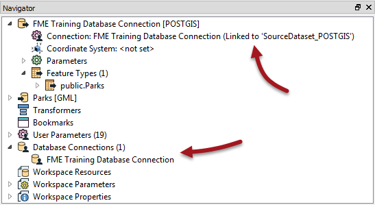
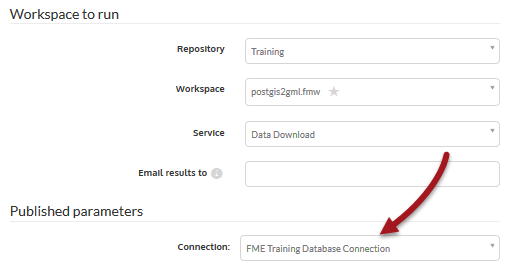

# Source Data Management

When the source data for a dataset is a database, instead of the workspace embedding connection parameters, a new technology can be used.

---

<!--New Section--> 

<table style="border-spacing: 0px">
<tr>
<td style="vertical-align:middle;background-color:darkorange;border: 2px solid darkorange">
<i class="fa fa-bolt fa-lg fa-pull-left fa-fw" style="color:white;padding-right: 12px;vertical-align:text-top"></i>
NEW
</td>
</tr>

<tr>
<td style="border: 1px solid darkorange">

Database connections were implemented in FME Desktop in FME2015, but Server support is entirely new for 2016

</td>
</tr>
</table>

---

## What is a Database Connection? ##

Database connections are containers for a set of database connection parameters. These parameters include database server, port number, username, password, and others that vary according to the database type.

Database connections can be published with a workspace from FME Desktop, or they can be added directly within FME Server. The two main advantages of database connections are:

- Connection parameters are no longer embedded in a workspace, meaning less of a security risk
	- For example, your parameters would not be exposed to anyone who downloaded the workspace
- Connection parameters can be reused among multiple workspaces
	- For example, two workspaces that use the same database can use the same connection

## Creating a Database Connection ##

Creating a database connection often starts in FME Desktop. This workspace has a connection for a PostGIS database:

When the workspace is published to FME Server a new dialog asks the author whether to also publish the database connection:

When run on Server the database connection is now available as a parameter:

The workspace then runs to completion as normal.

## Managing Database Connections ##

FME Server also has a section for managing database connections under Manage &gt; Database Connections on the menubar. This page allows administrators to create new connections, copy existing connections, delete existing connections, or edit existing connections:

---

<!--Person X Says Section-->

<table style="border-spacing: 0px">
<tr>
<td style="vertical-align:middle;background-color:darkorange;border: 2px solid darkorange">
<i class="fa fa-quote-left fa-lg fa-pull-left fa-fw" style="color:white;padding-right: 12px;vertical-align:text-top"></i>
Police Chief Webb-Mapp says...
</td>
</tr>

<tr>
<td style="border: 1px solid darkorange">

With this technology, a workspace can be tested in FME Desktop using the author's connection parameters, but then switched to a general account once published to Server; all in a way that is both easy and secure. 

</td>
</tr>
</table>