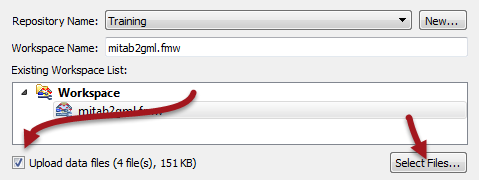

## Publishing Source Data ##

When the source data for a translation is stored as files (rather than a feed or database) it can be published to FME Server along with the workspace.

---

### Publishing Source Data ###

In this workspace the source dataset is MapInfo TAB:

A MapInfo TAB dataset is made up of a series of files (.tab, .dat, .id, .map). When this workspace is published the wizard allows us to published the data files alongside it by simply checking the box labelled *Upload data files*. 

 

FME automatically selects the files to upload based on what it thinks is necessary to run the translation. If there are other files you wish to upload, or files FME selected that you don't wish to upload, the Select Files button allows you to make changes:

This dialog also allows you to change where the files are published to, but for now we'll ignore that setting and go with the default of publishing to the repository.

Once the publishing wizard is complete, those files are uploaded to FME Server and tagged for use with this workspace.

---

### Using Published Source Data ###

When a workspace published with its data is run on FME Server, the uploaded data automatically is used as the source:

There are no other settings that need to be changed and the workspace will run to completion using the published data as its source.

However, although simple, there is a major limitation to managing data in this method: a dataset published in this way can only be referenced by this workspace, and by no other. It is hidden within FME Server's system files and is inaccessible to any other use.
 