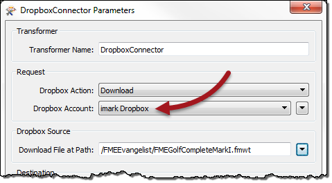
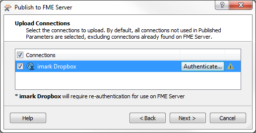

## Web Connections

When the source data for a dataset is a web service, instead of the workspace embedding connection parameters, a new technology can be used.

---

<!--New Section--> 

<table style="border-spacing: 0px">
<tr>
<td style="vertical-align:middle;background-color:darkorange;border: 2px solid darkorange">
<i class="fa fa-bolt fa-lg fa-pull-left fa-fw" style="color:white;padding-right: 12px;vertical-align:text-top"></i>
NEW
</td>
</tr>

<tr>
<td style="border: 1px solid darkorange">

Web connections were implemented in FME Desktop in FME2015, but Server support is entirely new for 2016.1

</td>
</tr>
</table>

---

### What is a Web Connection? ###

Web connections are containers for a set of web service connection parameters. These parameters include the service, username, password (or authenticated connection), and others that vary according to the service type.

The two main advantages of web connections are:

- Connection parameters are no longer embedded in a workspace, meaning less of a security risk
	- For example, your parameters would not be exposed to anyone who downloaded the workspace
- Connection parameters can be reused among multiple workspaces
	- For example, two workspaces that use the same web service can use the same connection

Web connections can be published with a workspace from FME Desktop, but not added directly within FME Server.

---

### Creating a Web Connection ###

Creating a web connection starts in FME Desktop using Tools &gt; FME Options &gt; Web Connections in Workbench.

When the workspace is published to FME Server a new dialog asks the author whether to also publish the web connection:

Notice how it must be re-authenticated for use on FME Server. By publishing and authenticating the web connection, the workspace that uses it can run to completion on Server as it would on Desktop.

---

### Managing Web Connections ###

FME Server also has a section for managing web connections under Manage &gt; Web Connections on the menubar. Currently this page allows administrators only to delete existing connections. The ability to create and edit connections is planned for FME2017

---

### Using Web Connections ###

When a workspace is run, if it has a transformer or reader that references a web service (of the correct type) then the end-user is prompted and can select the web connection to use

---

<!--Person X Says Section-->

<table style="border-spacing: 0px">
<tr>
<td style="vertical-align:middle;background-color:darkorange;border: 2px solid darkorange">
<i class="fa fa-quote-left fa-lg fa-pull-left fa-fw" style="color:white;padding-right: 12px;vertical-align:text-top"></i>
Sister Intuitive says...
</td>
</tr>

<tr>
<td style="border: 1px solid darkorange">

As with database connections, this functionality allows a workspace to be tested in FME Desktop using the author's connection parameters, but then switched to a general account once published to Server; all in a way that is both easy and secure. 

</td>
</tr>
</table>

