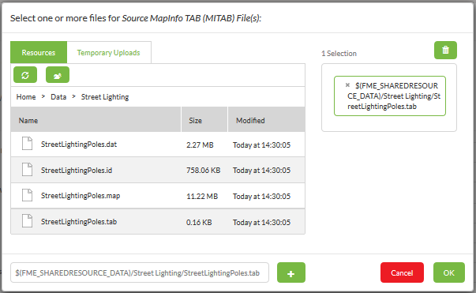
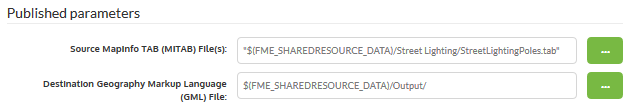
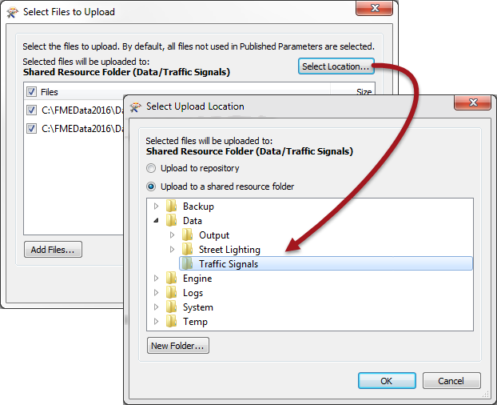
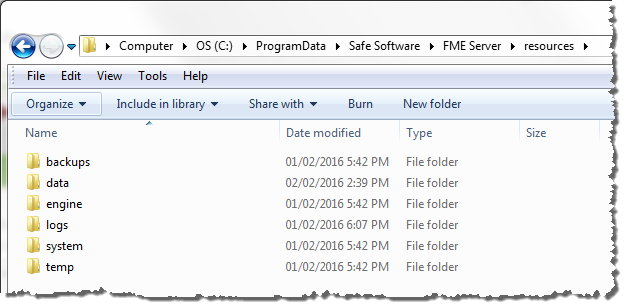

## Resources System ##

The final method of managing source data in FME Server is to use the system of tools called Resources.

---

### What are Resources? ###

"Resources" is an inbuilt file management system that allows data (and other files) to be published to an FME Server instance and used within all Server operations. It is accessed using Manage &gt; Resources from the web interface menu.

The Resources web page looks like this:

Although there are a number of different folders data can be stored in, the Data folder is the most logical location:

In this window are options to upload either a selection of files or an entire folder. Additionally, new folders can be created, and existing data moved, copied, or deleted.

---

### Using Uploaded Data ###

Using uploaded data in a translation is very simple. Here, for example, a user has created a new subfolder in the resources file system (Home &gt; Data &gt; StreetLighting), and has uploaded some MapInfo data to it:

Now when the workspace is run, the end-user clicks the browse button and is able to select data from the Resources folders, like so:

In fact, it's even possible to set the output data folder to be a Resources folder too:

---

### Other Upload Methods ###

Besides the web interface, there are other ways of getting data into the Resources filesystem.

Firstly, the FME Server publishing wizard in FME Workbench allows this. Where the default method is to select the files and upload them to the same repository as the workspace, it is permitted to change the location to the resources filesystem:

Alternatively, FME Server resources actually exists on the operating system's filesystem, meaning the data can be copied there directly. The default location (on a Windows operating system) is C:\ProgramData\Safe Software\FME Server\resources:

Finally, the Resources system also allows connections to Amazon S3: 

This allows data stored in S3 buckets to be used as the source for a translation on FME Server.

---

<!--Person X Says Section-->

<table style="border-spacing: 0px">
<tr>
<td style="vertical-align:middle;background-color:darkorange;border: 2px solid darkorange">
<i class="fa fa-quote-left fa-lg fa-pull-left fa-fw" style="color:white;padding-right: 12px;vertical-align:text-top"></i>
Sister Intuitive says...
</td>
</tr>

<tr>
<td style="border: 1px solid darkorange">

The Resources filesystem was (prior to FME2016) located within the FME Server installation folder on the operating system, but was moved in 2016 as the installation folder is (or should be) a restricted space off-limits to most users.

</td>
</tr>
</table>

---

### Benefits for Data Management ###

The advantage of these Resources, compared to other methods, is that data can be uploaded and referenced by any workspace, without having to upload it every time. This is particularly useful when access to the file system is restricted (like on an FME Cloud system).

If the workspace author does have access to the file system, then Resources are still useful, as a Resources folder can be mapped and shared among many users as a physical drive.
