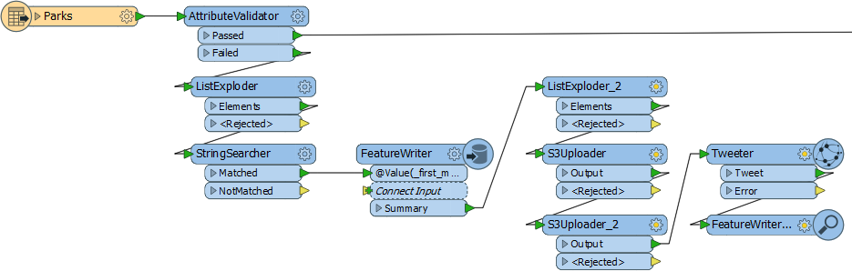
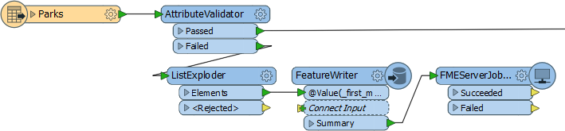
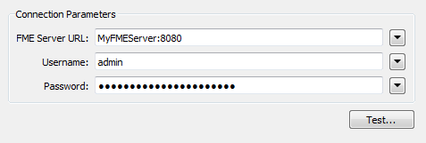
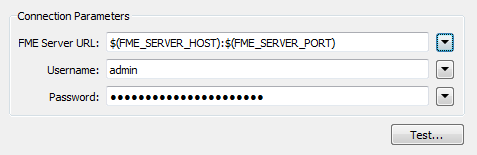

# Authoring Job Chains #

Workflow Management is a technique for controlling workspaces in sequence or branching with in-built logic. Part of this technique is being able to author workspaces that are "chained together" to run one after another.

---

## What are Job Chains? ##

A chain of jobs is one that is run in sequence one after the other. There are various ways to implement this.

### The FeatureWriter Transformer ###
The easiest way to chain workspaces... is not to! A chain is often necessary because one workspace writes data that the next must then process. However, the FeatureWriter transformer allows data to be written and then further transformation to take place within the same workspace!

In the above workspace, data is validated and validation errors written out to a series of datasets according to the error type. These datasets are uploaded to Amazon S3 and a tweet sent to alert someone to the problems.

Without the FeatureWriter, such a project might have taken two or maybe three workspaces chained together. Here it only requires one.

---

<!--New Section--> 

<table style="border-spacing: 0px">
<tr>
<td style="vertical-align:middle;background-color:darkorange;border: 2px solid darkorange">
<i class="fa fa-bolt fa-lg fa-pull-left fa-fw" style="color:white;padding-right: 12px;vertical-align:text-top"></i>
NEW
</td>
</tr>

<tr>
<td style="border: 1px solid darkorange">

The FeatureWriter transformer is new for FME2016, and advances the capabilities of FME Server by a huge amount. Further information is available in <a href="https://blog.safe.com/2016/01/fmeevangelist143/">this blog post</a> and in the <a href="http://www.safe.com/webinar/">FME2016 Deep Dive webinars</a> on the Safe web site.

</td>
</tr>
</table>

--- 

### A Simple Chain ###

It's fairly simple to get one workspace to run another; all that is needed is a transformer or shutdown script to send the command. Given that each workspace in FME Server can be run using a URL, and that there is a REST API to do similarly, it's quite simple to run a HTTP command using a HTTPCaller transformer or a shutdown script.

Alternatively, an FMEServerJobSubmitter transformer can be used. This transformer triggers a workspace to run on FME Server. It has various parameters that allow the author to define which workspace on which FME Server is to be run.

By adding this transformer to multiple workspaces a chain of almost any length can be created.

In this workspace the data is sent to a FeatureWriter transformer, and the results of that sent as a single summary feature that triggers the FMEServerJobSubmitter. 

However, don't think a FeatureWriter is a necessity for a chain of data. It's equally valid for a step in the chain to not write data, but just carry out an action and trigger the next step.

---

<table style="border-spacing: 0px">
<tr>
<td style="vertical-align:middle;background-color:darkorange;border: 2px solid darkorange">
<i class="fa fa-quote-left fa-lg fa-pull-left fa-fw" style="color:white;padding-right: 12px;vertical-align:text-top"></i>
Sister Intuitive says…
</td>
</tr>

<tr>
<td style="border: 1px solid darkorange">

The first workspace in a chain may start with a Reader that reads a source dataset, where each source feature triggers the FMEServerJobSubmitter. For example, the source data may be a list of files that are to be translated.
  But more often the next job needs to be triggered just once. This requires only a single feature and to produce this a Creator transformer can be used instead of a Reader, or a Sampler transformer used to restrict the flow of features to a single one.

</td>
</tr>
</table>

---

### A Parent-Child Approach ###
Instead of a chain of workspaces where one calls the next, a different approach is to have a control (parent) workspace that runs a series of (child) workspaces in turn.

Like in a simple chain, a master workspace runs other workspaces by using a transformer such as the FMEServerJobSubmitter.

Here a control workspace is using the FMEServerJobSubmitter to run three further FME workspaces. Maybe each workspace is a separate step in a database update process:

If a particular task fails then the output is routed to a text file Writer – meaning this could be used in a notification system to send an email to an administrator alerting them to the failure. Successfully executing all three results in a tweet being sent.

Instead of "Parent-Child", this setup is sometimes also known as the "Master-Slave" approach.

---

### Conditional Processing ###

In some scenarios there might be several workspaces, only one of which should be run. To do so the logic for deciding which workspace is executed can be made using a Tester, or other filter transformer.

For example, here an organization runs a daily process to upload field updates into a database. Once a week it does the same, but also exports all files to Dropbox (for example):

The test is carried out by a Tester, and the daily/weekly processes are each defined in a separate workspace. 

---

### FMEServerJobSubmitter and Portability ###

The FMEServerJobSubmitter transformer has connection parameters in which to define the Server instance and port number on which the job is to be submitted:

Here, for example, the workspace is to be run on a server called "MyFMEServer" which is connected to via port 8080. 

However, many FME Server installations include not one, but two servers. One for development and testing and the other the live system. If you develop a solution using an FMEServerJobSubmitter that connects to MyFMEServerDev (for example) then you would need to go back to each workspace and manually change the server name within each transformer.

So, best practice for this scenario is to not hard-code these values, but to add them as FME Server parameters. There are two specific parameters that can be used: **FME&#95;SERVER&#95;HOST** and **FME&#95;SERVER&#95;PORT**.

*FME&#95;SERVER&#95;HOST* can be used individually by selecting it from the drop-down menu on the right-hand-side of the FME Server URL parameter.

*FME&#95;SERVER&#95;PORT* can be incorporated by using the text editor (select Open Text Editor from the drop-down menu) and concatenating it with *FME&#95;SERVER&#95;HOST* 

Now this chain of workspaces will work on whatever Server installation it is deployed. 

Of course, if the initial (Parent/Master) workspace uses this technique it MUST also be run on the same Server installation. You couldn't run it on FME Desktop (for example) because FME Desktop won't have values for those two System Parameters.

---

<!--Warning Section--> 

<table style="border-spacing: 0px">
<tr>
<td style="vertical-align:middle;background-color:darkorange;border: 2px solid darkorange">
<i class="fa fa-exclamation-triangle fa-lg fa-pull-left fa-fw" style="color:white;padding-right: 12px;vertical-align:text-top"></i>
WARNING
</td>
</tr>

<tr>
<td style="border: 1px solid darkorange">

Interestingly, for either method, the initial/control workspace can be run on either FME Desktop (e.g. Workbench) or FME Server. The FMEServerJobSubmitter works on both platforms.
  However, there's a difference. On FME Desktop the control workspace runs immediately, but each child job executed by an FMEServerJobSubmitter transformer is submitted to the FME Server queue and may have to wait for an engine. On FME Server - if you have Wait for Job to Complete = Yes - it's the reverse: the control workspace is submitted to the queue, but each child job executed by an FMEServerJobSubmitter bypasses the queue and runs immediately. 
  This means that on Desktop the child processes are affected by the FMEServerJobSubmitter Job Priority and Job Tag parameters. But on Server (when Wait for Job = Yes) those parameters are ignored because the child processes are run immediately and not queued. In short, those FMEServerJobSubmitter parameters only apply when the call comes from FME Desktop, because only then are the jobs queued. 

</td>
</tr>
</table>