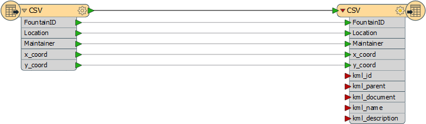
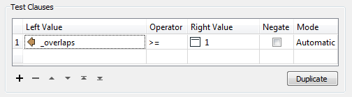
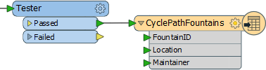

<!--Instructor Notes-->

<!--Exercise Section-->
<!--NB: In GitBook world we don't give a number to exercises-->

<table style="border-spacing: 0px;border-collapse: collapse;font-family:serif">
<tr>
<td width=25% style="vertical-align:middle;background-color:darkorange;border: 2px solid darkorange">
<i class="fa fa-cogs fa-lg fa-pull-left fa-fw" style="color:white;padding-right: 12px;vertical-align:text-top"></i>
Exercise 1
</td>
<td style="border: 2px solid darkorange;background-color:darkorange;color:white">

</td>
</tr>

<tr>
<td style="border: 1px solid darkorange; font-weight: bold">Data</td>
<td style="border: 1px solid darkorange"></td>
</tr>

<tr>
<td style="border: 1px solid darkorange; font-weight: bold">Overall Goal</td>
<td style="border: 1px solid darkorange"></td>
</tr>

<tr>
<td style="border: 1px solid darkorange; font-weight: bold">Demonstrates</td>
<td style="border: 1px solid darkorange"></td>
</tr>

<tr>
<td style="border: 1px solid darkorange; font-weight: bold">Start Workspace</td>
<td style="border: 1px solid darkorange">None</td>
</tr>

<tr>
<td style="border: 1px solid darkorange; font-weight: bold">End Workspace</td>
<td style="border: 1px solid darkorange">C:\FMEData2016\Workspaces\ServerAuthoring\Running-Ex1-Complete.fmw</td>
</tr>

</table>

---

You're a technical analyst in the GIS department of your local city. You have plenty of experience using FME Desktop, and your department has just purchased FME Server.

Today's task for you is to use two datasets - cycle paths and drinking fountains - to figure out which drinking fountains are close (within 20 metres) of a cycle route. The output is to be written as a KML dataset.

You can easily do this using FME Desktop, and decide to publish it to FME Server too so that users can upload their own set of cycle paths.

---

 **1) Inspect Source Data**
 The first task in any new project is to inspect the source data, so let's do that. Use the FME Data Inspector to open these two datasets:

<table style="border: 0px">

<tr>
<td style="font-weight: bold">Reader Format</td>
<td style="">Esri Shapefile</td>
</tr>

<tr>
<td style="font-weight: bold">Reader Dataset</td>
<td style="">C:\FMEData2016\Data\Transportation\Cycling\BikePaths_L.shp</td>
</tr>

</table>

<table style="border: 0px">

<tr>
<td style="font-weight: bold">Reader Format</td>
<td style="">CSV (Comma Separated Value)</td>
</tr>

<tr>
<td style="font-weight: bold">Reader Dataset</td>
<td style="">C:\FMEData2016\Data\Engineering\DrinkingFountains.csv</td>
</tr>

</table>

You can view the CSV data as a table only, or you can set the Schema Attributes (in the parameters dialog) to ensure the X/Y coordinate fields are interpreted as coordinate values. The data will look like this:

 **2) Create Workspace**
 Having seen what the data looks like, let's create a workspace to process it. Start FME Workbench and select the Generate Workspace tool. When prompted create the workspace with these parameters:

<table style="border: 0px">

<tr>
<td style="font-weight: bold">Reader Format</td>
<td style="">CSV (Comma Separated Value)</td>
</tr>

<tr>
<td style="font-weight: bold">Reader Dataset</td>
<td style="">C:\FMEData2016\Data\Engineering\DrinkingFountains.csv</td>
</tr>

<tr>
<td style="font-weight: bold">Reader Parameters</td>
<td style="">Coordinate System: utm83-10 Schema Attributes: x_coord, type = x_coordinate Schema Attributes: y_coord, type = y_coordinate  </td>
</tr>

<tr>
<td style="font-weight: bold">Writer Format</td>
<td style="">Google KML</td>
</tr>

<tr>
<td style="font-weight: bold">Reader Dataset</td>
<td style="">C:\FMEData2016\Output\DrinkingFountains.kml</td>
</tr>

</table>

 **3) Add Cycle Path Reader**
 The workspace, at this point, looks like this:

You'll notice that the reason we created the workspace with the CSV data is because it contains the attributes we want on the output. But now we should also add the cycle path data.

Select Readers &gt; Add Reader from the menubar. When prompted select the source data as follows:

<table style="border: 0px">

<tr>
<td style="font-weight: bold">Reader Format</td>
<td style="">Esri Shapefile</td>
</tr>

<tr>
<td style="font-weight: bold">Reader Dataset</td>
<td style="">C:\FMEData2016\Data\Transportation\Cycling\BikePaths_L.shp</td>
</tr>

<tr>
<td style="font-weight: bold">Workflow Option</td>
<td style="">Single Merged Feature Type</td>
</tr>

</table>

Click OK to add the Reader to the workspace. The reason we selected the Merged Feature Type option is because there are other cycle path datasets in that folder that we may wish to read in the future, and this option will allow each data file to pass into the workspace. 

 **4) Add Transformers**
 There are various ways we could find the closest water fountains to the cycle paths, but the simplest is perhaps to buffer the cycle paths, overlay the two datasets, and then check for overlaps. 

To do this requires three transformers: a GeographicBufferer, a PointOnAreaOverlayer, and a Tester. Place one instance of each transformer and connect them up in this configuration:

- CSV Reader &gt; PointOnAreaOverlayer:Point
- Cycle Reader &gt; GeographicBufferer:Input
- GeographicBuffer:Output &gt; PointOnAreaOverlayer:Area
- PointOnAreaOverlayer:Point &gt; Tester
- Tester:Passed &gt; KML Writer 

 **5) Set Transformer Parameters**
 Now the transformers are placed, let's set the parameters. 

- GeographicBufferer: Units=Metres, Distance=20
- PointOnAreaOverlayer: None
- Tester: Test Clause: _overlaps >= 1

These parameters will ensure we create a 20m buffer around each cycle path, count the number of times a drinking fountain overlaps the buffer, and filter through only drinking fountains with a count of 1 or greater.
 

 **6) Set Writer Schema**
 The only last thing to do is clean up the writer schema. We don't need to write out the x_coord or y_coord attributes in the output, and we don't need to see the kml attributes that have been exposed. Plus the feature type name for the output should be something other than "CSV".

So open the feature type properties for the KML Writer feature type.

In the general tab change the name from CSV to CyclePathFountains. In the user attributes tab remove the x_coord and y_coord attribute and any other kml attributes that have been added.

The result will look like this:

Save the workspace and run it to make sure the output looks correct.

---

<!--Person X Says Section-->

<table style="border-spacing: 0px">
<tr>
<td style="vertical-align:middle;background-color:darkorange;border: 2px solid darkorange">
<i class="fa fa-quote-left fa-lg fa-pull-left fa-fw" style="color:white;padding-right: 12px;vertical-align:text-top"></i>
Ms Analyst says...
</td>
</tr>

<tr>
<td style="border: 1px solid darkorange">

If the workspace fails with the error KML: Feature does not have a coordinate system specified then you did not set the coordinate system when you generated the workspace. Find the Reader coordinate system parameter in the Navigator window, set it to utm83-10, and try again!

</td>
</tr>
</table>

---

ddddddddddddddddddddddddddddddddddd

---

<!--Exercise Congratulations Section--> 

<table style="border-spacing: 0px">
<tr>
<td style="vertical-align:middle;background-color:darkorange;border: 2px solid darkorange">
<i class="fa fa-thumbs-o-up fa-lg fa-pull-left fa-fw" style="color:white;padding-right: 12px;vertical-align:text-top"></i>
CONGRATULATIONS
</td>
</tr>

<tr>
<td style="border: 1px solid darkorange">

By completing this exercise you have learned how to:
 
<ul><li>Create a workspace using a GeoJSON feed as the source</li>
<li>Publish a workspace to FME Server using the Publishing Wizard</li>
<li>Create a repository on FME Server using the Publishing Wizard</li>
<li>Register a workspace with the Job Submitter service using the Publishing Wizard</li></ul>

</td>
</tr>
</table>