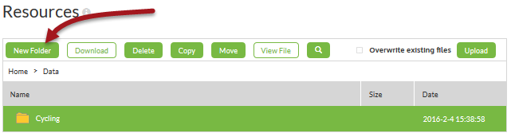
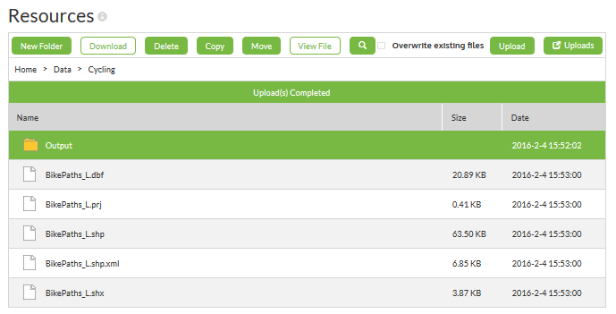
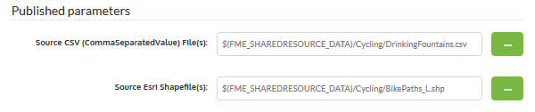
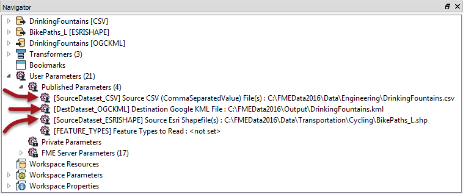
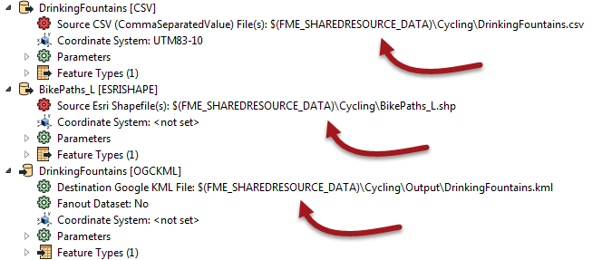

<!--Instructor Notes-->

<!--Exercise Section-->
<!--NB: In GitBook world we don't give a number to exercises-->

<table style="border-spacing: 0px;border-collapse: collapse;font-family:serif">
<tr>
<td width=25% style="vertical-align:middle;background-color:darkorange;border: 2px solid darkorange">
<i class="fa fa-cogs fa-lg fa-pull-left fa-fw" style="color:white;padding-right: 12px;vertical-align:text-top"></i>
Exercise 2
</td>
<td style="border: 2px solid darkorange;background-color:darkorange;color:white">

</td>
</tr>

<tr>
<td style="border: 1px solid darkorange; font-weight: bold">Data</td>
<td style="border: 1px solid darkorange">Cycle Paths (Esri Shapefile) Drinking Fountains (CSV (Comma Separated Value))</td>
</tr>

<tr>
<td style="border: 1px solid darkorange; font-weight: bold">Overall Goal</td>
<td style="border: 1px solid darkorange">Create an FME Server-hosted workspace to identify drinking fountains with 20 metres of a cycle path</td>
</tr>

<tr>
<td style="border: 1px solid darkorange; font-weight: bold">Demonstrates</td>
<td style="border: 1px solid darkorange">Uploading data to a resources folder and authoring a workspace to make use of it</td>
</tr>

<tr>
<td style="border: 1px solid darkorange; font-weight: bold">Start Workspace</td>
<td style="border: 1px solid darkorange">C:\FMEData2016\Workspaces\ServerAuthoring\Running-Ex2-Begin.fmw</td>
</tr>

<tr>
<td style="border: 1px solid darkorange; font-weight: bold">End Workspace</td>
<td style="border: 1px solid darkorange">C:\FMEData2016\Workspaces\ServerAuthoring\Running-Ex2-Complete.fmw</td>
</tr>

</table>

---

You're a technical analyst in the GIS department of your local city. You have plenty of experience using FME Desktop, and your department has just purchased FME Server.

Today's task for you is to use two datasets - cycle paths and drinking fountains - to figure out which drinking fountains are close (within 20 metres) of a cycle route. The output is to be written as a KML dataset.

So far you have created the workspace and published it to FME Server along with a set of data. However, it would be better practice to upload the source data to the FME Server Resources file system. That way the data could be used not only for this project, but any other that wished to use it.

We could also ensure that the output data is written to the resources folders too.

---

 **1) Open FME Server Web Interface**
 Open and log in to the FME Server web interface. Choose Manage &gt; Resources on the menubar to navigate to the resources management pages.

 **2) Create Folder**
 Most data should go under the Data folder, so double-click on Data in the dialog to open that folder. To avoid mixing datasets our data should go into its own subfolder. So click on the New Folder button and create a folder called Cycling:

Next double-click on Cycling and within that folder create another new one called Output.

 **3) Upload Cycle Path Data**
 Now, within the cycling folder, click the upload button and upload the five files for the cycling dataset:

<table style="border: 0px">

<tr>
<td style="font-weight: bold">Reader Dataset</td>
<td style="">C:\FMEData2016\Data\Transportation\Cycling\BikePaths_L.shp</td>
</tr>

</table>

Also upload into that folder, the source data for the drinking fountains:

<table style="border: 0px">

<tr>
<td style="font-weight: bold">Reader Dataset</td>
<td style="">C:\FMEData2016\Data\Engineering\DrinkingFountains.csv</td>
</tr>

</table>

So we now have both source datasets and a folder to write the output data to.

 **4) Run Workspace**
 Now locate and run the workspace published in exercise 1 (or else open the workspace listed above and publish it to FME Server).

In the published parameters for the workspace be sure to click the browse button, navigate to the resources folder Cycling, and select the appropriate files:

Click Run Workspace to finish running the workspace.

---

<!--Person X Says Section-->

<table style="border-spacing: 0px">
<tr>
<td style="vertical-align:middle;background-color:darkorange;border: 2px solid darkorange">
<i class="fa fa-quote-left fa-lg fa-pull-left fa-fw" style="color:white;padding-right: 12px;vertical-align:text-top"></i>
Ms Analyst says...
</td>
</tr>

<tr>
<td style="border: 1px solid darkorange">

You should also set the output location to the Cycling/Output folder - though of course there won't be an output folder location if you run this using the Data Download service!

</td>
</tr>
</table>

---

 **5) Open Workspace for Editing**
 Although the workspace ran correctly, and used the data in the resources folder, that's only because we selected that data at run time. It is not a permanent feature of the workspace.

For example, if I downloaded the workspace into FME Workbench, it would point to the original (local) data files, not the resources folder.

It would be much better if the workspace was programmed to look into the resources folders automatically.

So, start FME Workbench and open the workspace from exercise 1 (or the begin workspace listed above).

 **6) Delete Published Parameters**
 If we do set the workspace to read from the resources folders, we don't want to give users the chance to change that. So in the Navigator window locate the  three parameters for source and destination datasets and delete them:

 **7) Set Source/Destination Parameters**
 Now, in turn, double-click the source and destination dataset parameters and change them to:

<table>
<tr><td>CSV Reader</td><td>$(FME&#95;SHAREDRESOURCE&#95;DATA)\Cycling\DrinkingFountains.csv</td></tr>
<tr><td>Shape Reader</td><td>$(FME&#95;SHAREDRESOURCE&#95;DATA)\Cycling\BikePaths&#95;L.shp</td></tr>
<tr><td>KML Writer</td><td>$(FME&#95;SHAREDRESOURCE&#95;DATA)\Cycling\Output\DrinkingFountains.kml</td></tr>
</table>

<!--Person X Says Section-->

<table style="border-spacing: 0px">
<tr>
<td style="vertical-align:middle;background-color:darkorange;border: 2px solid darkorange">
<i class="fa fa-quote-left fa-lg fa-pull-left fa-fw" style="color:white;padding-right: 12px;vertical-align:text-top"></i>
Ms Analyst says...
</td>
</tr>

<tr>
<td style="border: 1px solid darkorange">

Remember, you can also obtain these file paths by locating the files in the FME Server web interface, right-clicking, and choosing Properties.

</td>
</tr>
</table>

---

The result will look like this:

Save the workspace and publish it back to FME Server.

---

<!--Person X Says Section-->

<table style="border-spacing: 0px">
<tr>
<td style="vertical-align:middle;background-color:darkorange;border: 2px solid darkorange">
<i class="fa fa-quote-left fa-lg fa-pull-left fa-fw" style="color:white;padding-right: 12px;vertical-align:text-top"></i>
Ms Analyst says...
</td>
</tr>

<tr>
<td style="border: 1px solid darkorange">

This time you won't be able to test-run the workspace in FME Workbench, because it won't recognize the shared resource parameter. Only FME Server will return a value for that parameter.

</td>
</tr>
</table>

---

 **8) Re-Run Workspace**
 Now run the workspace on FME Server. Be sure to use the Job Submitter service (not Data Download) so the output is written to the required file. This time you will not be prompted with a parameter to select the source (or destination) datasets, but they will be used in the resources folders just the same.

---

<!--Exercise Congratulations Section--> 

<table style="border-spacing: 0px">
<tr>
<td style="vertical-align:middle;background-color:darkorange;border: 2px solid darkorange">
<i class="fa fa-thumbs-o-up fa-lg fa-pull-left fa-fw" style="color:white;padding-right: 12px;vertical-align:text-top"></i>
CONGRATULATIONS
</td>
</tr>

<tr>
<td style="border: 1px solid darkorange">

By completing this exercise you have learned how to:
 
<ul><li>Create resources folders and upload data to them</li>
<li>Run a workspace and select data from resources folders</li>
<li>Edit a workspace to permanently use the resources folders</li>
<li>Delete parameters to prevent the end-user changing them</li></ul>

</td>
</tr>
</table>