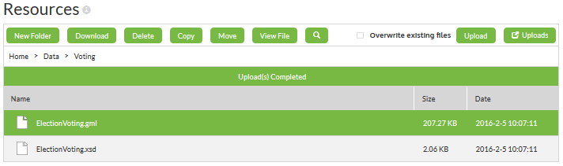
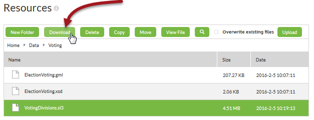
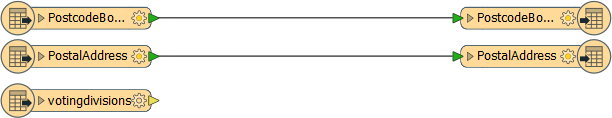
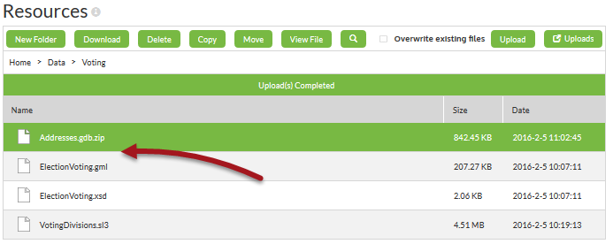
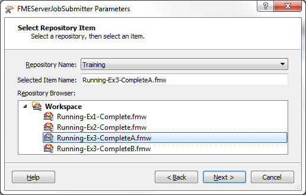

<!--Instructor Notes-->

<!--Exercise Section-->
<!--NB: In GitBook world we don't give a number to exercises-->

<table style="border-spacing: 0px;border-collapse: collapse;font-family:serif">
<tr>
<td width=25% style="vertical-align:middle;background-color:darkorange;border: 2px solid darkorange">
<i class="fa fa-cogs fa-lg fa-pull-left fa-fw" style="color:white;padding-right: 12px;vertical-align:text-top"></i>
Exercise 3
</td>
<td style="border: 2px solid darkorange;background-color:darkorange;color:white">

</td>
</tr>

<tr>
<td style="border: 1px solid darkorange; font-weight: bold">Data</td>
<td style="border: 1px solid darkorange">Voting Divisions (GML (Geography Markup Language)) Addresses (Esri Geodatabase (File Geodb API))</td>
</tr>

<tr>
<td style="border: 1px solid darkorange; font-weight: bold">Overall Goal</td>
<td style="border: 1px solid darkorange">Create workspaces to: - process voting divisions - to assign voting divisions to addresses - to chain the previous two translations together</td>
</tr>

<tr>
<td style="border: 1px solid darkorange; font-weight: bold">Demonstrates</td>
<td style="border: 1px solid darkorange">Authoring workspace chains</td>
</tr>

<tr>
<td style="border: 1px solid darkorange; font-weight: bold">Start Workspace</td>
<td style="border: 1px solid darkorange">None</td>
</tr>

<tr>
<td style="border: 1px solid darkorange; font-weight: bold">End Workspace</td>
<td style="border: 1px solid darkorange">C:\FMEData2016\Workspaces\ServerAuthoring\Running-Ex3-CompleteA.fmw C:\FMEData2016\Workspaces\ServerAuthoring\Running-Ex3-CompleteB.fmw C:\FMEData2016\Workspaces\ServerAuthoring\Running-Ex3-CompleteMaster.fmw</td>
</tr>

</table>

---

You're a technical analyst in the GIS department of your local city. You have plenty of experience using FME Desktop, and your department has just purchased FME Server.

A municipal election is about to happen and Elections Interopolis have provided a dataset of new voting divisions in GML format. Your first task today is to create a workspace to translate these voting divisions to a SpatiaLite database format for use within the city, and write the data to a resources folder on FME Server so that everyone can use it.

Coincidentally, the planning department heard of this update and has asked you to assign voting division IDs to each of the records in the city's address database, for use in election planning.

You realize that you can chain these two translations together to execute consecutively under a master workspace. So in all you have three workspaces to create!

---

 **1) Start FME Workbench**
 Start FME Workbench and generate a translation with these parameters:

<table style="border: 0px">

<tr>
<td style="font-weight: bold">Reader Format</td>
<td style="">GML (Geography Markup Language)</td>
</tr>

<tr>
<td style="font-weight: bold">Reader Dataset</td>
<td style="">C:\FMEData2016\Data\Elections\ElectionVoting.gml</td>
</tr>

<tr>
<td style="font-weight: bold">Writer Format</td>
<td style="">SpatiaLite</td>
</tr>

<tr>
<td style="font-weight: bold">Writer Dataset</td>
<td style=""></td>
</tr>

</table>

The Writer dataset can be left empty for now. When prompted, leave both source feature types (layers) selected.

 **2) Create Resources**
 We'll handle the input and output of this workspace using the resources folders on FME Server. So, log in to the FME Server web interface and navigate to Manage &gt; Resources &gt; Data

In here create a new folder called Voting. Double-click on the folder to enter it. Upload the source GML dataset to that folder (you should upload both the .gml and .xsd files):

 **3) Edit Workspace to use Resources**
 Back in FME Workbench delete the two existing published parameters. They should be called SourceDataset&#95;GML and DestDataset&#95;SPATIALITE

Next set the source and destination datasets as follows:

<table>
<tr><td>GML Reader</td><td>$(FME&#95;SHAREDRESOURCE&#95;DATA)\Voting\ElectionVoting.gml</td></tr>
<tr><td>SpatiaLite Writer</td><td>$(FME&#95;SHAREDRESOURCE&#95;DATA)\Voting\VotingDivisions.sl3</td></tr>
</table>

One final tweak: change the Writer parameter Overwrite Existing Database to Yes

 **4) Save, Publish, and Run Workspace**
 Save the workspace (remember the filename, it will be important later) and publish it to FME Server. It should be registered with the Job Submitter service. 

Locate the workspace in the Server web interface and run it to make sure it runs to completion. The evidence will be the log and an sl3 file in the resources folder.

Select the sl3 dataset and click the button to download the file. This is important; we'll need the file to set up our next workspace. 

Save the file to the Elections folder, so you will remember where it is; i.e. C:\FMEData2016\Data\Elections\VotingDivisions.sl3

 **5) Generate Workspace**
 That was the first workspace in our project. Now for the second.

Open Workbench and generate a new workspace with these parameters:

<table style="border: 0px">

<tr>
<td style="font-weight: bold">Reader Format</td>
<td style="">Esri Geodatabase (File Geodb API)</td>
</tr>

<tr>
<td style="font-weight: bold">Reader Dataset</td>
<td style="">C:\FMEData2016\Data\Addresses\Addresses.gdb</td>
</tr>

<tr>
<td style="font-weight: bold">Writer Format</td>
<td style="">Esri Geodatabase (File Geodb API)</td>
</tr>

<tr>
<td style="font-weight: bold">Writer Dataset</td>
<td style="">C:\FMEData2016\Output\NewAddresses.gdb</td>
</tr>

</table>

When prompted, leave both source feature types (tables) selected.

 **6) Add Reader**
 To assign voting divisions we need to have that data in our workspace. So, select Readers &gt; Reader from the menubar and add a Reader with the following parameters:

<table style="border: 0px">

<tr>
<td style="font-weight: bold">Reader Format</td>
<td style="">SpatiaLite</td>
</tr>

<tr>
<td style="font-weight: bold">Reader Dataset</td>
<td style="">C:\FMEData2016\Data\Elections\VotingDivisions.sl3</td>
</tr>

</table>

When prompted, select only the source feature type (table) *votingdivisions*. If you can't find that sl3 file, go back to step 4 and make sure you downloaded the result of the first workspace.

The workspace will now look like this:

 **7) Add Transformer**
 Now let's add a transformer to assign voting divisions. Place a PointOnAreaOverlayer transformer into the workspace. Connect it as follows:

- Geodatabase:PostalAddress &gt; PointOnAreaOverlayer:Point
- SpatiaLite:votingdivisions &gt; PointOnAreaOverlayer:Area
- PointOnAreaOverlayer:Point &gt; Geodatabase:PostalAddress
 

 **8) Edit Writer Schema**
 That transformer will copy the division attribute on to each address, but that attribute won't be written unless we also add it to the output schema. 

So, click the parameters button on the Writer feature type PostalAddress. In the User Attributes tab add a new attribute called division (of type int):

*division* is case-sensitive, since we want it to match what is coming in from the *votingdivisions* table.

 **9) Test Run Workspace**
 Before we start adjusting the dataset paths for use on FME Server, run the workspace to ensure it produces the correct output; i.e. that each address now has a division attribute. 

 **10) Create Resources**
 We'll also handle the input and output of this workspace using the resources folders on FME Server. 

Firstly, we can upload a File Geodatabase as a folder/file only if we're using the Chrome web browser. Just in case you aren't, locate the File Geodatabase in your file system and compress it into a single zip file:

Next, log in to the FME Server web interface and navigate to Manage &gt; Resources &gt; Data &gt; Voting

Upload the zipped address file to that folder:

 **11) Edit Workspace to use Resources**
 Back in FME Workbench delete the two existing published parameters. They should be called SourceDataset&#95;FILEGDB, SourceDataset&#95;SPATIALITE, and DestDataset&#95;SPATIALITE

Next set the source and destination datasets as follows:

<table>
<tr><td>Geodatabase Reader</td><td>$(FME&#95;SHAREDRESOURCE&#95;DATA)\Voting\Addresses.gdb.zip</td></tr>
<tr><td>SpatiaLite Reader</td><td>$(FME&#95;SHAREDRESOURCE&#95;DATA)\Voting\VotingDivisions.sl3</td></tr>
<tr><td>Geodatabase Writer</td><td>$(FME&#95;SHAREDRESOURCE&#95;DATA)\Voting\NewAddresses.gdb.zip</td></tr>
</table>

One final tweak: change the Writer parameter Overwrite Geodatabase to Yes

 **12) Save, Publish, and Run Workspace**
 Save the workspace (remember the filename, it will be important later) and publish it to FME Server. It should be registered with the Job Submitter service. 

Locate the workspace in the Server web interface and run it to make sure it runs to completion. The evidence will be the log and a zipped geodatabase file in the resources folder.

You may wish to download the newly created dataset to inspect it and make sure the output is correct.

 **13) Create Workspace**
 That was the second workspace in our project. Now for the third and final workspace. This workspace will be used to chain the previous two workspaces. It is going to be the master, with the two prior workspaces as children. 

So, open Workbench and start with an empty canvas. Place a Creator transformer followed by two FMEServerJobSubmitter transformers:

 **14) Set Parameters**
 Open the parameters dialog for the first of the FMEServerJobSubmitter transformers. Notice that it is a wizard-style, very similar to the publish workspace wizard.

In the first dialog enter your FME Server connection parameters. In the second select the first workspace (the one that converted election divisions from GML to SpatiaLite):

The third dialog is where we set the parameters for the translation. There are no published parameters, so we don't need to worry about those. However, set Wait for Server Job to Complete to Yes. If we didn't do this then the second job submitter transformer would run before the first had finished!

We can also change the output location of the data. For now set it to "As Specified in Workspace and Parameters".

Click Finish to close the wizard. Repeat the same process for the second FMEServerJobSubmitter, this time selecting the second workspace (the one that did the overlay of addresses on divisions).

 **15) Save, Publish, and Run Workspace**
 Save the workspace and publish it to FME Server. It should be registered with the Job Submitter service. 

Locate the workspace in the Server web interface and run it to make sure it runs to completion. It will run each of the two child workspaces in turn.

The evidence will be the log, a new sl3 file in the resources folder, and a new zipped geodatabase file in the resources folder:

Notice that the timestamps will be very similar for the two datasets; the VotingDivisions.sl3 file should be created first and then NewAddresses.gdb.zip shortly after (here, 6 seconds after).

 **16) Adjust Child Workspace**
 Now we have three workspaces on our FME Server. The first two can be run, by themselves, at any time that is required. We also have a master workspace that can run the two in sequence.

However, the thought occurs... what is someone edited the first workspace to change the name of the output dataset? Then the second workspace would fail in my chain because it would not know how to find the data.

Can we work around that? Yes, we can.

Back in FME Workbench open workspace number 2 (the one with the PointOnAreaOverlayer). Locate the source dataset parameter for the SpatiaLite Reader. Right-click on it and choose Create User Parameter:

In the dialog that opens simply click OK to accept the default values. We have now replaced the source dataset parameter that used to be published.

Save the workspace and publish it back to Server. You'll need to use the full publish tool - republish won't work for what we have changed.

 **17) Adjust Master Workspace**
 Now open the master workspace in FME Server. 

Open the wizard for the first FMEServerJobSubmitter transformer. This time set the Output Data Location parameter to *Temporary Folder*.

Open the wizard for the second FMEServerJobSubmitter transformer. This time the Job Parameters dialog will include a parameter for the source dataset.

Click the drop-down arrow and choose Attributes &gt; output_datasets{}.path:

You'll be prompted to select a list number. Simply select 0 (zero).

What we have done is told the second FMEServerJobSubmitter to use as its input the name of the dataset output by the first FMEServerJobSubmitter. So if the first child workspace ever changes its output dataset name, it will be passed on to the second child workspace automatically.

Publish the master workspace back to FME Server and run it to make sure all is still working correctly.

---

<!--Person X Says Section-->

<table style="border-spacing: 0px">
<tr>
<td style="vertical-align:middle;background-color:darkorange;border: 2px solid darkorange">
<i class="fa fa-quote-left fa-lg fa-pull-left fa-fw" style="color:white;padding-right: 12px;vertical-align:text-top"></i>
person X says...
</td>
</tr>

<tr>
<td style="border: 1px solid darkorange">

The drawback of passing the output name from one workspace to another is that the data is no longer permanently written in the first workspace. i.e. if you look at the Voting folder VotingDivisions.sl3 will not have been updated. 

</td>
</tr>
</table>

---

<!--Exercise Congratulations Section--> 

<table style="border-spacing: 0px">
<tr>
<td style="vertical-align:middle;background-color:darkorange;border: 2px solid darkorange">
<i class="fa fa-thumbs-o-up fa-lg fa-pull-left fa-fw" style="color:white;padding-right: 12px;vertical-align:text-top"></i>
CONGRATULATIONS
</td>
</tr>

<tr>
<td style="border: 1px solid darkorange">

By completing this exercise you have learned how to:
 
<ul><li>Create child workspaces that read and write resources datasets</li>
<li>Create a master workspace that runs the child workspaces using the FMEServerJobSubmitter</li>
<li>Set up an FMEServerJobSubmitter to automatically use as input the output from a previous workspace</li></ul>

</td>
</tr>
</table>