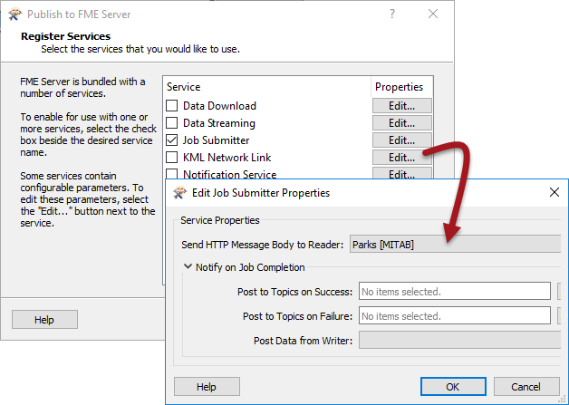

# Self-Serve and Services

Self-Serve is implemented through a number of Services on FME Server. A Service is a particular method of communication between client and server. FME Server provides a wide range of services to carry out different forms of data self-serve.

## What is a Service? ##

In the simplest of terms, a service is a piece of software that handles communications between a client and a server. In other words, it’s a tool that allows users to access complex functionality through a simplified interface.

In terms of FME Server, the client is often—but not always—a web browser that passes requests to FME Server using a service.

In short, a service allows the sending of specific types of requests to FME Server, and allows results to be provided to client applications in a specific way.

For example, instead of just running a workspace, you can have a web page ask for the results of the workspace as a package of data compressed in a zip file.

---

<table style="border-spacing: 0px">
<tr>
<td style="vertical-align:middle;background-color:darkorange;border: 2px solid darkorange">
<i class="fa fa-quote-left fa-lg fa-pull-left fa-fw" style="color:white;padding-right: 12px;vertical-align:text-top"></i>
Professor Spatial F.M.E., E.T.L. says...
</td>
</tr>

<tr>
<td style="border: 1px solid darkorange">

Good morning class. I'm here to guide you through this chapter on Self Serve with FME.
  Let's start with the idea of services. Although the concept sounds complicated, a service is just a simpler way of communicating requests to FME Server than using the API. Also, FME Server includes a number of predefined services that cover a lot of the functionality you are likely to need.

</td>
</tr>
</table>

---

## Available Services ##

FME Server includes the following services:

<table>
<tr><td>Data Download Service</td><td rowspan="4">Transformation Services</td></tr>
<tr><td>Data Streaming Service</td></tr>
<tr><td>Job Submitter Service</td></tr>
<tr><td>KML Network Link Service</td></tr>

<tr><td>Data Upload Service</td><td rowspan="4">Utility Services</td></tr>
<tr><td>Token Service</td></tr>
<tr><td>Web Connection (SOAP) Service</td></tr>
<tr><td>REST Service</td></tr>

<tr><td>Notification Service</td><td>Notification Services</td></tr>

</table>

Remember that services can communicate in both directions. Transformation services – for example Data Download – are primarily Self-Serve tools for Server to deliver data to the end user.

Utility services can be described as “helper” services. They interact with FME Server to assist in menial tasks such as uploading data or providing token security. In most cases these are facilities that an author or developer will be using in a way that’s hidden from the user.

The Notification Service is used for passing short messages into and out of FME Server. Incoming messages notify FME Server to take some action, whereas outgoing messages alert an end-user (or system) that some sort of event has occurred.

---

<!--Tip Section--> 

<table style="border-spacing: 0px">
<tr>
<td style="vertical-align:middle;background-color:darkorange;border: 2px solid darkorange">
<i class="fa fa-info-circle fa-lg fa-pull-left fa-fw" style="color:white;padding-right: 12px;vertical-align:text-top"></i>
TIP
</td>
</tr>

<tr>
<td style="border: 1px solid darkorange">

Prior versions of FME had services specifically for OGC services such as WMS and WFS. Safe Software now recommends that customers looking to provide OGC Web Services do so using a combination of a workspace that implements the standard and the data streaming service that serves the output.
  This new method of providing OGC Services is more flexible as you have full control over implementation of OGC features. See the FME Server documentation for more information and links to example workspaces.

</td>
</tr>
</table>

---

## Workspaces and Services ##

When a workspace is published to FME Server the last panel of the publishing wizard is for registering it with a particular service:

The Job Submitter service is automatically selected in the FME Server publishing wizard, whenever a workspace is published, but many other services are available too.

Registering a workspace with a service makes the workspace available for use in that service although, as you’ll discover, not every workspace is capable of being used by every service.

Be aware of the Edit button to the right of each service.

Every service has a set of parameters available that determine how a workspace will be run with that service:

Notice how these parameters include ones for notification topics to trigger on completion of the workspace.

---

<table style="border-spacing: 0px">
<tr>
<td style="vertical-align:middle;background-color:darkorange;border: 2px solid darkorange">
<i class="fa fa-exclamation-triangle fa-lg fa-pull-left fa-fw" style="color:white;padding-right: 12px;vertical-align:text-top"></i>
WARNING
</td>
</tr>

<tr>
<td style="border: 1px solid darkorange">

It’s important to understand that a workspace may be registered against one
service, many services, <strong>or no services at all!</strong>

</td>
</tr>
</table>

---

<!--Person X Says Section-->

<table style="border-spacing: 0px">
<tr>
<td style="vertical-align:middle;background-color:darkorange;border: 2px solid darkorange">
<i class="fa fa-quote-left fa-lg fa-pull-left fa-fw" style="color:white;padding-right: 12px;vertical-align:text-top"></i>
Miss Vector says...
</td>
</tr>

<tr>
<td style="border: 1px solid darkorange">

When a workspace is not registered against any service, how can you run it? Select all that apply.
  1. With the FMEServerJobSubmitter transformer
 2. With the run dialog in the web interface
 3. With the URL specified under Developer Information in the run dialog
 4. By setting it to run under a schedule

</td>
</tr>
</table>
