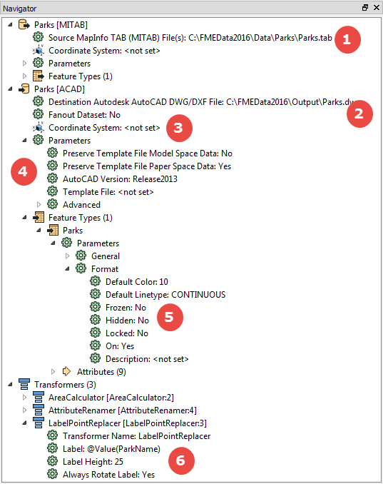
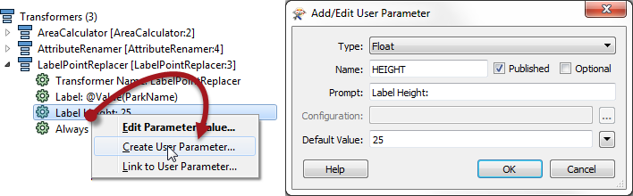
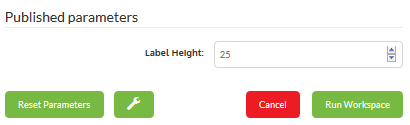

# Miscellaneous Published Parameters

Any parameter in FME can be published and presented to the user as a choice to be made when running a workspace. They don’t have to be specifically related to the Data Download service.

Parameters are published in FME Desktop (i.e. FME Workbench) for use in FME Server.

---

## Publishing a Parameter ##

In Workbench parameters are located in several places, but the FME Workbench Navigator window is the one place where you will find them gathered in a single location:

As you can see, there are parameters for the source data location (1) and the destination data dataset (2), which is the one that the Data Download service overrides. There are also parameters for controlling the coordinate system (3), general Reader and Writer parameters (4), parameters for each feature type (5) and parameters for transformers (6).

Parameters are published by right-clicking on them and choosing “Create User Parameter”. For example, here a workspace author is publishing a parameter on the LabelPointReplacer transformer:

The author gets to choose the type of parameter (in this case a floating point number), the user prompt, and the default value. When the workspace is run the end-user will now be able to decide what size they want labels to appear as:

---

