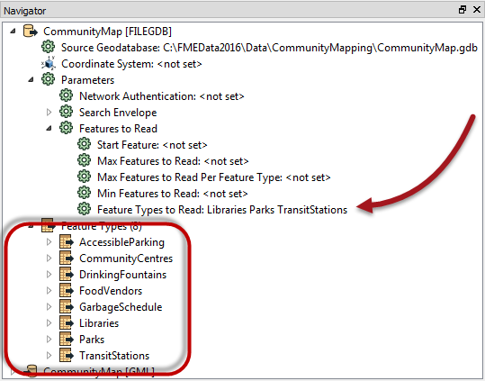
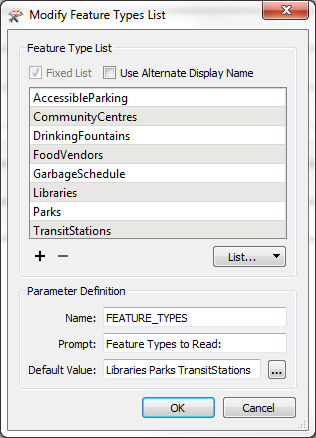
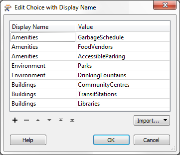

# Layer Selection and Handling

Spatial data is often organized in layers (groups, classes, categories, feature types) and a common way that users will wish to choose data in a self-serve system is on a layer-basis.

In FME, feature type (layer) flexibility can be achieved through the *Feature Types to Read* parameter.

## Selecting Layers ##

Each reader in FME has a parameter called Feature Types to Read. This parameter is used to tell FME which of the feature types in the workspace should be used in the translation. 

Here a Reader contains eight feature types. The Feature Types to Read parameter has been set up to read just three of these (Libraries, Parks, TransitStations).

In the above, the parameter had been set by the author. However, when this parameter is published, the workspace will accept a list of layers to read from the user.

---

<!--Tip Section--> 

<table style="border-spacing: 0px">
<tr>
<td style="vertical-align:middle;background-color:darkorange;border: 2px solid darkorange">
<i class="fa fa-info-circle fa-lg fa-pull-left fa-fw" style="color:white;padding-right: 12px;vertical-align:text-top"></i>
TIP
</td>
</tr>

<tr>
<td style="border: 1px solid darkorange">

Technically, what the end-user thinks they are selecting is a list of output layers, when in fact we are giving them a list of source data. If the two are not an exact match, then use the Grouped Layers method outlined below. 

</td>
</tr>
</table>

---

## Publishing Feature Types to Read ##

The dialog for publishing this parameter is different to that for formats and coordinate systems:

This is because FME can automatically scan the workspace and provide a list of available feature types. It's not necessary to manually set up the list or even add them semi-automatically with an *import* option.

Additionally, the Use Alternate Display Name allows the author to publish alternate names (for example Road Centrelines instead of RdCtrLns) in a similar way to the “Choice with Alias” parameter.

---

<!--Tip Section--> 

<table style="border-spacing: 0px">
<tr>
<td style="vertical-align:middle;background-color:darkorange;border: 2px solid darkorange">
<i class="fa fa-info-circle fa-lg fa-pull-left fa-fw" style="color:white;padding-right: 12px;vertical-align:text-top"></i>
TIP
</td>
</tr>

<tr>
<td style="border: 1px solid darkorange">

By default the Feature Types to Read list is fixed (as in the above screenshot).
  However, if any of the Reader feature types has a merge filter set, then the Feature Types to Read option presents the end-user with a list of ALL feature types in the source dataset, whether or not they are specifically added to the workspace!

</td>
</tr>
</table>

---

## Grouped Layers ##

The choice of data by layer is easily handled if the layers correspond to Feature Types in the source data. However, on some occasions we wish to present “groups” of layers, rather than a simple, separate list.

For example, we may wish to present “Water” as a choice to the end-user, where water is a group made up of multiple source feature types such as Lakes, Rivers, and Streams.

This type of scenario can be achieved using a parameter of type “Choice with Alias (Multiple)”.

Here the author has eight feature types, but they are organized in three groups (Amenities, Environment, Buildings) and he wishes to present them to the end-user in this way:

The first step is to create a parameter of type “Choice with Alias (Multiple)”. In the parameter configuration, all feature types from the same group are given the same display name:

Finally, the Feature Types to Read parameter is linked to the newly created Choice with Alias parameter.

Now when the workspace is run, the end-user is presented with a set of three options (Environment, Buildings, and Amenities) that reflect a series of different layers/feature types:

