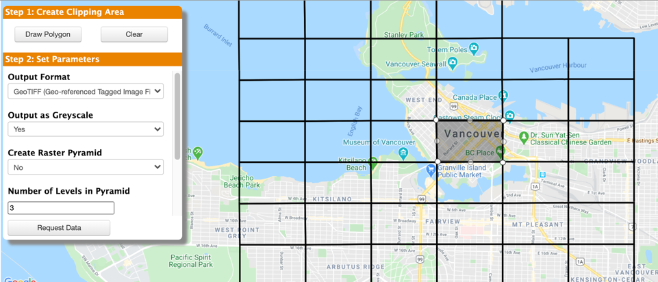

# Self-Serve with FME Server

Creating self-serve data integration workflows takes the burden of user requests away from expert staff, enabling them to concentrate on more important work.

This chapter looks at how self-serve is implemented on FME Server, and how to allow the end user to set parameters, select format, choose a coordinate system, and define which layers to download.
