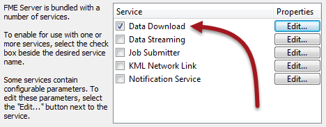

# Data Download Service

The Data Download service is the key tool for Self-Serve setups, where users are selecting their own choice of data to download. It operates in a different way to simply running a workspace. 

When you run a workspace with the Job Submitter service the data is written to the location specified by the workspace; for example a file, directory, or database.

The Data Download service instead writes the output to a zip file and presents the user with a link to that file. This makes it ideal for self-serve, because the data is delivered directly to the user.

## Creating and Using a Data Download Service ##

A workspace becomes available for data download use when the author registers it against the Data Download service when publishing it to FME Server:

Once registered this way, Data Download options become available in the FME Server Web interface for that particular workspace:

The results of the workspace are not written to a specific output location; instead they are delivered to the user in the form of a hyperlink to a zipped dataset:

---

<!--Person X Says Section-->

<table style="border-spacing: 0px">
<tr>
<td style="vertical-align:middle;background-color:darkorange;border: 2px solid darkorange">
<i class="fa fa-quote-left fa-lg fa-pull-left fa-fw" style="color:white;padding-right: 12px;vertical-align:text-top"></i>
Miss Vector says...
</td>
</tr>

<tr>
<td style="border: 1px solid darkorange">

When a workspace is registered against the Data Download service (and no other), how can you run it? Select all that apply.
  1. With the FMEServerJobSubmitter transformer
 2. With the run dialog in the web interface
 3. With the URL specified under Developer Information in the run dialog
 4. By setting it to run under a schedule

</td>
</tr>
</table>
