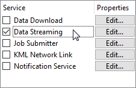
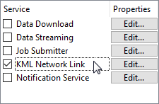

# Other Self-Serve Services #

Although most people look at self-serve mostly in the context of Data Download, that is not the only Self-Serve Service available.

---

## Data Streaming ##

Data Streaming is another service that a workspace can be registered against:

Whereas the Job Submitter service writes data, and the Data Download service returns a link to the data, a Data Streaming service returns a file of the data itself, streamed back to the client.

For example, if the Data Streaming URL for a workspace is posted into a web browser, the data will be automatically downloaded and opened in whatever application the browser associates with that file type (some data might open directly in the web browser itself).

Alternatively, the URL can be used directly as the source for a client application, like a GIS tool. When the client actively downloads the contents on a regular basis – as a GeoRSS reader would – then you have a feed, which is significantly different to a regular data download service.

---

<!--Person X Says Section-->

<table style="border-spacing: 0px">
<tr>
<td style="vertical-align:middle;background-color:darkorange;border: 2px solid darkorange">
<i class="fa fa-quote-left fa-lg fa-pull-left fa-fw" style="color:white;padding-right: 12px;vertical-align:text-top"></i>
Professor Spatial F.M.E., E.T.L. says...
</td>
</tr>

<tr>
<td style="border: 1px solid darkorange">

Data Streaming is a slight misnomer in that a data streaming service does not supply a continuous stream of data; it merely provides a snapshot of the data at a particular point in time.

</td>
</tr>
</table>

---

### What Formats can be Streamed? ###

You can use any workspace with the data streaming service, provided it writes data in a format that is file-based or folder-based (i.e. not to a database or web URL).

If an output dataset is comprised of more than one file, the data streaming service automatically creates a compressed (zip) folder out of the data. For example, AutoCAD DWG format could be streamed, whereas ESRI Shape would be returned in a zipped file.

The most popular formats to stream are those that have a suitable client to read the feed. Some of the main formats that are output using the data streaming services include:

- RSS
- GeoRSS
- GeoJSON
- KML
- HTML
- JSON

### MIME Types in Workspaces ###

A MIME header is a component of a file or e-mail message that is capable of indicating the content type of the file; for example, ***Content-Type: text/plain*** indicates a simple text file.

The application chosen to open a streamed file will depend on the MIME type and file association on the client’s system.

Setting MIME type is most important for FME writers where the content is not specifically defined by the writer. For example, the HTML writer has no MIME type setting because it is obviously providing text/html. The TextFile writer has a MIME type setting because the nature of its contents are ambiguous; it might be writing plain text (text/plain) or XML (text/xml) or it might even write the contents of a blob attribute containing a raster png image (image/png):

Here the author is saying that the content of the text file is valid PNG and should be opened in the default PNG application (possibly a web browser, possibly a graphic editor).

## KML Network Link ##

Google [describes a KML Network Link](https://www.google.ca/earth/outreach/tutorials/network_link.html) as a type of *bookmark*; a link from Google Earth (or any other KML-reading application) to the true set of data.

In FME you can register any workspace that writes KML as a KML Network Link service, however you must also register it under Data Streaming as well:

Running the workspace using this service merely returns a small KMZ (compressed KML) file that contains this "bookmark". The bookmark is a link back to the workspace whose URL points to the Data Streaming service.

When Google Earth opens a KML Network Link service from FME Server, it receives the link to the workspace:

When the link is followed it triggers FME Server into running the workspace and returning the results as a stream of KML data.

Because Google Earth permits a refresh rate for network links, the translation can be re-run at a user-defined interval. This way the results are always as up-to-date as the chosen interval.

Of course, in this scenario the output is never written to a permanent dataset; the resulting data is simply streamed to the browser, which writes it to a cache.
