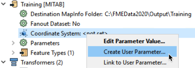
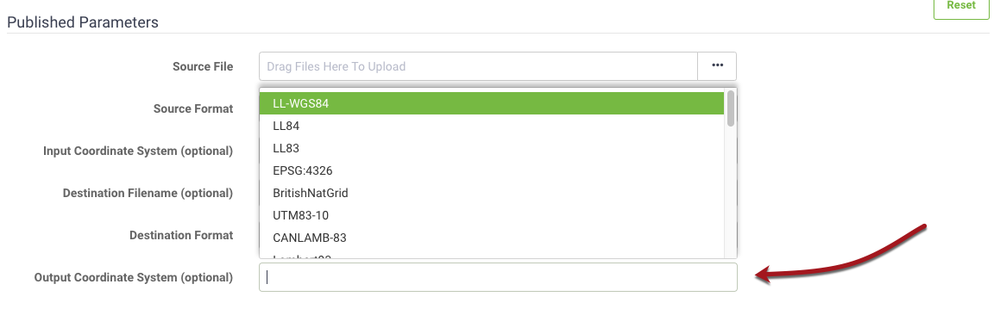
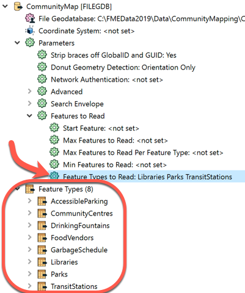
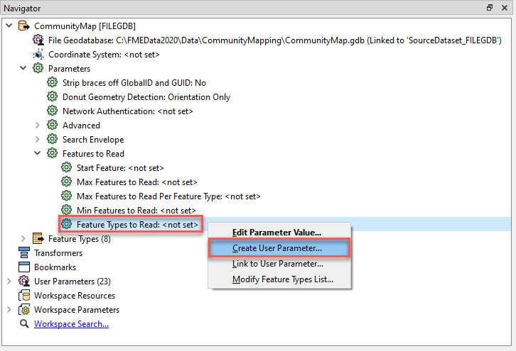
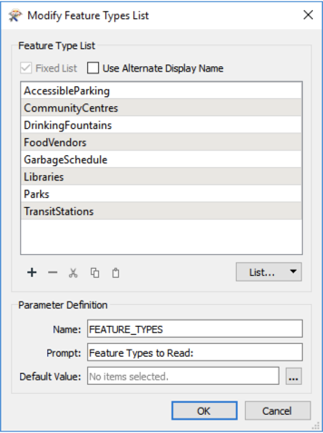
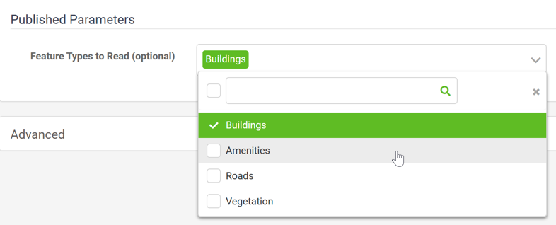

# Common Published Parameters Uses #

Self-serve systems can be used to give the user control over any parameter in a workspace. Common uses for published parameters in self-serve workflows including giving the user control over:

- Format
- Coordinate system
- Layers
- Geographic area of interest

---

## Format Selection ##

To control format at run-time requires the use of the Generic reader/writer in FME. The Writer has a parameter that controls which format of data will be written.

Here, for example, the Generic writer is being set to write data in Tableau Data Extract format. However, if the author of the workspace publishes this parameter, the user gets to choose their own output format at run-time:

One point to keep in mind when using the writer is that each writer format has its own specific parameters, and these may still need to be set when a generic writer is used. This can be achieved by adding a writer of the same format and setting the parameters in that writer. The Generic writer will inherit the parameters of this dummy writer, even if no features are connected to it.

---

## Coordinate System Selection ##

Regardless of format, each writer in FME has a coordinate system parameter that can be published:

This allows the end-user to receive data in a coordinate system of their choice:

Alternatively a transformer – such as the CsmapReprojector – can be used, in which case the relevant parameters can be found under the Transformers section of the Navigator window. The obvious advantage to using a transformer is that you have control over other reprojection factors, such as the geographic transformation and grid height.

---

<!--Tip Section-->

<table style="border-spacing: 0px">
<tr>
<td style="vertical-align:middle;background-color:darkorange;border: 2px solid darkorange">
<i class="fa fa-info-circle fa-lg fa-pull-left fa-fw" style="color:white;padding-right: 12px;vertical-align:text-top"></i>
TIP
</td>
</tr>

<tr>
<td style="border: 1px solid darkorange">

By default, users can choose any coordinate system or format. Often this amount of choice can be overwhelming to the user or can let them choose an option that doesn't work for the given workspace, e.g. choosing a raster format when the expected output is vector data. You can address this issue by creating a Choice with Alias parameter and importing only the formats or coordinate systems you want to use.  <a href="https://s3.amazonaws.com/gitbook/Desktop-Advanced-2019/DesktopAdvanced3AdvancedRW/3.Exercise2.html">This exercise</a> from the Desktop Advanced course shows how to create these parameters.

</td>
</tr>
</table>

---

## Selecting Layers ##

Each reader in FME has a parameter called Feature Types to Read. This parameter is used to tell FME which of the feature types in the workspace should be used in the translation.

Here a Reader contains eight feature types. The Feature Types to Read parameter has been set up to read just three of these (Libraries, Parks, TransitStations).

The parameter can be set by the workspace author, but in most cases, it is published so that the end user can select a list of layers to read.

Choosing to publish the Feature Types to Read parameter results in a dialog that lets you control which feature types the user can choose from:

---

<!--Tip Section-->

<table style="border-spacing: 0px">
<tr>
<td style="vertical-align:middle;background-color:darkorange;border: 2px solid darkorange">
<i class="fa fa-info-circle fa-lg fa-pull-left fa-fw" style="color:white;padding-right: 12px;vertical-align:text-top"></i>
TIP
</td>
</tr>

<tr>
<td style="border: 1px solid darkorange">

You can also group feature types together into a single option for the user. The way to do this is by using the Alternate Display Name option and entering the same value for the Display Name for each layer you want to group together:

That way the user is presented with groups instead of individual layers:

</td>
</tr>
</table>
