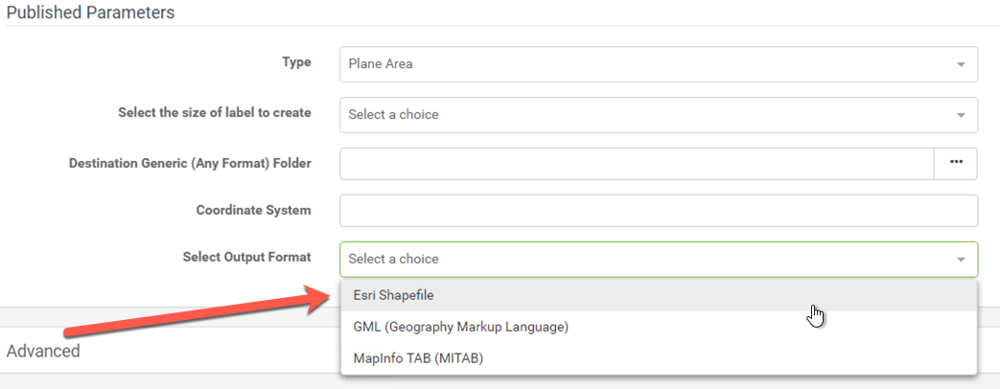

# Format and Coordinate System Selection #

Self-serve systems allow an end-user to download data in the schema of their choice. This schema includes both data format and coordinate system.

---

## Format Selection ##

To control format at run-time requires the use of the Generic reader/writer in FME. The Writer has a parameter that controls which format of data will be written.

Here, for example, the Generic writer is being set to write data in Tableau Data Extract format. However, if the author of the workspace publishes this parameter, the user gets to choose their own output format at run-time:

One point to keep in mind when using the writer is that each writer format has its own specific parameters, and these may still need to be set when a generic writer is used. This can be achieved by adding a writer of the same format and setting the parameters in that writer. The Generic writer will inherit the parameters of this dummy writer, even if no features are connected to it.

---

## Coordinate System Selection ##

Regardless of format, each writer in FME has a coordinate system parameter that can be published:

This allows the end-user to receive data in a coordinate system of their choice:

Alternatively a transformer – such as the CsmapReprojector – can be used, in which case the relevant parameters can be found under the Transformers section of the Navigator window. The obvious advantage to using a transformer is that you have control over other reprojection factors, such as the geographic transformation and grid height.

---

## Using Choice with Alias for Formats/Coordinate Systems ##

The screenshots above show that, although the format and coordinate system are published, the list may be overly complex. It's also important to note that the formats published parameter would be a plain text-only field in the FME Server web interface. This would force the end user to enter values manually. An author can reduce the list of formats (or coordinate systems) to a reasonable set of choices, instead of the full list of FME supported formats (or coordinate systems).

This is why the Choice With Alias parameter is preferred. Not only does that show up as a choice box in the FME Server web interface, but it shows an alias to the user too (so they are presented with Esri Shapefile as the format name instead of SHAPE).

The sequence of actions is this:

- Use Add Parameter to create a new User Parameter in Workbench. Select the type as Choice with Alias, fill in the other fields, then click the Configuration button:

- When creating a Choice with Alias parameter for a format or coordinate system, it's not necessary to manually enter display names and values. Instead choose the import option to select the required formats (or coordinate systems) from a list:

- Then, like this author, search for and select the chosen formats (or coordinate systems):

- Finally you must join the newly-defined Choice with Alias parameter to the appropriate parameter in the FME Navigator:

These selections become part of the parameter definition and allow the user to select their chosen format from within the FME Server web interface:

Notice how the list will show only the four selected formats and will pass on the short form of the name, which is what FME expects.
