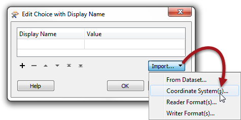
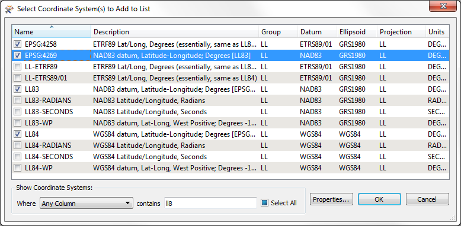

# Format and Coordinate System Selection #

Self-serve systems allow an end-user to download data in the schema of their choice. This schema includes both data format and data coordinate system.

---

## Format Selection ##

To control format at run-time requires use of the Generic reader/writer in FME. The Writer has a parameter that controls which format of data is being written. 

By publishing this parameter, the user gets to choose the output format at run-time.

There are a couple of points to keep in mind when using the writer:

- The output format parameter is automatically published, but in FME Server’s interface it appears only as a text field. Best practice decrees this should be replaced by a new Choice with Alias parameter. That will make it easier for the user to select a format, and the author can reduce the list of formats to a reasonable set of choices, each with a descriptive name.

- Each writer format has its own specific parameters, and these may still need to be set when a generic writer is used. This can be achieved by adding a writer of the same format and setting the parameters in that writer. The Generic writer will inherit the parameters of this dummy writer, even if no features are connected to it.

---

## Coordinate System Selection ##

Regardless of format, each Writer in FME has a coordinate system parameter, and publishing this parameter allows the end-user to receive data in a coordinate system of their choice.

Alternatively a transformer – such as the CSMapReprojector – can be used, in which case the relevant parameters can be found under the Transformers section of the Navigator window. The obvious advantage to using a transformer is that you have control over other reprojection factors, such as the geographic transformation and grid height.

---

## Using Choice with Alias for Formats/Coordinate Systems ##

When creating a Choice with Alias parameter for a format or coordinate system, it's not necessary to manually enter display names and values. Instead an import option allows the author to select the supported formats from a list:

Here the author has opened the list of coordinate systems and has selected several:

These selections then appear in the parameter definition window:

Now when the end-user runs this workspace they will be presented with a list of coordinate systems to select from. The list will show only the four selected systems and will pass on the short form of the name, which is what FME expects. 

Besides coordinate systems, this functionality also supports reader and writer formats, for use in the Generic Reader and Writer. 

---

<!--Person X Says Section-->

<table style="border-spacing: 0px">
<tr>
<td style="vertical-align:middle;background-color:darkorange;border: 2px solid darkorange">
<i class="fa fa-quote-left fa-lg fa-pull-left fa-fw" style="color:white;padding-right: 12px;vertical-align:text-top"></i>
Miss Vector says...
</td>
</tr>

<tr>
<td style="border: 1px solid darkorange">

Let me throw an easy question at you! If the Generic Writer parameter is published to determine what format to write data in a data download system, what would the Generic Reader parameter be used for?
  1. To determine what format of data to read in a Data Download system
 2. To determine what format of data to read in a Data Upload system
 3. To determine the correct Styler transformer to use in the workspace
 4. To determine whether I'm connected to a Data Upload or a Data Download system 

</td>
</tr>
</table>
